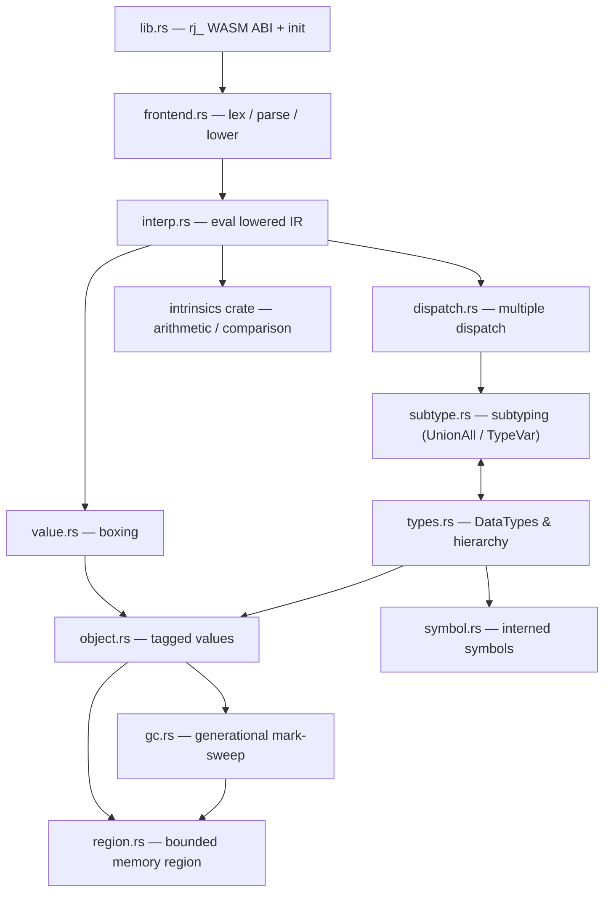

# Architecture

How Ruju's runtime is organized today — the modules that exist and how they
fit together. This describes the current implementation; the plan lives in
`roadmap.md`, and per-subsystem status and fidelity in `ledger.md`.

## Components

| Module | Role |
| - | - |
| `lib.rs` | the `rj_`-prefixed WASM ABI and runtime initialization |
| `frontend.rs` | hand-written bootstrap lexer / parser / lowering for a subset of Julia source |
| `interp.rs` | tree-walking interpreter over lowered IR |
| `dispatch.rs` | multiple dispatch — method table, applicability, specificity |
| `subtype.rs` | subtyping, including the `where` machinery (`UnionAll` / `TypeVar`) |
| `types.rs` | `DataType`s, the type hierarchy, tuples / unions / parametrics, uniquing |
| `value.rs` | boxing and unboxing of primitive values |
| `object.rs` | the tagged-value model — every object headers its `DataType` |
| `symbol.rs` | interned (immortal) symbols |
| `gc.rs` | generational, pooled mark-sweep GC with shadow-stack rooting |
| `region.rs` | the single bounded region of WASM linear memory (offset-based references) |
| `intrinsics` (crate) | pure arithmetic and comparison intrinsics |
