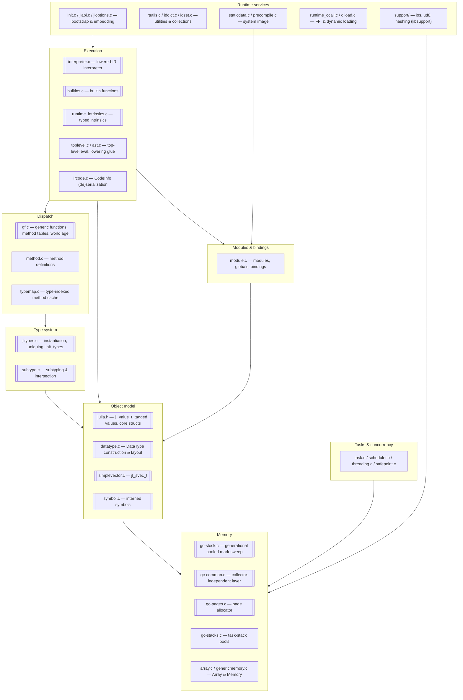
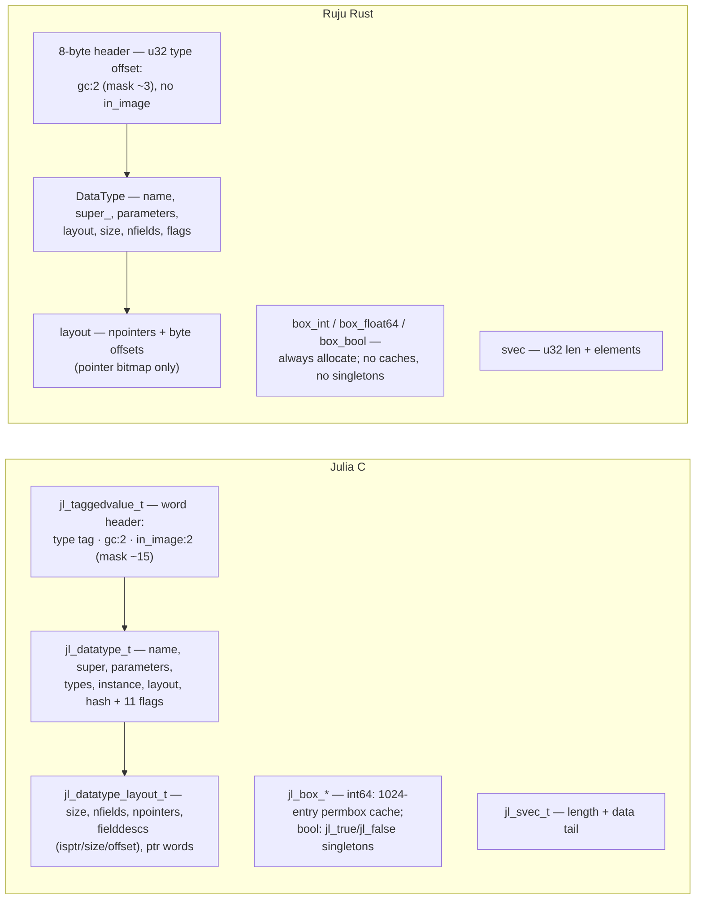
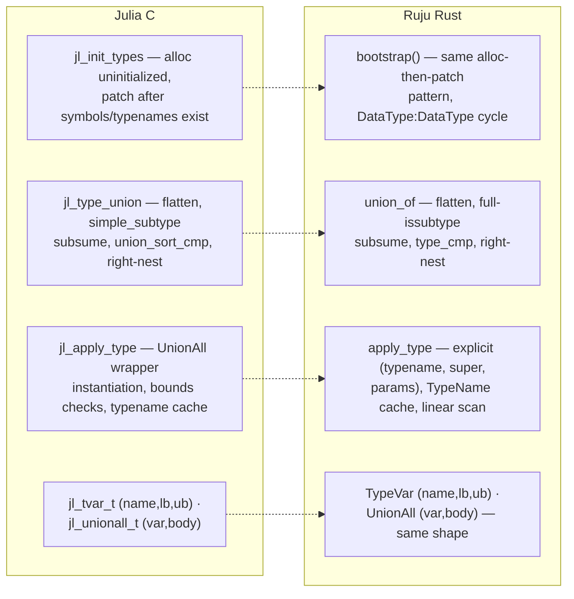
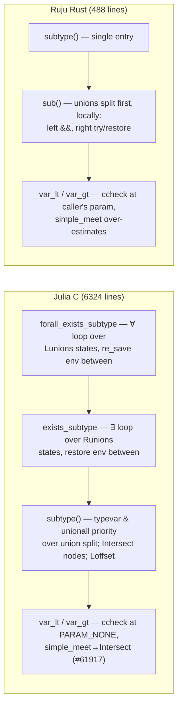
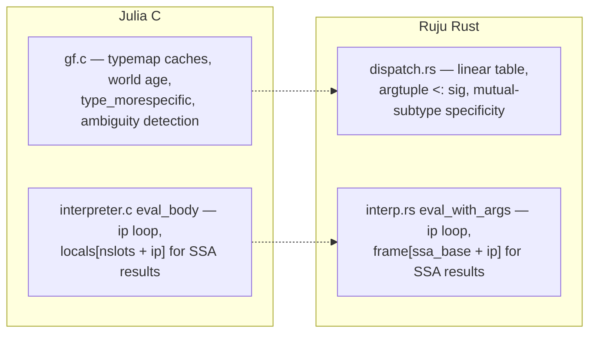
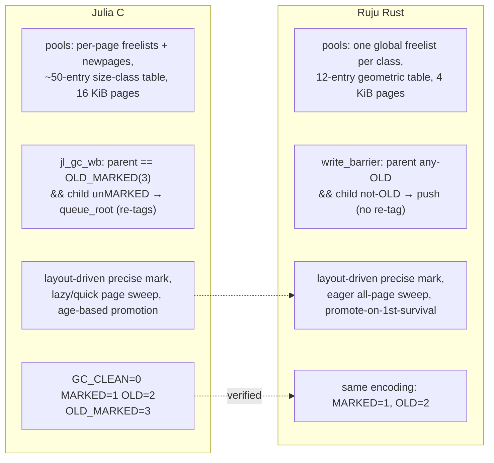

# Fidelity audit — Julia `src/` vs Ruju `runtime/`

A module-by-module verification that Ruju's Rust runtime implements the same
design — and produces the same outputs — as the C/C++ reference it ports
(`reference/julia/src/`, pinned at the commit recorded in
`reference/README.md`). Each audited subsystem gets a side-by-side
architectural comparison and a findings list; every finding that contradicts
`ledger.md` is applied back to the ledger.

**Method.** The Rust runtime (~3.8k lines) was read exhaustively; the C
reference (~34k lines in the audited files) was read targeted to every ledger
claim, structure by structure and function by function. Behavioural claims are
cross-checked with the native test suite and the subtype oracle
(`runtime/verify_julia_subtype.mjs`).

## The shape of Julia's C runtime

Julia's `src/` divides into nine subsystems. Arrows point from a subsystem to
what it depends on. Double-bordered nodes are the ones Ruju's phase-0 runtime
reimplements (in whole or in part); the others are later phases or deliberate
divergences (see `ledger.md`).

Not present in the vendored reference (and out of scope for it): `codegen.cpp`
and `jitlayers.cpp` — upstream Julia's LLVM JIT — which Ruju replaces with the
planned build-time AOT backend (a recorded divergence).

The C runtime's layering is the porting order: nothing above the object model
works unless the object model is exact, which is why this audit proceeds
bottom-up — object model, types, subtyping, dispatch, interpreter, GC,
symbols/intrinsics — the reverse of the diagram's arrows.

---

## Object model — `julia.h` / `datatype.c` / `simplevector.c` vs `object.rs` / `value.rs`

**Verified.** Tagged header design (tag-before-object, GC bits in the low
header bits, `type_of` by masking); `jl_svec_t` shape; the `~6 of ~17`
DataType-field claim; singletons tracked outside the type; the freelist
threaded through the header word exactly mirrors `jl_taggedvalue_t`'s `next`
union.

**Findings.**
1. **Bool boxing is unfaithful in identity.** `jl_box_bool` returns the
   `jl_true`/`jl_false` singletons and never allocates; `box_bool` allocates a
   fresh object per call. Latent until `===` exists, then observable.
   (`jl_box_int64`'s ±512 permbox cache is also absent — already in the
   ledger.)
2. `jl_set_typeof` stores the whole header word (callers must not have
   initialized GC bits); Ruju's `set_type` preserves GC bits — safer, benign,
   recorded.
3. Julia reserves 4 low header bits (`gc:2`, `in_image:2`); Ruju reserves 2
   (no system image yet). Part of the offset adaptation; recorded.
4. `object::alloc`'s collect-on-exhaustion retry is the documented trigger
   placeholder, not "Julia's behavior" as its comment claims — Julia collects
   proactively at a heap target and throws OOM on true exhaustion.

## Type system — `jltypes.c` / `datatype.c` vs `types.rs`

**Verified.** The bootstrap pattern matches `jl_init_types`; the hierarchy and
primitive sizes match `boot.jl` exactly (the ledger's "verified vs boot.jl" is
genuine); tuple identification by shared `TypeName` matches
`jl_tuple_typename`; `TypeVar`/`UnionAll` object shapes match `jl_tvar_t`/
`jl_unionall_t`; union normalization has the right overall algorithm
(flatten → subsume → sort → right-nested build).

**Findings.**
5. **Union canonical order misses Julia's tiers.** `union_sort_cmp` sorts
   singletons first, then isbits DataTypes, then other DataTypes, then
   UnionAlls, *before* the name comparison `type_cmp` implements. E.g. Julia
   canonicalizes to `Union{Nothing, Int64}`, Ruju to `Union{Int64, Nothing}` —
   an observable output difference.
6. **The ledger mischaracterized Julia's union identity.** Julia does *not*
   intern unions; `===` on types is structural (`jl_types_egal`). The gap is a
   missing `types_egal`, not a missing cache.
7. During normalization the C subsumption check uses `simple_subtype`
   (typevar-aware, deliberately weaker); Ruju calls full `issubtype`
   unconditionally — wrong in principle when members carry free typevars.
8. `apply_type` takes an explicit supertype (callers pass `Any`); Julia
   instantiates the wrapper's declared super with the parameters. Subsumed by
   the "no `UnionAll` instantiation" ledger note, now stated explicitly.
9. The primitive tower omits `BFloat16 <: AbstractFloat` (in `boot.jl`).

## Subtyping — `subtype.c` vs `subtype.rs`

**Verified.** The `jl_stenv_t`/`jl_varbinding_t` mapping is real: per-var
`lb`/`ub` narrowing through `simple_meet`/`simple_join`, the
`existential` flag as Julia's `R`, `depth0`-ordered ∀∃-vs-∃∀ handling
(matches `subtype.c`'s var-var logic almost line for line), the ∃∃
inner-most-variable rule (`var_outside`), and the consistency-scope
machinery (`occurs_cov`/`cov_diag` mirror
`push/pop_consistency_scope`). The ledger's Partial markings here are honest.

**Findings.**
10. **Two free typevars diverge.** Julia returns `false` unconditionally when
    both sides are free singleton typevars (`subtype.c:1970`); Ruju falls
    through to a bounds-based check and can answer `true`.
11. **Dispatch-order divergences.** Julia gives typevar-left and UnionAll-left
    priority over splitting a right-side union (each justified by a recorded
    issue), and has a typevar-right fast path before splitting a left union;
    Ruju splits unions first, unconditionally. This changes which bounds get
    recorded (whole-union `ub` vs single-member `ub`) and can interact with
    the diagonal rule.
12. `ccheck` runs at the **caller's** `param`; Julia's `subtype_ccheck` enters
    at `PARAM_NONE`, so a top-level typevar occurrence inside a bound check
    counts as covariant in Ruju but not in Julia.
13. `forall_exists_equal` checks the reverse direction at `Invariant`; Julia
    uses `PARAM_NONE` for the flip, and has fast paths Ruju lacks (same-name
    nested datatype forwards to a single subtype call; greedy componentwise
    two-union path).
14. **The pinned C has moved past the port.** The vendored `subtype.c` carries
    the `Intersect` meet node (#61917), `push_forall_bound_scope` on the ∀
    paths, and `Loffset` — machinery absent from `subtype.rs`. Future ports
    must target the pin, not the state of upstream when porting began.
15. **Oracle coverage is thin.** 24 assertions, all in the ground/simple-var
    zone; none reaches findings 10–13. `test/subtype.jl` upstream has two
    orders of magnitude more.

## Dispatch & interpreter — `gf.c` / `interpreter.c` vs `dispatch.rs` / `interp.rs`

**Verified.** The `eval_body` instruction-pointer loop and the
slots-then-SSA-values single-frame layout match the C exactly
(`locals[jl_source_nslots + ip]` ↔ `frame[ssa_base + ip]`) — both
"Done · Faithful" interpreter rows are genuine. The missing `Bool`
`TypeError` on `GotoIfNot` is real and was already in the ledger.

**Findings.**
16. The applicability note "Julia uses type intersection" is imprecise: for a
    concrete argument tuple, runtime dispatch *is* subtype-based (against
    typemap caches); intersection serves abstract match queries and ambiguity
    detection. The real gaps are the cache, `type_morespecific`, world age,
    and `MethodError` — all already Planned.

## GC — `gc-stock.c` / `gc-common.c` / `gc-pages.c` vs `gc.rs` / `region.rs`

**Verified.** Generational state encodings match exactly (the ledger's
"verified" is real); precise layout-driven marking; non-moving design;
shadow-stack rooting as the mandatory `JL_GC_PUSH`/`JL_GC_PUSHARGS` analog;
freelist threaded through the header word = `jl_taggedvalue_t.next`.
Promotion, trigger, and full-vs-quick placeholder rows are accurately
described.

**Findings (three Done·Faithful rows downgraded).**
17. **Write barrier condition differs in both halves.** `jl_gc_wb` fires on
    parent `== GC_OLD_MARKED` (3, "old *and not in remset*") with child
    not-MARKED, and `jl_gc_queue_root` re-tags the parent so the barrier does
    not refire; Ruju fires on parent any-old with child not-old and never
    re-tags (duplicate remset entries possible). Conservative, but not
    `jl_gc_wb`. → **Partial**.
18. **Pool allocation constants and structure are placeholders.** Julia:
    16 KiB pages by default (`GC_PAGE_LG2=14`; the 12 the Rust comment cites
    is the non-default `GC_SMALL_PAGE` config), a ~50-entry size-class table,
    per-page freelists with `newpages` and `pagemeta`. Ruju: 4 KiB pages, a
    12-entry geometric table, one global freelist per class, `Page{start,
    osize}` only. → **Partial**.
19. **Sweeping is eager.** Julia's lazy/quick-sweep page machinery
    (`pagemeta` has_marked/has_young, partial sweeps) is absent; Ruju walks
    every page every collection. → **Partial**.

## Symbols & intrinsics — `symbol.c` / `runtime_intrinsics.c` vs `symbol.rs` / `intrinsics`

**Verified.** Interning semantics (one object per name, pointer identity,
immortal); intrinsic semantics — wrapping two's-complement `add_int`/
`sub_int`/`mul_int`, signed comparisons, IEEE-754 float ops — match
`runtime_intrinsics.c` for the implemented subset.

**Findings.**
20. The ledger said Julia uses a "hashed table" for symbols; it is a
    hash-keyed **invasive binary tree** living inside each `jl_sym_t`
    (`left`/`right`/`hash` fields). Ruju's side-table design also means the
    symbol object layout differs (`len + bytes`; no embedded tree links or
    hash). Note corrected.

---

## Verdict

The codebase is what the ledger says it is **in shape**: every audited
subsystem genuinely ports the C design it names, several rows claimed as
verified really are (state encodings, hierarchy vs `boot.jl`, the
interpreter loop, the consistency-scope machinery), and most simplifications
were already recorded. The audit found **no fabricated fidelity** — but it
found three GC rows claiming Done that are simplifications (17–19), two
mischaracterizations (6, 20), one identity-semantics gap (1), and a cluster
of subtype divergences (10–13) in exactly the zone the 24-assertion oracle
does not cover. All corrections are applied to `ledger.md`; findings 10–15
are the priority queue for the existential-types roadmap item, and oracle
expansion is the cheapest way to keep this class of divergence visible.
