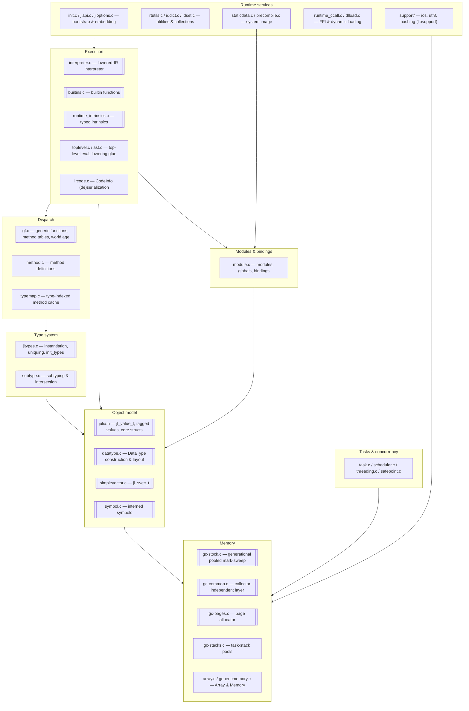
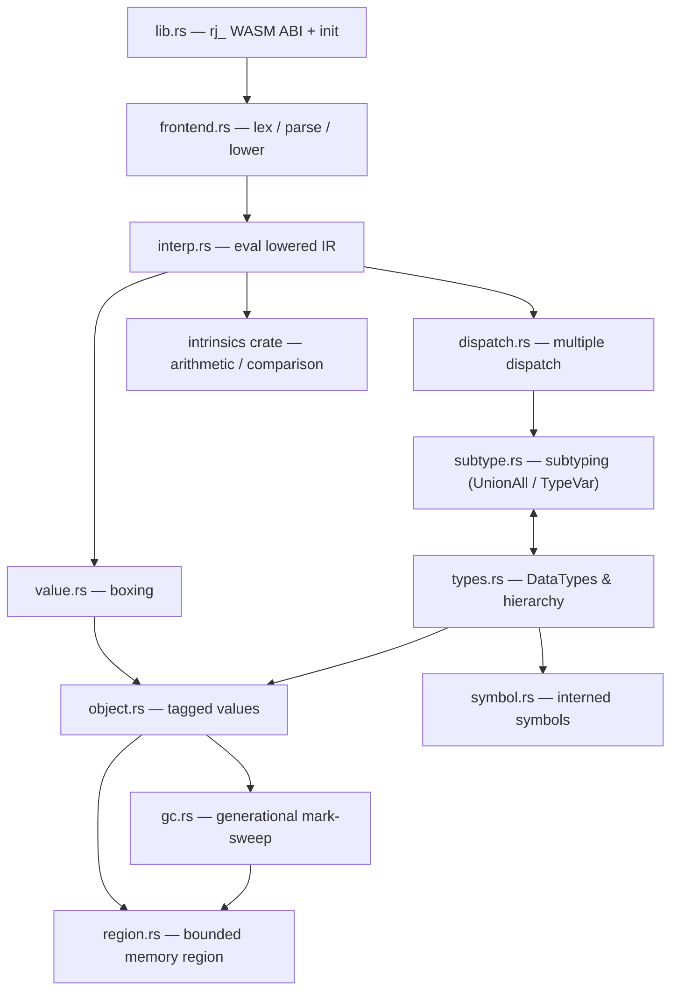
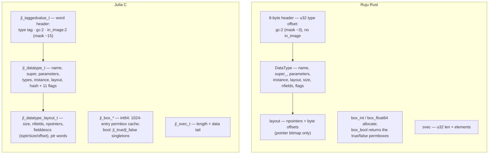
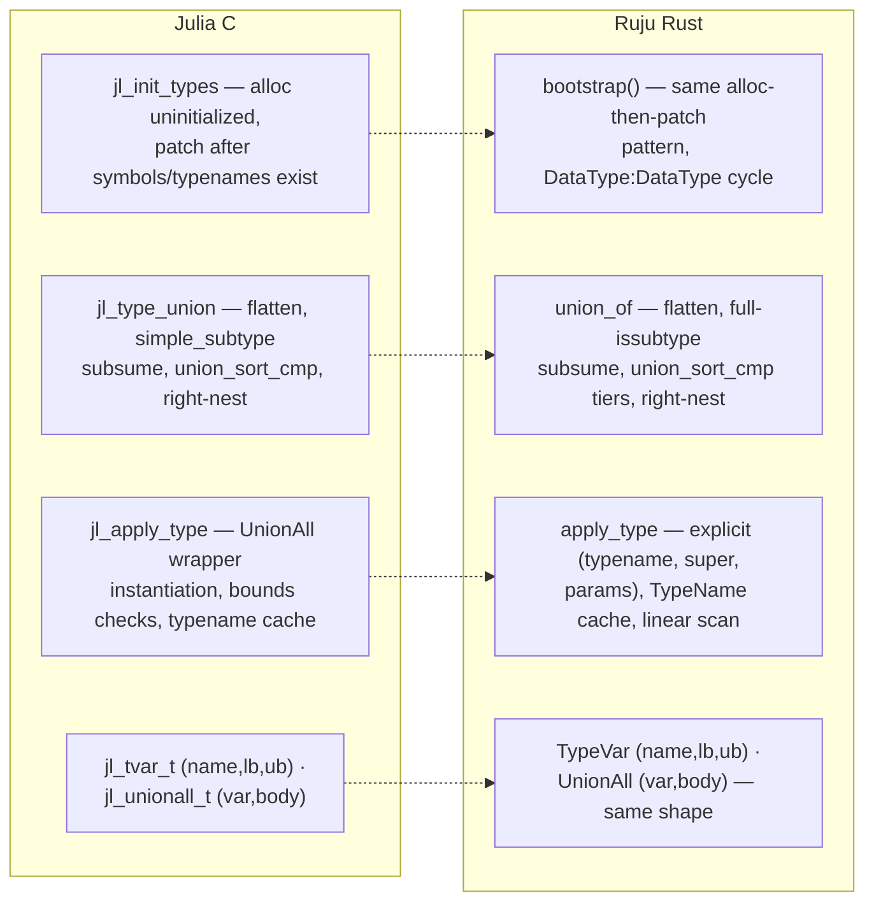
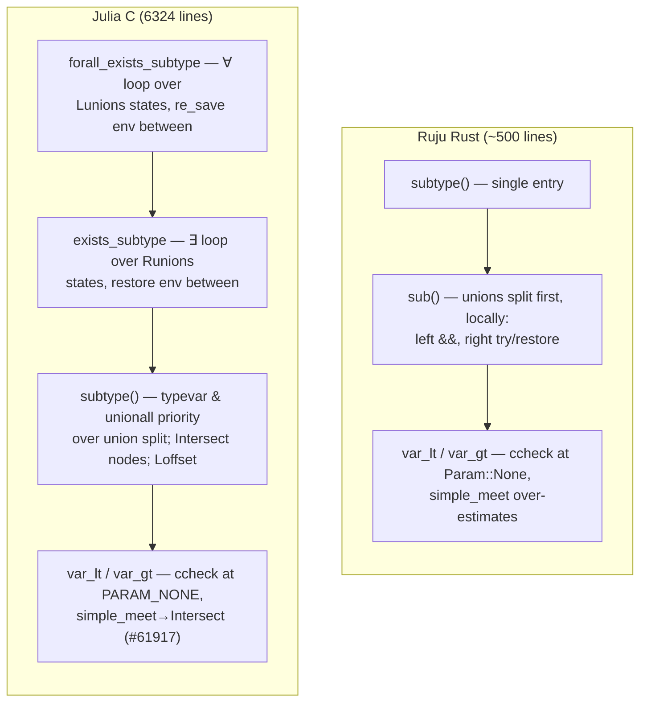
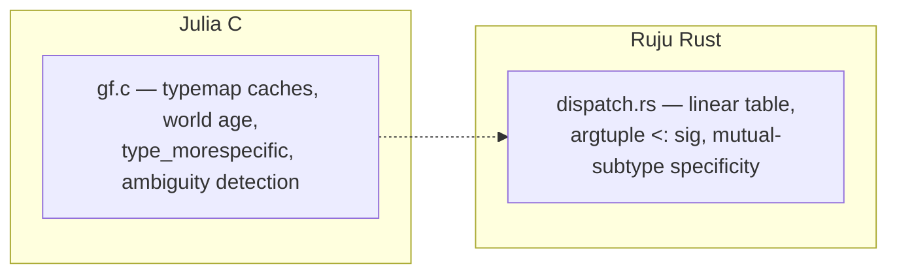
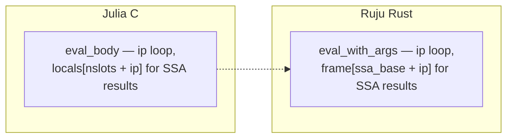
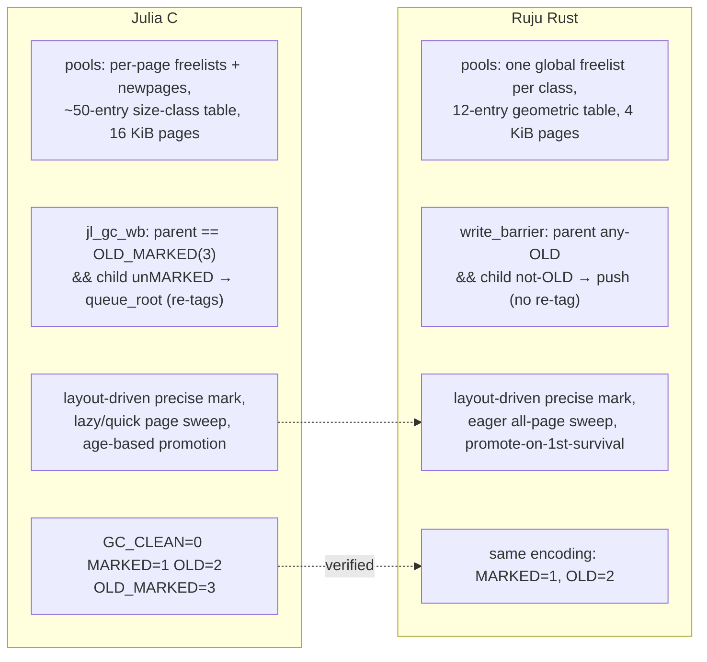

# Implementation

Where we are: the per-module comparison of Julia's C/C++ runtime
(`reference/julia/src/`, pinned at the commit in `reference/README.md`)
against Ruju's Rust reimplementation. This is the evidence ledger — every
**Done · Faithful** row is backed by a reference-verified comparison
recorded here.

Each module section carries: the side-by-side C-vs-Rust mini-maps (where the
Rust port has begun), the status table, and the audit findings with their
line citations. Sections for modules not yet started carry the C side alone —
an empty right column is itself information.

## How to read the status tables

Two independent axes per piece:

- **Status** — how much exists: **Planned** (nothing yet) · **Partial**
  (present but incomplete) · **Done** (complete for what it covers).
- **Fidelity** — its relationship to Julia: **Faithful** (Julia's *design*,
  even if simplified or incomplete — same shape, possibly less of it) ·
  **Divergence** (a *deliberately different* design, for the WASM target or
  the composable-memory model).

A *simplification* is **Faithful + Partial**, not a divergence. "Done ·
Faithful" means *reference-verified* (`methodology.md`), not "tests pass" —
audits found the difference matters. When unsure, read the file named in the
section heading.

**Global conventions (project-wide divergences, stated once).** Every piece
below assumes these and does not repeat them; a row is **Divergence** only
for a departure *beyond* them.

- References are region-relative **offsets**, not native pointers (bounded,
  composable memory).
- A single bounded heap **region**; exported symbols are `rj_`-prefixed.
- **Single-threaded** for now (the `Sync` on global state relies on it).

## The shape of Julia's C runtime

Julia's `src/` divides into nine subsystems. Arrows point from a subsystem to
what it depends on. Double-bordered nodes are the ones Ruju's phase-0 runtime
reimplements (in whole or in part).

Not present in the vendored reference: `codegen.cpp` and `jitlayers.cpp` —
upstream Julia's LLVM JIT — which Ruju replaces with the planned build-time
AOT backend (a recorded divergence). The C runtime's layering is the porting
order: nothing above the object model works unless the object model is exact.

## The shape of Ruju's runtime

How the Rust modules fit together today. `runtime/` is conceptually the
replacement for `reference/julia/src/`.

| Module | Role |
| - | - |
| `lib.rs` | the `rj_`-prefixed WASM ABI and runtime initialization |
| `frontend.rs` | hand-written bootstrap lexer / parser / lowering for a subset of Julia source |
| `interp.rs` | tree-walking interpreter over lowered IR |
| `dispatch.rs` | multiple dispatch — method table, applicability, specificity |
| `subtype.rs` | subtyping, including the `where` machinery (`UnionAll` / `TypeVar`) |
| `types.rs` | `DataType`s, the type hierarchy, tuples / unions / parametrics, uniquing |
| `value.rs` | boxing and unboxing of primitive values |
| `object.rs` | the tagged-value model — every object headers its `DataType` |
| `symbol.rs` | interned (immortal) symbols |
| `gc.rs` | generational, pooled mark-sweep GC with shadow-stack rooting |
| `region.rs` | the single bounded region of WASM linear memory (offset-based references) |
| `intrinsics` (crate) | pure arithmetic and comparison intrinsics |

---

## Object model & values — `julia.h`, `datatype.c`, `simplevector.c` vs `object.rs`, `value.rs`

**Reference-verified (audit 2026-06).** Tagged header design (tag-before-
object, GC bits in the low header bits, `type_of` by masking); `jl_svec_t`
shape; the DataType-field subset claim; singletons via `instance`; the
freelist threaded through the header word exactly mirrors
`jl_taggedvalue_t`'s `next` union.

**Audit findings.**
1. ~~Bool boxing identity gap~~ — **fixed**: `box_bool` returns the
   `jl_true`/`jl_false` permboxes allocated at bootstrap (`jl_box_bool`,
   `datatype.c:1642`). The `±512` `jl_box_int64` permbox cache is still
   absent.
2. `jl_set_typeof` stores the whole header word; Ruju's `set_type` preserves
   GC bits — safer, benign, recorded.
3. Julia reserves 4 low header bits (`gc:2`, `in_image:2`); Ruju reserves 2
   (no system image yet). Part of the offset adaptation.
4. `object::alloc`'s collect-on-exhaustion retry is the documented trigger
   placeholder, not "Julia's behavior" as its comment claims.

| Piece | Status | Fidelity | Notes (Julia → ours) |
| - | - | - | - |
| Tagged header (tag-before-object, GC bits) | Done | Faithful | `jl_taggedvalue_t` |
| `DataType` struct | Partial | Faithful | ~7 of `jl_datatype_t`'s ~17 fields (incl. `instance`) |
| Field layout | Partial | Faithful | pointer bitmap only; no field-type/offset table |
| Boxing | Partial | Faithful | `Int64`/`Bool`/`Float64`; `Bool` boxes are the `jl_true`/`jl_false` permboxes (fixed, audit 2026-06); no small-int cache; other primitives later |
| `SimpleVector` | Done | Faithful | `jl_svec_t` |
| Singletons | Done | Faithful | `jl_datatype_t.instance`: `nothing` lives in `Nothing.instance`; zero-size pointer-free structs get an eager instance (`jl_compute_field_offsets`) |

## Type system — `jltypes.c`, `datatype.c` vs `types.rs`

**Reference-verified (audit 2026-06).** The bootstrap pattern matches
`jl_init_types`; the hierarchy and primitive sizes match `boot.jl` exactly;
tuple identification by shared `TypeName` matches `jl_tuple_typename`;
`TypeVar`/`UnionAll` object shapes match `jl_tvar_t`/`jl_unionall_t`; union
normalization has the right overall algorithm.

**Audit findings.**
5. ~~Union canonical order missed Julia's tiers~~ — **fixed**: `type_cmp`
   now implements `union_sort_cmp`'s tiers (singletons, then isbits, then
   other DataTypes, then UnionAlls) over the `name_cmp` tie-break.
6. Julia does *not* intern unions; `===` on types is structural
   (`jl_types_egal`). The gap is a missing `types_egal`, not a missing cache.
7. During normalization the C subsumption check uses `simple_subtype`
   (typevar-aware, deliberately weaker); Ruju calls full `issubtype`
   unconditionally — wrong in principle when members carry free typevars.
8. `apply_type` takes an explicit supertype (callers pass `Any`); Julia
   instantiates the wrapper's declared super with the parameters.
9. The primitive tower omits `BFloat16 <: AbstractFloat` (in `boot.jl`).

| Piece | Status | Fidelity | Notes |
| - | - | - | - |
| `jl_init_types` bootstrap | Done | Faithful | incl. the `DataType : DataType` cycle |
| Hierarchy & primitive sizes | Done | Faithful | verified vs `boot.jl` |
| `TypeName` | Partial | Faithful | name + cache; missing module/wrapper/names/hash |
| `apply_type` instantiation | Partial | Faithful | tuples + parametrics; no `UnionAll` instantiation |
| Uniquing (hash-consing) | Partial | Faithful | on `TypeName`; linear scan vs sorted/hashed |
| `Union` | Partial | Faithful | normalized (`jl_type_union`): flatten, subtype-dedup, canonical sort with `union_sort_cmp`'s singleton/isbits tiers (fixed, audit 2026-06); dedup uses full `issubtype` vs the C's typevar-aware `simple_subtype`; type `===` needs structural `jl_types_egal` (Julia does **not** intern unions); no `Vararg` merge |
| `Bottom` | Partial | Faithful | a `DataType`; Julia uses a `TypeofBottom` instance |
| `UnionAll` / `TypeVar` | Partial | Faithful | `jl_unionall_t`/`jl_tvar_t` objects (var + bounds + body); no `where`-var renaming/aliasing or `innervars` |
| `Type{T}` kinds | Planned | Faithful | — |
| Abstract `Tuple` (`jl_anytuple_type`) | Planned | Faithful | tuple super is `Any` for now |

## Subtyping — `subtype.c` vs `subtype.rs`

**Reference-verified (audit 2026-06).** The `jl_stenv_t`/`jl_varbinding_t`
mapping is real: per-var `lb`/`ub` narrowing through
`simple_meet`/`simple_join`, the `existential` flag as Julia's `R`,
`depth0`-ordered ∀∃-vs-∃∀ handling, the ∃∃ inner-most-variable rule
(`var_outside`), and the consistency-scope machinery (`occurs_cov`/
`cov_diag` mirror `push/pop_consistency_scope`).

**Audit findings.**
10. ~~Two free typevars consulted bounds~~ — **fixed**: unconditionally
    false, as `subtype.c:1970`.
11. **Dispatch-order divergences (open).** Julia gives typevar-left and
    UnionAll-left priority over splitting a right-side union, and has a
    typevar-right fast path before splitting a left union; Ruju splits
    unions first, unconditionally. Changes which bounds get recorded.
12. ~~`ccheck` ran at the caller's param~~ — **fixed**: enters at
    `Param::None`, as `subtype_ccheck` does.
13. ~~`forall_exists_equal` reverse direction at Invariant~~ — **fixed**:
    reverse at `Param::None` + the same-name-datatype fast path; the
    two-union greedy path is still absent.
14. **The pinned C has moved past the port (open).** The vendored
    `subtype.c` carries the `Intersect` meet node (#61917),
    `push_forall_bound_scope`, and `Loffset` — machinery absent from
    `subtype.rs`.
15. Oracle coverage: 24 → 53 assertions (post-audit expansion), which
    immediately caught a fourth bug — the diagonal rule rejected typevar
    lower bounds, breaking UnionAll alpha-equivalence (**fixed** per
    `subtype.c:1404–1419`; `concrete`-flag propagation still absent).

Oracle: `runtime/verify_julia_subtype.mjs` runs assertions copied verbatim
from JuliaLang/julia's own `test/subtype.jl` (mapping `Ref{T}`→`Box{T}`,
`Int`→`Int64`) — currently 53/53, plus 1 tracked known divergence
(tuple-over-union distributivity, which needs Julia's global union-decision
machine; it self-reports if a fix makes it pass).

| Piece | Status | Fidelity | Notes |
| - | - | - | - |
| `jl_subtype` structural core | Partial | Faithful | reflexive/`Any`/`Bottom`, Union forall–exists, covariant tuples, nominal, invariant parametrics, `UnionAll`/`TypeVar` via the env. Audit 2026-06 fixes landed: free-vs-free typevars now unconditionally false; `forall_exists_equal` reverse check at `PARAM_NONE` + same-name-datatype fast path. Remaining divergences: unions split before typevar/UnionAll handling (Julia prioritizes the latter); no two-union greedy path; local union backtracking vs the global decision machine (see oracle's known divergence) |
| Existential env (`jl_stenv_t`) | Partial | Faithful | `var_lt`/`var_gt` narrow per-var `lb`/`ub`; ∀/∃ via the `existential` flag; `invdepth`/`depth0` order interacting existentials (`var_outside`, ∀∃-vs-∃∀). No `where`-var renaming or `innervars` leak handling |
| Diagonal rule | Partial | Faithful | `occurs_cov` + `cov_diag` consistency-scope folding (`subtype_ccheck`), static `var_occurs_invariant`, `is_leaf_bound`; `ccheck` enters at `PARAM_NONE` (fixed, audit 2026-06); typevar lower bounds accepted (fixed — Julia also propagates `concrete=1` to that var, which we still don't); pinned C has newer machinery the port predates (`Intersect` #61917, `push_forall_bound_scope`, `Loffset`) |
| Union backtracking | Partial | Faithful | env save/restore on the exists branch; not Julia's `Lunions`/`Runions` bit-stack iterator |
| `simple_meet` / `simple_join` | Partial | Faithful | join defers to the normalized `union_type` (keeps free vars, so `S>:T` survives); meet over-estimates to `b` for typevar operands (no `Intersect` node) |
| `jl_type_intersection` | Planned | Faithful | — |
| `jl_type_morespecific` | Partial | Faithful | subtype-based approximation |
| Varargs | Planned | Faithful | `Vararg{T,N}` in tuple types |
| Fast paths (`obviously_egal`) | Planned | Faithful | — |

## Method dispatch — `gf.c`, `typemap.c` vs `dispatch.rs`

**Audit finding.**
16. The old "Julia uses type intersection" note was imprecise: for a
    concrete argument tuple, runtime dispatch *is* subtype-based (against
    typemap caches); intersection serves abstract match queries and
    ambiguity detection.

| Piece | Status | Fidelity | Notes |
| - | - | - | - |
| Method table | Partial | Faithful | Rust-side table; Julia's is heap `jl_methtable_t` |
| Applicability | Partial | Faithful | `argtuple <: sig` — matches Julia's concrete-tuple dispatch (intersection serves abstract match queries/ambiguity); missing: typemap cache, world age |
| Specificity | Partial | Faithful | subtype-based |
| Method cache (`typemap`) | Planned | Faithful | linear scan per call now |
| World age | Planned | Faithful | — |
| Ambiguity / `MethodError` | Planned | Faithful | first match; `NULL` on miss |
| `@generated`, kwargs, vararg methods | Planned | Faithful | — |

## Interpreter — `interpreter.c` vs `interp.rs`

**Reference-verified (audit 2026-06).** The `eval_body` instruction-pointer
loop and the slots-then-SSA-values single-frame layout match the C exactly
(`locals[jl_source_nslots + ip]` ↔ `frame[ssa_base + ip]`).

| Piece | Status | Fidelity | Notes |
| - | - | - | - |
| `eval_body` loop | Done | Faithful | instruction-pointer loop |
| Statements (`Goto`/`GotoIfNot`/`Return`/`:call`/`:(=)`) | Partial | Faithful | `GotoIfNot` skips the `Bool` `TypeError` |
| Operands (SSA / slot / const) | Done | Faithful | — |
| Phi / phic / upsilon | Planned | Faithful | SSA-form nodes |
| Exception handling (`enter`/`leave`) | Planned | Faithful | — |
| `:new` / `getfield` / `setfield!` / globals / closures | Planned | Faithful | — |
| IR source | Partial | **Divergence** | hand-built Rust IR via a Rust front-end; faithful path is heap `CodeInfo` from `JuliaLowering` |

## Builtins — `builtins.c` vs `builtins.rs`

**Reference-verified (2026-06, egal increment).** `egal` ports `jl_egal_`
(`julia.h:1877`) → `jl_egal__unboxed_` (`julia.h:1866`: symbols, `Bool`,
`Nothing`, mutables compare by identity only — sound because of interning,
the permboxes, and `instance`) → `jl_egal__bitstag` (`builtins.c:247`:
payload bits by width, svec elementwise, DataType name+parameters, `Union`
componentwise, `UnionAll` via `egal_types` with `tvar_names = 1`).
`types_egal` ports `egal_types` (`builtins.c:169`) with the typevar
environment; `jl_types_egal` (`builtins.c:230`) is the `tvar_names = 0`
entry — so `===` on `where` types is name-sensitive while structural type
equality is alpha-equivalent, and the tests pin that asymmetry. The
front-end lexes `===` to the egal builtin (any values, no unboxing).

| Piece | Status | Fidelity | Notes |
| - | - | - | - |
| `typeof`, `<:` | Partial | Faithful | via the ABI |
| `===` (`jl_egal`), `jl_types_egal` | Partial | Faithful | implemented for every value kind that exists (primitives by bits — NaN egal, ±0.0 not; identity-only kinds; svec; types; `where` alpha-equivalence). Omitted with the values that don't exist yet: strings, struct fields (`compare_fields`), `Vararg`, `TypeEq`, modules, `object_id`; the concrete-DataType fast path is skipped (uniquing reaches the same answer through parameters) |
| `isa` | Planned | Faithful | — |
| `getfield`/`setfield!`/`nfields`/`fieldtype` | Planned | Faithful | needs struct support |
| `tuple`, `apply`, `invoke`, array builtins | Planned | Faithful | `invoke`-like dispatch exists |

## Intrinsics — `runtime_intrinsics.c` vs `intrinsics` crate

**Reference-verified (audit 2026-06).** Wrapping two's-complement
`add_int`/`sub_int`/`mul_int`, signed comparisons, IEEE-754 float ops —
match `runtime_intrinsics.c` for the implemented subset.

| Piece | Status | Fidelity | Notes |
| - | - | - | - |
| Integer arithmetic | Partial | Faithful | `add/sub/mul` + `slt/sle/eq` of ~50+ |
| Bitwise / shifts | Planned | Faithful | — |
| Float arithmetic & compare | Partial | Faithful | `add/sub/mul` + `lt/le/eq` |
| Conversions (`sitofp`, `trunc`, …) | Planned | Faithful | — |
| Pointer / memory intrinsics | Planned | Faithful | — |
| Operator → intrinsic dispatch | Partial | Faithful | type-switched in `apply`; faithful is generic-function operators (`+` etc.) over the typed intrinsics |

## Garbage collector — `gc-stock.c`, `gc-common.c`, `gc-pages.c`, `gc-stacks.c` vs `gc.rs`, `region.rs`

**Reference-verified (audit 2026-06).** Generational state encodings match
exactly; precise layout-driven marking; non-moving design; shadow-stack
rooting as the mandatory `JL_GC_PUSH`/`JL_GC_PUSHARGS` analog; freelist
threaded through the header word = `jl_taggedvalue_t.next`.

**Audit findings (three Done·Faithful rows downgraded; all open, =
strategy's "GC exactness & tuning" frontier item).**
17. **Write barrier condition differs in both halves.** `jl_gc_wb` fires on
    parent `== GC_OLD_MARKED` with child not-MARKED and re-tags via
    `jl_gc_queue_root`; Ruju fires on parent any-old with child not-old and
    never re-tags. Conservative, but not `jl_gc_wb`.
18. **Pool allocation constants and structure are placeholders.** 16 KiB
    default pages vs 4 KiB; ~50-entry size-class table vs 12-entry
    geometric; per-page freelists + `newpages` + `pagemeta` vs one global
    freelist per class.
19. **Sweeping is eager.** Julia's lazy/quick-sweep page machinery absent.

| Piece | Status | Fidelity | Notes |
| - | - | - | - |
| Pool allocation (size classes, pages, free lists) | Partial | Faithful | `jl_gc_pool_t` design (freelist threads the header word = `jl_taggedvalue_t.next`); but 12-entry geometric size table vs Julia's ~50-entry table, 4 KiB pages vs default 16 KiB, one global freelist per class vs per-page freelists + `newpages` + `pagemeta` (audit 2026-06) |
| Big-object path | Planned | Faithful | large objects use a pool for now |
| Precise marking | Done | Faithful | type-layout driven |
| Sweeping (page walk, free-list rebuild) | Partial | Faithful | eager every-page walk; Julia's lazy/quick-sweep page machinery (`pagemeta` has_marked/has_young) absent (audit 2026-06) |
| Non-moving collection | Done | Faithful | the stock GC is non-moving too |
| Generational state encodings | Done | Faithful | `GC_CLEAN/MARKED/OLD/OLD_MARKED`, verified |
| Promotion policy | Partial | Faithful | one-survival placeholder; Julia uses `PROMOTE_AGE` + per-object age |
| Write barrier + remembered set | Partial | Faithful | `jl_gc_wb`'s condition differs in both halves: Julia fires on parent `== GC_OLD_MARKED` with child unMARKED and re-tags via `jl_gc_queue_root`; ours fires on any old parent with child not-old, never re-tags (duplicates possible). Conservative-correct (audit 2026-06) |
| Collection trigger | Partial | Faithful | exhaustion-only placeholder; Julia is proactive at a heap-target |
| Full-vs-quick policy | Partial | Faithful | escalation placeholder; Julia uses a growth heuristic |
| Shadow-stack rooting (`gcframe`) | Done | Faithful | — |
| Machine-stack scanning | n/a | **Divergence** | impossible in WASM; the shadow stack is *mandatory* instead |
| Safepoints | Partial | Faithful | trivial (single-threaded); multithreaded protocol later |
| Finalizers | Planned | Faithful | — |
| Weak references | Planned | Faithful | — |
| Heap snapshot / alloc profiler | Planned | Faithful | tooling |

## Symbols — `symbol.c` vs `symbol.rs`

**Audit finding.**
20. Julia interns into a hash-keyed **invasive binary tree** living inside
    each `jl_sym_t` (`left`/`right`/`hash` fields), not a "hashed table" as
    the old note said; Ruju's side-table design also means the symbol object
    layout differs.

| Piece | Status | Fidelity | Notes |
| - | - | - | - |
| Interned, immortal symbol table | Partial | Faithful | immortal ✓; a Rust `Vec` (linear) vs Julia's hash-keyed invasive binary tree embedded in `jl_sym_t` (`left`/`right`/`hash`) — our symbol body is `len + bytes`, no embedded tree links |

## Tasks & concurrency — `task.c`, `threading.c`, `scheduler.c`, `safepoint.c`

| Piece | Status | Fidelity | Notes |
| - | - | - | - |
| Tasks (coroutines) | Planned | **Divergence** | WASM has no native stack switch (needs asyncify / the stack-switching proposal) |
| Threading | Planned | **Divergence** | WASM threads = SharedArrayBuffer + workers, a different model |
| Scheduler | Planned | Faithful | — |
| Locks / atomics | Planned | Faithful | WASM atomics exist |

## Modules & top level — `module.c`, `toplevel.c`

| Piece | Status | Fidelity | Notes |
| - | - | - | - |
| Modules & bindings | Planned | Faithful | — |
| Global variables | Planned | Faithful | — |
| Top-level eval | Partial | Faithful | the front-end evaluates expressions; no module/global system |
| Imports / exports | Planned | Faithful | — |

## Runtime utilities — `rtutils.c`, `iddict.c`, `idset.c`, `smallintset.c`

| Piece | Status | Fidelity | Notes |
| - | - | - | - |
| Error / exception throwing | Planned | Faithful | — |
| Display / printing (`jl_show`) | Planned | Faithful | — |
| Internal hash collections | n/a | **Divergence** | Rust `std` collections used internally instead of Julia's C IdDict/IdSet |

## IR & methods — `ircode.c`, `method.c`, `opaque_closure.c`

| Piece | Status | Fidelity | Notes |
| - | - | - | - |
| `CodeInfo` (de)serialization | Planned | Faithful | — |
| Method definitions (`jl_method_t`) | Partial | Faithful | Rust-side method bodies |
| OpaqueClosure | Planned | Faithful | — |

## Arrays & memory — `array.c`, `genericmemory.c`

| Piece | Status | Fidelity | Notes |
| - | - | - | - |
| `GenericMemory` | Planned | Faithful | — |
| `Array` | Planned | Faithful | — |
| `arrayref`/`arrayset`/`length`/`push!` | Planned | Faithful | — |

## Serialization & system image — `staticdata.c`, `precompile.c`

| Piece | Status | Fidelity | Notes |
| - | - | - | - |
| System image | Planned | **Divergence** | Ruju's "image" is the AOT-compiled artifact — a different model |
| Precompilation / package images | Planned | Faithful | — |

## Init & C API — `init.c`, `jlapi.c`, `jloptions.c`, `engine.c`

| Piece | Status | Fidelity | Notes |
| - | - | - | - |
| Runtime init | Partial | Faithful | `rj_init` (region + types + dispatch) |
| Embedding ABI | Partial | **Divergence** | the `rj_` C ABI is a WASM/JS-host interface, not the `jl_` C API |
| Options parsing | Planned | Faithful | — |

## Front-end (parsing & lowering) — `ast.c`, `JuliaSyntax`, `JuliaLowering` vs `frontend.rs`

| Piece | Status | Fidelity | Notes |
| - | - | - | - |
| Parsing | Partial | **Divergence** | Rust bootstrap lexer/parser; faithful path is `JuliaSyntax` (AOT) |
| Lowering to `CodeInfo` | Partial | **Divergence** | Rust lowering to our own IR; faithful path is `JuliaLowering` |

## FFI — `runtime_ccall.c`

| Piece | Status | Fidelity | Notes |
| - | - | - | - |
| `ccall` | Planned | **Divergence** | in WASM, "C" calls are host/JS imports — a different model |

## AOT backend (Phase 1) — replaces removed `codegen.cpp`/`jitlayers.cpp`

| Piece | Status | Fidelity | Notes |
| - | - | - | - |
| IR → code | Planned | **Divergence** | Julia JITs via LLVM; Ruju plans a build-time IR → WASM compiler |

## Platform, profiling & support — `dlload.c`, `sys.c`, `timing.c`, `src/support/`

| Piece | Status | Fidelity | Notes |
| - | - | - | - |
| Dynamic loading (`dlopen`) | n/a | **Divergence** | single WASM module; no dynamic loading |
| System info | Planned | Faithful | — |
| Support lib (hashing/ios/utf8/strtod) | n/a | **Divergence** | Rust `std`/crates provide equivalents |
| Timing / profiling | Planned | **Divergence** | native/signal-based profiling absent in WASM |

---

## Audit record

**2026-06 (full pass, modules: object model, types, subtyping, dispatch,
interpreter, GC, symbols, intrinsics).** Method: the Rust runtime (~3.8k
lines) read exhaustively; the C reference (~34k lines in the audited files)
read targeted to every status claim. Verdict: the codebase is what the
tables say it is **in shape** — no fabricated fidelity — but three GC rows
claimed Done for simplifications (findings 17–19, downgraded), two notes
mischaracterized Julia (6, 20, corrected), one identity gap existed (1,
since fixed), and a cluster of subtype divergences (10–15) sat exactly where
the then-24-assertion oracle was blind. Findings 1, 5, 10, 12, 13 and the
15-adjacent diagonal bug were fixed in the increments that followed; 11, 14,
17–19 and the remainder of 15 are open and appear on `strategy.md`'s
frontier. Audits have found over-claims every time they have run.
