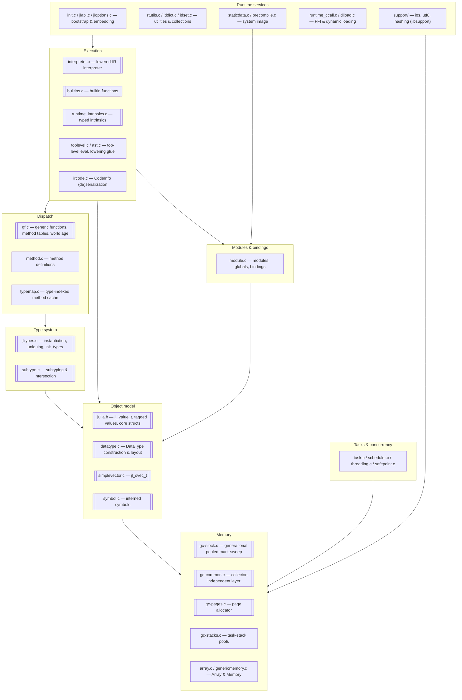
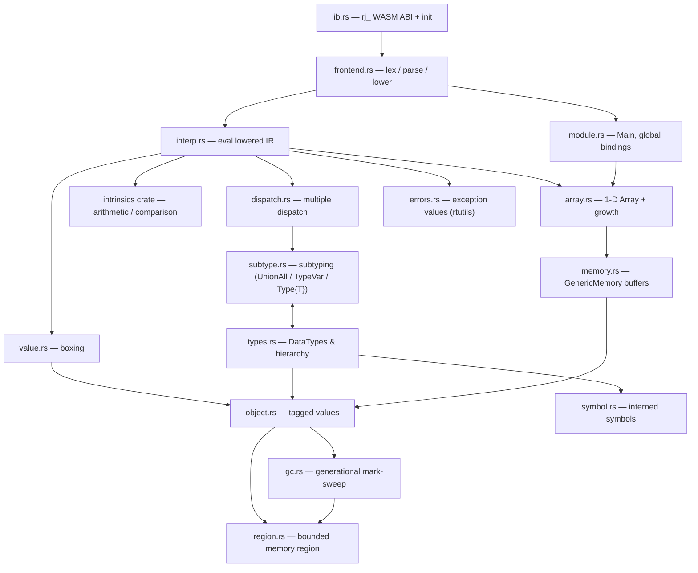
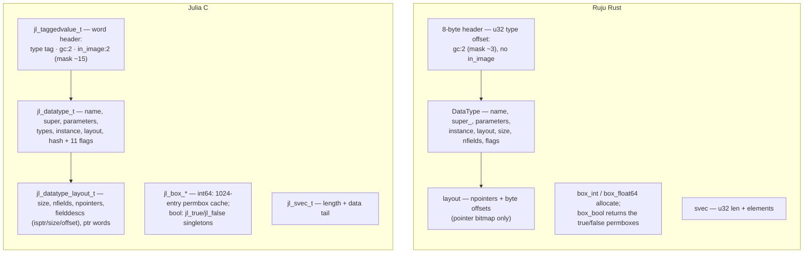
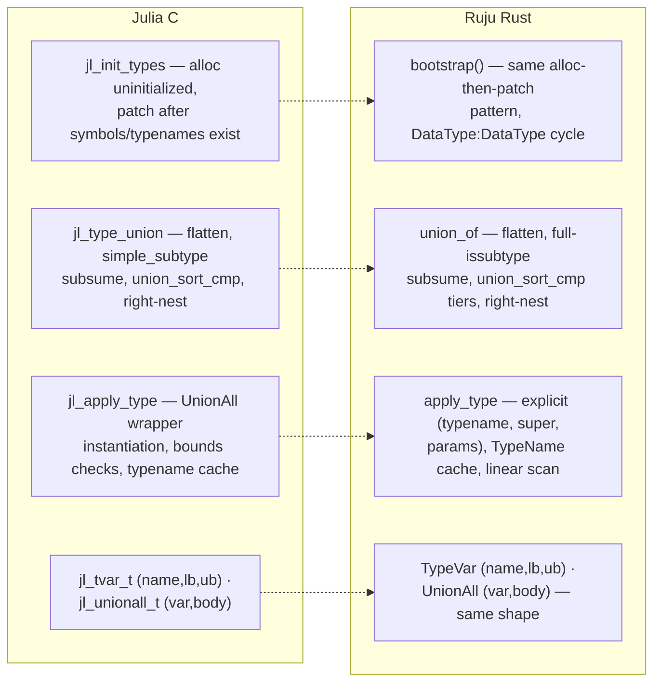
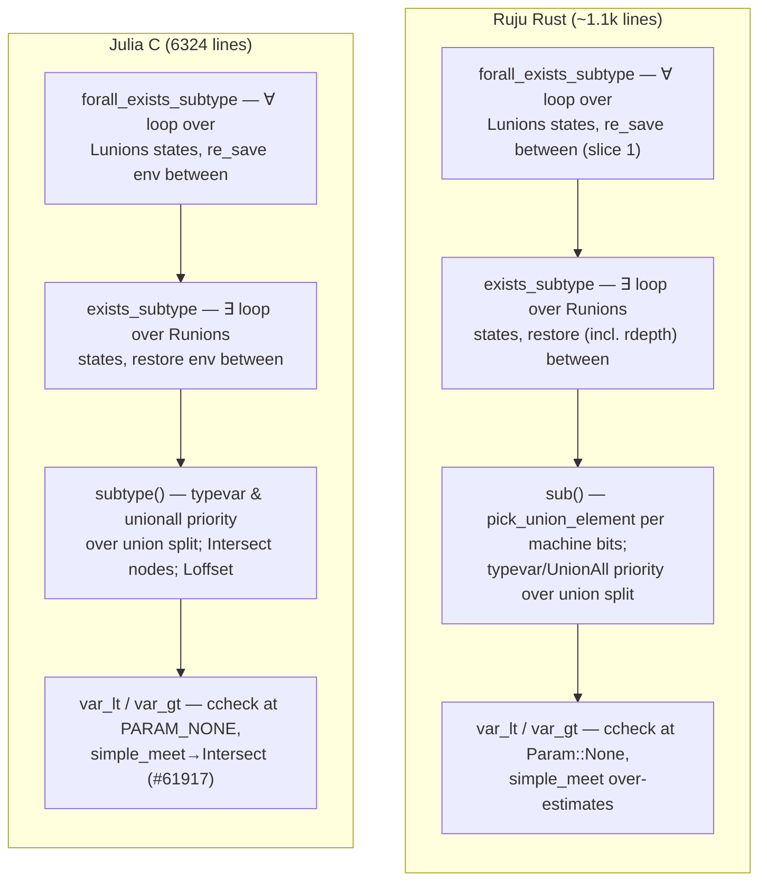
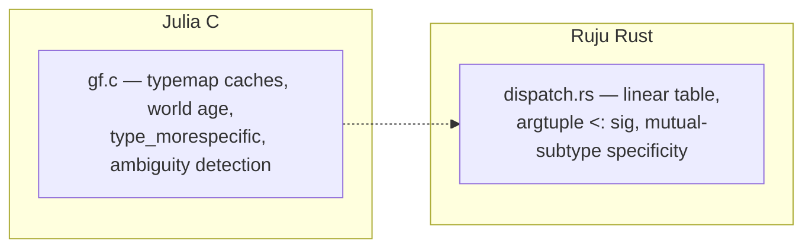
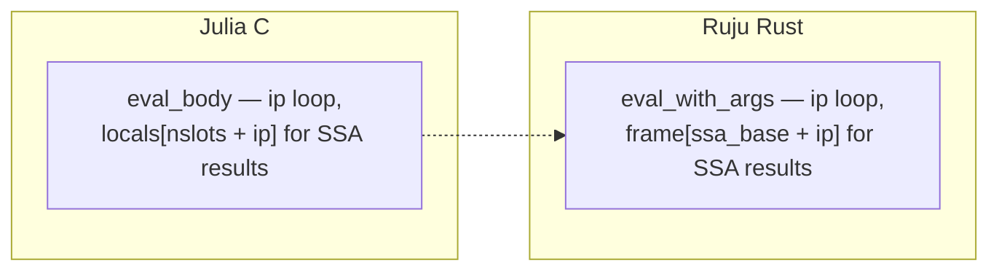
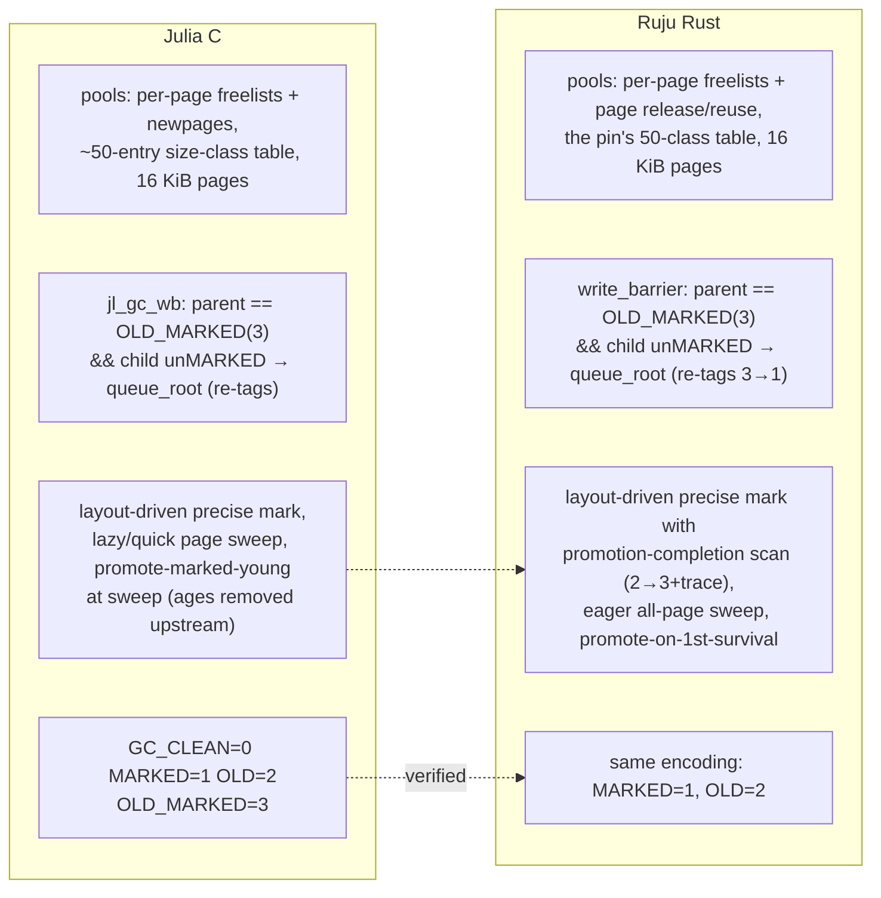

# Implementation

Where we are: the per-module comparison of Julia's C/C++ runtime
(`reference/julia/src/`, pinned at the commit in `reference/README.md`)
against Ruju's Rust reimplementation. This is the evidence ledger — every
**Done · Faithful** row is backed by a reference-verified comparison
recorded here.

Each module section carries: the side-by-side C-vs-Rust mini-maps (where the
Rust port has begun), the status table, and the audit findings with their
line citations. Sections for modules not yet started carry the C side alone —
an empty right column is itself information.

**Contents:**
[How to read the status tables](#how-to-read-the-status-tables) ·
[The shape of Julia's C runtime](#the-shape-of-julias-c-runtime) ·
[The shape of Ruju's runtime](#the-shape-of-rujus-runtime) ·
[Audit record](#audit-record)

**Modules:**
[Object model & values](#object-model--values--juliah-datatypec-simplevectorc-vs-objectrs-valuers) ·
[Type system](#type-system--jltypesc-datatypec-vs-typesrs) ·
[Subtyping](#subtyping--subtypec-vs-subtypers) ·
[Method dispatch](#method-dispatch--gfc-typemapc-vs-dispatchrs) ·
[Interpreter](#interpreter--interpreterc-vs-interprs) ·
[Builtins](#builtins--builtinsc-vs-builtinsrs) ·
[Intrinsics](#intrinsics--runtime_intrinsicsc-vs-intrinsics-crate) ·
[Garbage collector](#garbage-collector--gc-stockc-gc-commonc-gc-pagesc-gc-stacksc-vs-gcrs-regionrs) ·
[Symbols](#symbols--symbolc-vs-symbolrs) ·
[Tasks & concurrency](#tasks--concurrency--taskc-threadingc-schedulerc-safepointc) ·
[Modules & top level](#modules--top-level--modulec-toplevelc) ·
[Runtime utilities](#runtime-utilities--rtutilsc-iddictc-idsetc-smallintsetc) ·
[IR & methods](#ir--methods--ircodec-methodc-opaque_closurec) ·
[Arrays & memory](#arrays--memory--arrayc-genericmemoryc) ·
[Serialization & system image](#serialization--system-image--staticdatac-precompilec) ·
[Init & C API](#init--c-api--initc-jlapic-jloptionsc-enginec) ·
[Front-end](#front-end-parsing--lowering--astc-juliasyntax-julialowering-vs-frontendrs) ·
[FFI](#ffi--runtime_ccallc) ·
[AOT backend](#aot-backend-phase-1--replaces-removed-codegencppjitlayerscpp) ·
[Platform & support](#platform-profiling--support--dlloadc-sysc-timingc-srcsupport)

## How to read the status tables

Two independent axes per piece:

- **Status** — how much exists: **Planned** (nothing yet) · **Partial**
  (present but incomplete) · **Done** (complete for what it covers).
- **Fidelity** — its relationship to Julia: **Faithful** (Julia's *design*,
  even if simplified or incomplete — same shape, possibly less of it) ·
  **Divergence** (a *deliberately different* design, for the WASM target or
  the composable-memory model).

A *simplification* is **Faithful + Partial**, not a divergence. "Done ·
Faithful" means *reference-verified* (`methodology.md`), not "tests pass" —
audits found the difference matters. When unsure, read the file named in the
section heading.

**Global conventions (project-wide divergences, stated once).** Every piece
below assumes these and does not repeat them; a row is **Divergence** only
for a departure *beyond* them.

- References are region-relative **offsets**, not native pointers (bounded,
  composable memory).
- A single bounded heap **region**; exported symbols are `rj_`-prefixed.
- **Single-threaded** for now (the `Sync` on global state relies on it).

## The shape of Julia's C runtime

Julia's `src/` divides into nine subsystems. Arrows point from a subsystem to
what it depends on. Double-bordered nodes are the ones Ruju's phase-0 runtime
reimplements (in whole or in part).

Not present in the vendored reference: `codegen.cpp` and `jitlayers.cpp` —
upstream Julia's LLVM JIT — which Ruju replaces with the planned build-time
AOT backend (a recorded divergence). The C runtime's layering is the porting
order: nothing above the object model works unless the object model is exact.

## The shape of Ruju's runtime

How the Rust modules fit together today. `runtime/` is conceptually the
replacement for `reference/julia/src/`.

| Module | Role |
| - | - |
| `lib.rs` | the `rj_`-prefixed WASM ABI and runtime initialization |
| `frontend.rs` | hand-written bootstrap lexer / parser / lowering for a subset of Julia source |
| `interp.rs` | tree-walking interpreter over lowered IR |
| `dispatch.rs` | multiple dispatch — method table, applicability, specificity |
| `subtype.rs` | subtyping, including the `where` machinery (`UnionAll` / `TypeVar`) |
| `types.rs` | `DataType`s, the type hierarchy, tuples / unions / parametrics, uniquing |
| `value.rs` | boxing and unboxing of primitive values |
| `object.rs` | the tagged-value model — every object headers its `DataType` |
| `symbol.rs` | interned (immortal) symbols |
| `gc.rs` | generational, pooled mark-sweep GC with shadow-stack rooting |
| `region.rs` | the single bounded region of WASM linear memory (offset-based references) |
| `memory.rs` | `GenericMemory{T}` — the flat linear-memory buffer under arrays |
| `array.rs` | one-dimensional `Array{T}` over a memory buffer, with growth |
| `module.rs` | modules and global bindings (`Main`) |
| `errors.rs` | exception values (the `rtutils.c` analog) |
| `intrinsics` (crate) | pure arithmetic and comparison intrinsics |

---

## Object model & values — `julia.h`, `datatype.c`, `simplevector.c` vs `object.rs`, `value.rs`

**Reference-verified (audit 2026-06).** Tagged header design (tag-before-
object, GC bits in the low header bits, `type_of` by masking); `jl_svec_t`
shape; the DataType-field subset claim; singletons via `instance`; the
freelist threaded through the header word exactly mirrors
`jl_taggedvalue_t`'s `next` union.

**Audit findings.**
1. ~~Bool boxing identity gap~~ — **fixed**: `box_bool` returns the
   `jl_true`/`jl_false` permboxes allocated at bootstrap (`jl_box_bool`,
   `datatype.c:1642`). The `±512` `jl_box_int64` permbox cache is still
   absent.
2. `jl_set_typeof` stores the whole header word; Ruju's `set_type` preserves
   GC bits — safer, benign, recorded.
3. Julia reserves 4 low header bits (`gc:2`, `in_image:2`); Ruju reserves 2
   (no system image yet). Part of the offset adaptation.
4. `object::alloc`'s collect-on-exhaustion retry is the documented trigger
   placeholder, not "Julia's behavior" as its comment claims.

| Piece | Status | Fidelity | Notes (Julia → ours) |
| - | - | - | - |
| Tagged header (tag-before-object, GC bits) | Done | Faithful | `jl_taggedvalue_t` |
| `DataType` struct | Partial | Faithful | ~8 of `jl_datatype_t`'s ~17 fields (incl. `types`, `instance`); `TypeName` gains `names` + `mutabl` (structs 2026-06) |
| Field layout | Partial | Faithful | `jl_compute_field_offsets` core (structs 2026-06), **reference-verified against the `datatype.c:735–833` body** — verification found and fixed two divergences in the first draft: a field aligns to its *type's* alignment (a struct's = max of its fields', not its size), and the total size pads to the struct alignment so nested inline copies are exact. Per-field offset/size/isptr descriptors after the GC's `[npointers, offsets]` prefix; inline pointer-free isbits fields, references otherwise. Omitted: inline isbits unions (selector bytes), inline immutables containing pointers (`first_ptr`/`hasptr`), atomics, `n_uninitialized`, `haspadding`/`isbitsegal` tracking (needed when struct egal arrives) |
| Boxing | Partial | Faithful | every primitive width except `Int128`/`UInt128`/`Float16` (intrinsics 2026-06); `Bool` boxes are the `jl_true`/`jl_false` permboxes (fixed, audit 2026-06); no permbox caches for ints/chars |
| `SimpleVector` | Done | Faithful | `jl_svec_t` |
| Singletons | Done | Faithful | `jl_datatype_t.instance`: `nothing` lives in `Nothing.instance`; zero-size pointer-free structs get an eager instance (`jl_compute_field_offsets`) |

## Type system — `jltypes.c`, `datatype.c` vs `types.rs`

**Reference-verified (audit 2026-06).** The bootstrap pattern matches
`jl_init_types`; the hierarchy and primitive sizes match `boot.jl` exactly;
tuple identification by shared `TypeName` matches `jl_tuple_typename`;
`TypeVar`/`UnionAll` object shapes match `jl_tvar_t`/`jl_unionall_t`; union
normalization has the right overall algorithm.

**Audit findings.**
5. ~~Union canonical order missed Julia's tiers~~ — **fixed**: `type_cmp`
   now implements `union_sort_cmp`'s tiers (singletons, then isbits, then
   other DataTypes, then UnionAlls) over the `name_cmp` tie-break.
6. Julia does *not* intern unions; `===` on types is structural
   (`jl_types_egal`). The gap is a missing `types_egal`, not a missing cache.
7. During normalization the C subsumption check uses `simple_subtype`
   (typevar-aware, deliberately weaker); Ruju calls full `issubtype`
   unconditionally — wrong in principle when members carry free typevars.
8. `apply_type` takes an explicit supertype (callers pass `Any`); Julia
   instantiates the wrapper's declared super with the parameters
   (`inst_type_w_` on `dt->super`, `jltypes.c:2554–2555`).
9. The primitive tower omits `BFloat16 <: AbstractFloat` (in `boot.jl`).
22. **The `AbstractArray` tower is absent (open, audit 2026-07).**
    `array_type`/`memory_type` instantiate with super `Any`
    (`types.rs:612–628`); `boot.jl` places `Array{T,N} <: DenseArray{T,N} <:
    AbstractArray{T,N}` (`boot.jl:56–57,76`) and `GenericMemory` under
    `DenseVector` (`:62`). None of the three abstract types exist in the
    bootstrap. The hierarchy row is downgraded to Partial until they land.
23. ~~Fixed-count `Vararg{T,N}` expansion at construction was
    unconditional~~ — **fixed (engine slice 3, 2026-07-09)**: the C's guard
    ported exactly (`nt == 0 || !jl_has_free_typevars(va0)`,
    `jltypes.c:2361`), so `Tuple{Vararg{T,2}}` with a free `T` stays a
    `Vararg` (the `INT` kind the engine's length classification now
    handles), and instantiation rebuilds tuples through `tuple_type` so a
    substitution that grounds `T` re-expands consistently with direct
    construction. Pinned by a native test.

| Piece | Status | Fidelity | Notes |
| - | - | - | - |
| `jl_init_types` bootstrap | Done | Faithful | incl. the `DataType : DataType` cycle |
| Hierarchy & primitive sizes | Partial | Faithful | primitive tower verified vs `boot.jl`; the M1-added `Array`/`GenericMemory` sit directly under `Any` — the `AbstractArray`/`DenseArray`/`DenseVector` tower (`boot.jl:56–57,62,76`) is absent (finding 22, audit 2026-07); `Exception <: Any` and the exception types are placed per `boot.jl:372–400` |
| `TypeName` | Partial | Faithful | name + cache; missing module/wrapper/names/hash |
| `apply_type` instantiation | Partial | Faithful | tuples + parametrics; `UnionAll` instantiation via `instantiate_unionall`/`inst_type` (`jl_instantiate_unionall`/`inst_type_w_`, `jltypes.c:1606,2752`, varargs-era 2026-07): single-variable substitution over typevars, nested `UnionAll` (with bound-var remap), `Union`, `Vararg`, and datatype/tuple parameters, re-uniquing rebuilt parametrics. Omitted: the recursive-type stack, `check`/`nothrow` bound validation, and parametric-supertype re-instantiation (nominal supers carried through unchanged — our demo parametrics are `Any`-supered) |
| Uniquing (hash-consing) | Partial | Faithful | on `TypeName`; linear scan vs sorted/hashed |
| `Union` | Partial | Faithful | normalized (`jl_type_union`): flatten, subtype-dedup, canonical sort with `union_sort_cmp`'s singleton/isbits tiers (fixed, audit 2026-06); dedup uses full `issubtype` vs the C's typevar-aware `simple_subtype`; type `===` needs structural `jl_types_egal` (Julia does **not** intern unions — `jl_type_union` builds fresh structs, `jltypes.c:706,759`); no `Vararg` merge |
| `Bottom` | Partial | Faithful | a `DataType`; Julia uses a `TypeofBottom` instance (`jl_typeofbottom_type`, `jltypes.c:651`) |
| `UnionAll` / `TypeVar` | Partial | Faithful | `jl_unionall_t`/`jl_tvar_t` objects (var + bounds + body); no `where`-var renaming/aliasing or `innervars` |
| `Type{T}` kinds | Partial | Faithful | landed 2026-07: an abstract `Type` builtin whose TypeName is shared by every uniqued `Type{T}` instantiation; `DataType`/`Union`/`UnionAll` re-supered under it (boot.jl); the kind rules of `subtype.c:2094–2121` (the pin phrases them on its TypeEq node — same semantics): `Type{X}` with concrete `X` dispatches as `typeof(X)` (so `Type{Int} <: DataType`), `Type{typevar}` reduces to `Kind <: y`, and `x <: Type{typevar}` requires `x` to be a kind, recursing as `Type{T'} where T'` to bind the variable; both-`Type{}` queries ride the ordinary invariant-parametric path. Oracle: `test/subtype.jl:536–551` (the 11 cases expressible in our ABI). Omitted: `TypeofBottom` (no such value exists — the C's exemptions at `subtype.c:2081,2106` concern `typeof(Union{})` the *kind*; our `Bottom`-left fast path covers `Union{}` the *type*, and `typeof(Bottom)` is not constructible here — refined, audit 2026-07), the bare `Type` as `Type{T} where T` (ours is a bare abstract type — `Type <: Type{T} where T` diverges), the nested `Type{Type{T}}` rule (`:2113–2119`). The C's right-hand rule recurses via the immortal `jl_type_type` (`subtype.c:2111`); ours allocates a fresh `Type{T'} where T'` per query — the rooting half is finding 24 |
| Abstract `Tuple` (`jl_anytuple_type`) | Planned | Faithful | tuple super is `Any` for now |

## Subtyping — `subtype.c` vs `subtype.rs`

**Reference-verified (audit 2026-06).** The `jl_stenv_t`/`jl_varbinding_t`
mapping is real: per-var `lb`/`ub` narrowing through
`simple_meet`/`simple_join`, the `existential` flag as Julia's `R`,
`depth0`-ordered ∀∃-vs-∃∀ handling, the ∃∃ inner-most-variable rule
(`var_outside`), and the consistency-scope machinery (`occurs_cov`/
`cov_diag` mirror `push/pop_consistency_scope`).

**Audit findings.**
10. ~~Two free typevars consulted bounds~~ — **fixed**: unconditionally
    false, as `subtype.c:1970`.
11. ~~Dispatch-order divergences~~ — **fixed (engine slice 1, 2026-07)**:
    the typevar-right fast path before a left-union pick (`subtype.c:
    1908–1931`, minus the intersection arm), UnionAll-left priority over a
    right-union pick (`:1937–1938`), and the typevar-left split-or-not
    machine decision (`:1940–1948`, the `convert(Type{T},T)` pattern,
    oracle `test/subtype.jl:445–446`) all landed with the union-decision
    machine.
12. ~~`ccheck` ran at the caller's param~~ — **fixed**: enters at
    `Param::None`, as `subtype_ccheck` does.
13. ~~`forall_exists_equal` reverse direction at Invariant~~ — **fixed**:
    reverse at `Param::None` + the same-name-datatype fast path; the
    two-union greedy path is still absent.
14. **The pinned C has moved past the port (open).** The vendored
    `subtype.c` carries the `Intersect` meet node (#61917),
    `push_forall_bound_scope`, and `Loffset` — machinery absent from
    `subtype.rs`.
15. Oracle coverage: 24 → 53 assertions (post-audit expansion), which
    immediately caught a fourth bug — the diagonal rule rejected typevar
    lower bounds, breaking UnionAll alpha-equivalence (**fixed** per
    `subtype.c:1404–1419`; the `concrete`-flag propagation tail **closed by
    engine slice 4, 2026-07-09** — the full `:1400–1420` pop-check, incl.
    the non-diagonal-concrete upper-bound bar, pinned by pinned-Julia-
    verified native cases and the oracle's diagonal tranche).
24. ~~The query path allocates with nothing rooted~~ (audit 2026-07;
    = `design/research/research-subtype-engine.md` §7 risk 5) — **fixed
    (engine slice 1, first commit, 2026-07)**. The exposure: `subtype.rs`
    contained no `Rooted`/`Frame`, while `simple_join` → `types::union_type`
    and the kind rule's fresh `make_typevar`/`type_type`/`unionall_type`
    allocate mid-query — a collection there could free the query types (the
    host's offsets are not rooted), a binding's narrowed `lb`/`ub`, or a
    snapshot's saved bounds. Ported the C's discipline: the entry roots the
    query types (adaptation — the C leaves this to callers, which our host
    boundary cannot do); each binding's mutable `lb`/`ub` is mirrored in a
    2-slot shadow-stack frame with write-through on narrowing
    (`JL_GC_PUSH5(&u, &vb.lb, &vb.ub, …)`, `subtype.c:1378`); env snapshots
    root their saved bounds (`jl_savedenv_t`'s `gcframe` + `roots`,
    `subtype.c:331–337,385–414`); the kind rule roots its intermediates.
    Enforced by a new allocation-stress GC mode (`gc::set_stress` — every
    allocation collects) and a stress test that fails deterministically on
    the unrooted engine (dangling env references corrupt the mark phase's
    live accounting). The host boundary itself (JS holding un-interned
    type offsets across allocating `rj_` calls, e.g. fresh unions and
    `UnionAll`s in the oracle) remains exposed between queries — uncached
    constructions survive today because the oracle stays under the heap
    target; a host-side rooting contract is future work, noted here.

Oracle: `runtime/verify_julia_subtype.mjs` runs assertions copied verbatim
from JuliaLang/julia's own `test/subtype.jl` (mapping `Ref{T}`→`Box{T}`,
`Int`→`Int64`) — currently **134/134, 0 known divergences** (engine slices
1–4, 2026-07; slice 2 added `:452–458`, the invariant-position union family
through `Ref`, incl. shared `S` across union arms; slice 3 added `:70,
79–80, 85–86, 632` — the typevar-count vararg tranche, `NTuple` ≈
`Tuple{Vararg{T,N}}`; slice 4 added `:110–124` — the diagonal family whose
bounds cross a union arm — `:141`, and the `test_3` cross-bounded
existentials `:338–341`, Box for Ptr with bare `Ptr` spelled
`Box{X} where X`). History: the unbounded-varargs slice added 19 cases
(`test/subtype.jl:43–59,587–594`), the two-parameter `Pair` constructor added
8 invariant/`where`/diagonal cases (`:206–271`), a curated expansion added 7
bounded-typevar and diagonal `test_3` cases plus 2 passing tuple-over-union
cases (106 total); the union-decision machine then **healed the two
long-tracked distributivity divergences** (`:371`, `:410` — each needs a
per-union-branch choice local backtracking cannot make; both self-reported
FIXED on the machine's first run and were promoted to regular cases) and
added 9 more: the vararg-over-union pair (`:373–374`), a nested-union reject
(`:377`), the 8-way nested-union stress canary (`:396–401`), the
`convert(Type{T},T)` pattern (`:445–446`), and the invariant-position
family that must *stay* false (`:448–450`). The known-divergence mechanism
is retained empty.

| Piece | Status | Fidelity | Notes |
| - | - | - | - |
| `jl_subtype` structural core | Partial | Faithful | reflexive/`Any`/`Bottom`, Union forall–exists via the **global union-decision machine** (below), covariant tuples (incl. an unbounded-`Vararg` tail — `subtype_tuple`/`subtype_tuple_tail`/`subtype_tuple_varargs` length classification + tail walk, `subtype.c:1740–1899`, varargs slice 2026-07), nominal, invariant parametrics, `UnionAll`/`TypeVar` via the env, and the pin's dispatch order (typevar/UnionAll priority over union splits — finding 11, fixed). Slice 2 (2026-07) landed the `forall_exists_equal` tail: the definite/indefinite tuple-length gate (`subtype.c:2156–2177,2315–2317` — kind-based over all four vararg kinds since slice 3), the two-union greedy path (`:2331–2339` — the componentwise attempt is itself a recorded machine decision), and `equal_var` (`:2270–2309`, minus the intersection/innervar arms; gated on `Loffset == 0` and `jl_is_type(x)` since slice 3, `:2341`). Slice 3 (2026-07-09) closed the ∃-var-left guard on eager `UnionAll`-right unwrap (`subtype.c:2036–2048` — an existential `x` now routes through `subtype_var` so the `UnionAll` lands in its narrowed bound), guarded the reflexive fast path on `Loffset == 0` (`N == N + k` must fail), and gave `sub()` the boxed-long leaf comparison modulo the offset (`:2151–2153`) |
| Existential env (`jl_stenv_t`) | Partial | Faithful | `var_lt`/`var_gt` narrow per-var `lb`/`ub`; ∀/∃ via the `existential` flag; `invdepth`/`depth0` order interacting existentials (`var_outside`, ∀∃-vs-∃∀). GC-rooted (engine slice 1, 2026-07): binding bounds mirrored in per-frame shadow-stack slots with write-through, snapshots root their saved bounds, the entry roots the query (`subtype.c:1378`, `:331–337`; finding 24). Slice 3 (2026-07-09): the `Loffset` channel (`:138–140`) with `flip_offset` around `forall_exists_equal`'s reverse direction (`:481, 2351–2353`), `subtype_var`'s constant folding of a boxed length into the offset (`:1122–1131`), the `var_lt`/`var_gt` only-a-typevar-absorbs-an-offset guards (`:1032–1035, 1083–1086`), and the `intvalued`/`max_offset` binding fields (`:86–94`; `max_offset` poisoned to −1 on occurrence, `:905–908`, recovered around the length equation). No `where`-var renaming or `innervars` leak handling |
| Diagonal rule | Partial | Faithful | `occurs_cov` + `cov_diag` consistency-scope folding (`subtype_ccheck`), `is_leaf_bound`; `ccheck` enters at `PARAM_NONE` (fixed, audit 2026-06); typevar lower bounds accepted (fixed — Julia also propagates `concrete=1` to that var, `subtype.c:1411–1415`, which we still don't). Slice 2 (2026-07): `push_forall_bound_scope` (`:957–983`) scopes a ∀-variable's expanded-bound occurrences in `var_lt`/`var_gt` (`:1040–1043,1090–1093`, via `subtype_left_var`, `:875–891`); the full `record_var_occurrence` (`:894–904`) — `occurs_inv` counted below `depth0`, invariant-at-`depth0` counting as covariant (`occurs_inv` consumed since slice 5: `widen_Type_if_concrete` + the envout fill); `body_occurs_inv` cached at binding push as the pin does (`:1381`). Native tests pin `test/subtype.jl:127–138` (Float64 for String). `is_leaf_bound` gained the pin's non-type-value arm (slice 3, `subtype.c:1152` — a boxed vararg length is a concrete leaf). Slice 4 (2026-07-09) landed the full pop-check (`:1400–1420`): the `concrete` binding flag (not in the C's saved-env record — restores preserve it, as they do `intvalued`), its propagation through a diagonal variable's typevar lower bound, and the non-diagonal-concrete upper-bound bar; oracle: the diagonal-through-union family (`test/subtype.jl:110–124`, Float64 for String) and the abstract-lower-bound guard (`:141`) |
| Union backtracking (the decision machine) | Done | Faithful | **engine slices 1–2 (2026-07), reference-verified against the pin**: `jl_unionstate_t` as a bit-stack binary counter ×2 (`Lunions`/`Runions`; `statestack_get/set`, `next_union_state`, `pick_union_decision`, `pick_union_element` — `subtype.c:203–271`); the ∀/∃ driver loops `forall_exists_subtype`/`exists_subtype` (`:2359–2404`) with the exact save-discipline asymmetry (`re_save_env` after each successful ∀ pass so cross-arm constraints on outer existentials accumulate; `restore_env` between ∃ attempts), `Runions.depth` riding in the snapshot (`:382,476`); `push`/`pop_unionstate` shields in `forall_exists_equal` (`:2347,2355`) and `subtype_ccheck` (`:862,871`); the full `local_forall_exists_subtype` (`:2189–2268`, slice 2): all five regimes, the freeze heuristic (`:2245–2251`), `limit_slow` saturating at 4 ∀ passes (lossy by design — the pin's explosion guard, `true`→`false` only), and `env_unchanged` (`:811–840`) incl. the became-diagonal check. Healed both tracked oracle divergences (`:371,:410`) on the machine's first run. Slice 3 threaded `Loffset` through the loops' fast paths (`obviously_egal` equality holds only at offset 0, `:2313`; the `equal_var` gate, `:2341`). Remaining beyond the machine itself: `envout` (slice 5) touches these loops again |
| `simple_meet` / `simple_join` | Partial | Faithful | join defers to the normalized `union_type` (keeps free vars, so `S>:T` survives). **Meet is exact since engine slice 4 (2026-07-09)**: the three-mode `simple_meet` contract (`subtype.c:759–780` — exact / over-approximate / under-estimate) over the **`Intersect{a,b}` meet node** (#61917; `julia.h:595–604`, a never-uniqued, never-user-visible bootstrap type recognized by identity, GC-traced like `Vararg`): `var_lt` keeps incomparable upper-bound constraints as a nested meet spine instead of forgetting one (`:1059–1066`); `x <: a ∩ b` splits dually to Union-left (`:1952–1961`, left-side asserted unreachable); `widen_intersect` (`:786–800`) over-approximates the spine at `subtype_unionall` exit before a bound could escape (the consumer is slice 5's envout — placement kept faithful now); `is_leaf_bound`/`obviously_egal`/the free-var walker gained their node arms (`:520, :1142`). `simple_intersect` (`jltypes.c:864–979`) is faithful-partial: disjointness evidence is a conservative `obviously_disjoint` subset (no full-intersection emptiness — weaker evidence only under-simplifies, never mis-answers), componentwise subsumption uses full `issubtype` for the C's `simple_subtype2` (finding 7's recorded substitution), and the final union rebuild goes through the normalized constructor |
| `envout` (`jl_subtype_env`) | Partial | Faithful | engine slice 5 (2026-07-09): `envout`/`envsz`/`envidx` on the env (`subtype.c:125–133`, entries mirrored into a rooted frame — the C's "envout is gc-rooted"); `envidx` incremented around each existential body (`:1388–1391`); the fill's full value-selection cascade at `subtype_unionall` exit (`:1489–1560`) incl. `wrap_tvar_env`'s `svec(tvar, constrained)` wrapper (`:1224–1227`), the `N::Int` unconstrained-length token, and the AND-merge across ∀ arms; `exists_subtype` preserves assigned slots across right-flips (`:2369–2375`); `restore_env` clears from `envidx` (`:477–478`); `widen_Type_if_concrete` on the lb in argument position (`:1394–1396` — `occurs_inv`'s first consumer). Adaptations, recorded: the `tainted_inner`/`innervars` bounds-leak bookkeeping is folded into the `has_universal_typevar` guard (innervars absent since slice 1); concreteness evidence for the pin-the-least-solution arm is `is_leaf_bound` (no `isconcretetype` flag; dispatchtuples omitted). Verified: 10 env-binding cases whose expected values come from the pinned binary's own `jl_subtype_env` (native + the oracle's env section via the `rj_subtype_env`/`rj_env_*` ABI); the 134-case oracle is bit-identical |
| `jl_type_intersection` | Planned | Faithful | **unblocked** — envout (slice 5) was its doorway; the head of the M3 spine |
| `jl_type_morespecific` | Partial | Faithful | subtype-based approximation |
| Varargs | Partial | Faithful | unbounded `Vararg{T}` in tuple tails (varargs slice 2026-07): its own `jl_vararg_t`-analog value kind (element `T@0`, count `N@4`) and a `Vararg` arm in `var_occurs_invariant`. Fixed-count `Vararg{T,N}` (the `INT` kind) expands at tuple construction as `inst_datatype_inner` does — under the C's free-typevar guard since engine slice 3 (finding 23, fixed) — so `Tuple{Int,Vararg{Int,2}} === Tuple{Int,Int,Int}` through uniquing (oracle: `test/subtype.jl:61–68`). **The length algebra landed (engine slice 3, 2026-07-09)**: typevar-valued `N` (the `BOUND` kind), the **full** `subtype_tuple` length classification over all four kinds — incl. the pinned-lower-bound arithmetic (`subtype.c:1846–1894`) — `check_vararg_length`'s N-discharge at the tail's end (`:1828–1832`, `:1568–1583`), `subtype_tuple_varargs`' N-equation (`:1594–1738`: long-vs-long directly, long-vs-var by folding the count difference into the constant, var-vs-var through `forall_exists_equal` under `Loffset`), the `intvalued`/`max_offset` binding fields with the pin's snapshot-around-the-equation bookkeeping, and boxed `Int64` lengths as type parameters (leaves in `is_leaf_bound`, compared modulo the offset at every cited site). Oracle: `test/subtype.jl:70, 79–80, 85–86, 632` (`NTuple` ≈ `Tuple{Vararg{T,N}}`). Omitted: vararg uniquing and the repeated-element/separable tail fast paths (pure optimizations) |
| Fast paths (`obviously_egal`) | Partial | Faithful | `obviously_egal` (`subtype.c:501–538`, minus the `isconcretetype` early-out — an optimization over uniquing — and the TypeEq/Intersect arms whose node kinds don't exist here) and `obviously_in_union` (`:621–641`) landed with slice 1 as the machine's guards; `jl_obvious_subtype` and the repeated-element/separable tuple fast paths remain Planned |

## Method dispatch — `gf.c`, `typemap.c` vs `dispatch.rs`

**Audit finding.**
16. The old "Julia uses type intersection" note was imprecise: for a
    concrete argument tuple, runtime dispatch *is* subtype-based (against
    typemap caches); intersection serves abstract match queries and
    ambiguity detection.

| Piece | Status | Fidelity | Notes |
| - | - | - | - |
| Method table | Partial | Faithful | Rust-side table; Julia's is heap `jl_methtable_t` (`julia.h:979`). Generic functions are callable **values** (M2 C-0 stage 2, 2026-07): each is a zero-size singleton whose type sits under the abstract `Function` (`jl_function_type`, `jltypes.c:3503`; the `jl_new_generic_function` shape), and `CallValue` dispatch keys off `typeof(callee)` as `jl_apply_generic` does. Recorded divergence: method signatures are still `Tuple{argtypes...}` — Julia's include `typeof(f)` as the first element |
| Applicability | Partial | Faithful | `argtuple <: sig` — matches Julia's concrete-tuple dispatch (`jl_typemap_assoc_exact`, `gf.c:3259`; intersection serves match queries/guards, `gf.c:1149`); missing: typemap cache, world age |
| Specificity | Partial | Faithful | subtype-based |
| Function values | Partial | Faithful | generic functions and native builtins are singleton values under the abstract `Function`, resolved by `typeof(f)` (`dispatch::FnKind`); the operator prelude (`loader.rs`) binds `+ - * / ÷ % == < <= > >= ===` in `Main` as generic functions whose methods wrap the typed intrinsics — the faithful shape (Julia's operators are `base/` generic functions), Int64/Float64 coverage for now |
| Compiled-method entries (`fptr1`) | Partial | Faithful | AOT thin slice 2026-07: `Entry` gains an optional `fptr1` funcref-table index (the `CodeInstance.invoke` analog); `invoke` prefers it over interpreting `body` — selection unchanged, one method table serves both execution fronts. The call is a `call_indirect` via transmute (a Rust fn pointer is a table index on wasm32 — verified by `harness_aot.mjs`). Compiled code cannot throw in this vocabulary; the shared exception channel is thin-slice stage 2's recorded decision |
| Method cache (`typemap`) | Planned | Faithful | linear scan per call now |
| World age | Planned | Faithful | — |
| Ambiguity / `MethodError` | Planned | Faithful | first match; `NULL` on miss |
| `@generated`, kwargs, vararg methods | Planned | Faithful | — |

## Interpreter — `interpreter.c` vs `interp.rs`

**Reference-verified (audit 2026-06).** The `eval_body` instruction-pointer
loop and the slots-then-SSA-values single-frame layout match the C exactly
(`locals[jl_source_nslots + ip]` ↔ `frame[ssa_base + ip]`).

**Audit finding (M1 session-start audit, 2026-07).**
25. The exceptions rework re-verified end to end: the setjmp→handler-stack
    divergence, `Leave(n)` count semantics (`jl_pop_handler`), the rooted
    exception frame cell, and the single-cell-vs-`jl_excstack_t` remaining
    gap all match their descriptions. Two corrections: the
    `jl_current_exception` citation pointed at `:521,608` (enter/leave)
    instead of `interpreter.c:350–351` (fixed above); and `ArrayLit` holds
    its fresh array in a bare local across the element-fill loop
    (`interp.rs:400–405`) — safe only because `aset` never allocates; root
    it if that changes.

| Piece | Status | Fidelity | Notes |
| - | - | - | - |
| `eval_body` loop | Done | Faithful | instruction-pointer loop |
| Statements (`Goto`/`GotoIfNot`/`Return`/`:call`/`:(=)`) | Partial | Faithful | `GotoIfNot` skips the `Bool` `TypeError` (`interpreter.c:505–507`); a builtin error (`DivideError`) diverts to the innermost active handler's catch block, else propagates as a `Result` eval error (exceptions slice 1, 2026-07). `CallValue` is the real `:call` shape (M2 C-0 stage 2): the callee is an evaluated operand (`interpreter.c:242` → `jl_apply`), a non-callable callee throwing catchably (an `ErrorException` until `MethodError` lands with dispatch hardening — recorded); `CallGeneric`-by-id remains the bootstrap front-end's convenience; `Value` (a bare value form as a statement — the `eval_body` default arm), `AssignCall`/`AssignCaught` (assignments whose rhs is a call / `the_exception`, as lowering emits), and `LatestWorld` (no-op; single world, recorded) landed with C-1. `:method` landed in both arities (C-0 stage 3): 1-arg declares/fetches the generic function in `Main` (`eval_methoddef`, `interpreter.c:80–97,366` → `jl_declare_const_gf`, minus constness), 3-arg defines a method (`:99–111,642` → `jl_method_def`) — adaptations recorded on the statement: sig is `Tuple{argtypes...}` (no `typeof(f)`/sparams in the argdata yet), the body rides inline until heap `CodeInfo`, result is `nothing` (no `jl_method_t` objects), and the C's toplevel-only confinement of the 3-arg form awaits a toplevel/method frame distinction. `:isdefined` landed (stage 5, `interpreter.c:251–260` — bindedness without evaluation: an unbound global is `false`, not a throw); `:splatnew` waits on runtime tuple values and `:static_parameter` on the sparams environment (blocked on vocabulary, not statement work — recorded) |
| Operands (SSA / slot / const / global) | Partial | Faithful | M2 C-0 stage 1 (2026-07): the `eval_value` value forms for the shapes we represent (`interpreter.c:201–226`) — SSA, slot, inline literals (a bootstrap convenience), boxed constants (`QuoteNode`, `:217`), and `GlobalRef` (`:220–221` → `jl_eval_globalref`, `:174`) resolving in `Main` at evaluation time, an unbound read throwing catchably (an `ErrorException` until `UndefVarError`'s world-age field is representable — recorded); `AssignGlobal` is the GlobalRef arm of `:=` (`:592–606`) minus world age/constness. Module implicitly `Main` until nested modules (recorded). Missing: `PiNode`, bare-Symbol toplevel reads |
| Phi / phic / upsilon | Planned | Faithful | SSA-form nodes |
| Exception handling (`enter`/`leave`) | Partial | **Divergence** | control flow + value binding ported (exceptions slices 1–2, 2026-07): `Enter`/`Leave` + an explicit handler stack, and `Throw`/`Caught` for `throw`/`catch e` — a thrown value diverts to the innermost handler's catch destination and is bound there via `Caught` (`Expr(:the_exception)`), held in a rooted frame cell across the catch block (`EnterNode` at `interpreter.c:521`, `:leave` at `:608`; `Expr(:the_exception)` → `jl_current_exception` lives at `:350–351`, and `jl_throw` in `rtutils.c` — citations corrected, audit 2026-07). the front-end lexes/parses/lowers `try <body> catch [e] <handler> end` and `throw(v)` to these statements (exceptions slices 3–4), so a `DivideError` inside a `try` is recovered in the `catch`, and a thrown value binds to the `catch e` variable, **end-to-end from source through WASM** (`harness.mjs`). **Divergence** because WASM has no `setjmp`/`longjmp` — the C's per-handler `jl_setjmp` + recursive `eval_body` becomes a handler stack + catch-dest jump in the single ip-loop (the shape compiled code will reuse, per the AOT carry-forward ledger). Exceptions are **reified values** (exceptions slice 5, 2026-07): the eval error channel carries `jl_throw`-shaped exception objects — `DivideError`/`UndefRefError`/`OutOfMemoryError` singletons, `BoundsError{a,i}` with the container and 1-based index (`jl_bounds_error_int`, `rtutils.c:222–228`; boot.jl:373–400; field metadata absent — finding 28), and `ErrorException{msg}` with an interned-`Symbol` message until a String type exists (recorded) — `errors.rs` is the `rtutils.c` analog and the host boundary formats uncaught ones. `finally` lowers by cleanup duplication with a `Rethrow` on the exception path, incl. the `try/catch/finally` desugar. The exception **stack** landed (M2 C-0 stage 4, 2026-07): the `jl_excstack_t` analog in `errors.rs` (GC-rooted; single-task, so one global stack is the task's), `Enter` capturing the boxed depth as its SSA result (`interpreter.c:551–553`), `PopException` restoring it at catch-scope exit (`:637–640` → `jl_restore_excstack`, `rtutils.c:371`), `Caught` reading the top (`jl_current_exception`, `jlapi.c:179`), `Rethrow` re-throwing the top without a duplicate push (`throw_internal(ct, NULL)`), and the front-end emitting `PopException` at catch exits — healing the recorded nested-catch-inside-`finally` clobber (pinned end-to-end from source and at the IR level). The stack stores exceptions only — no backtraces yet (recorded). Remaining: scoped `EnterNode`s |
| `:new` / `getfield` / `setfield!` / globals / closures | Partial | Faithful | `New`/`GetField`/`SetField` statements over the slice-1 runtime core (structs 2026-06); field resolution by interned symbol at run time; globals landed at the interpreter level (M2 C-0 stage 1 — `Op::Global`/`AssignGlobal`; the bootstrap front-end still flows toplevel state via seed/flush until pre-lowered code arrives); closures still Planned |
| IR source | Partial | Faithful | **M2 C-1 (2026-07): the runtime executes the pinned Julia's own lowering output, loaded as data** — `tools/prelower.jl` (runs under the fetched pinned binary) serializes each toplevel thunk's `CodeInfo` into a pin-versioned line format; `loader.rs` parses it into interpreter bodies and executes them in order (`rj_load_lowered`); the lowering oracle (`runtime/verify_julia_lowering.mjs`) pins same-source agreement with Julia's own execution (4/4 corpus programs: globals through the `declare_global`/`get_binding_type`/`setglobal!`/`convert` dance, function definition + call, try/catch, while loops). Producer-side adaptations, recorded: `GlobalRef` modules collapse to `Main`; method-body slots pre-shifted past `#self#` (referencing it is a loud error until dispatch passes the callee); `LineNumberNode` constants → `nothing`; unsupported lowered forms fail loudly. The in-memory form is still the Rust `Stmt` enum (heap-`CodeInfo` reshape ahead); `frontend.rs` is demoted to the dev convenience D1 planned |

## Builtins — `builtins.c` vs `builtins.rs`

**Reference-verified (2026-06, egal increment).** `egal` ports `jl_egal_`
(`julia.h:1877`) → `jl_egal__unboxed_` (`julia.h:1866`: symbols, `Bool`,
`Nothing`, mutables compare by identity only — sound because of interning,
the permboxes, and `instance`) → `jl_egal__bitstag` (`builtins.c:247`:
payload bits by width, svec elementwise, DataType name+parameters, `Union`
componentwise, `UnionAll` via `egal_types` with `tvar_names = 1`).
`types_egal` ports `egal_types` (`builtins.c:169`) with the typevar
environment; `jl_types_egal` (`builtins.c:230`) is the `tvar_names = 0`
entry — so `===` on `where` types is name-sensitive while structural type
equality is alpha-equivalent, and the tests pin that asymmetry. The
front-end lexes `===` to the egal builtin (any values, no unboxing).

| Piece | Status | Fidelity | Notes |
| - | - | - | - |
| `typeof`, `<:` | Partial | Faithful | via the ABI |
| `===` (`jl_egal`), `jl_types_egal` | Partial | Faithful | implemented for every value kind that exists (primitives by bits — NaN egal, ±0.0 not; identity-only kinds; svec; types; `where` alpha-equivalence). Omitted with the values that don't exist yet: strings, struct fields (`compare_fields`), `Vararg`, `TypeEq`, modules, `object_id`; the concrete-DataType fast path is skipped (uniquing reaches the same answer through parameters) |
| `isa` | Planned | Faithful | — |
| `getfield`/`setfield!`/`nfields`/`fieldtype` | Partial | Faithful | runtime core landed (structs 2026-06): `new_struct` (`jl_new_structv`, `datatype.c:1675` — arity + `isa` checks, singleton return), `get_nth_field` (`datatype.c:1854` — inline bits re-boxed via `jl_new_bits`), `set_nth_field` (`datatype.c:1912` — barrier on references; immutability error per `get_checked_fieldindex`, `builtins.c:1031`), field lookup by interned name. Errors travel the eval `Result` channel. Interpreter/front-end wiring is slice 2; egal on struct values (`compare_fields`) still absent |
| `tuple`, `apply`, `invoke`, array builtins | Planned | Faithful | `invoke`-like dispatch exists |
| Callable `Core` builtins (`jl_f_*`) | Partial | Faithful | M2 C-1 (2026-07): `svec`/`Typeof`/`typeof`/`isa`/`throw` as native function values (Julia's `Core` functions are C builtins, not generic functions — same shape here: Rust fns behind singleton `Function` types), plus `declare_global` (no-op — constness/typed bindings recorded absent), `get_binding_type` (always `Any`), `setglobal!` (module collapses to `Main`), and a minimal identity `convert` (the real one is generic `base/` code — recorded) |

## Intrinsics — `runtime_intrinsics.c` vs `intrinsics` crate

**Reference-verified (audit 2026-06).** Wrapping two's-complement
`add_int`/`sub_int`/`mul_int`, signed comparisons, IEEE-754 float ops —
match `runtime_intrinsics.c` for the implemented subset.

| Piece | Status | Fidelity | Notes |
| - | - | - | - |
| Integer arithmetic | Partial | Faithful | `add/sub/mul/neg` wrapping; `checked_sdiv/srem` with Julia's `DivideError` conditions (`runtime_intrinsics.c:1251` — the throw is the interpreter's, via the eval error channel); `slt/sle/ult/ule/eq`; i64 width only (intrinsics 2026-06) |
| Bitwise / shifts | Partial | Faithful | `and/or/xor/not`; `shl/lshr/ashr` with the exact count-overflow semantics (`runtime_intrinsics.c:1569–1574`: ≥ width → 0 / sign word); i64 only |
| Float arithmetic & compare | Partial | Faithful | `add/sub/mul/div/neg` + `rem_float` (= `fmod`) + `lt/le/eq` |
| Conversions (`sitofp`, `trunc`, …) | Partial | Faithful | `sitofp`/`fptosi` (i64↔f64). `fptosi` on out-of-range input: the C casts (implementation-defined; Julia documents "an arbitrary value", `base/float.jl:401`); we chose Rust's saturating cast (NaN → 0) — a permitted choice, but **unverified against Julia's actual output**; add an oracle case when conversions reach surface syntax (intrinsics 2026-06). `trunc/sext/zext/bitcast` later |
| Pointer / memory intrinsics | Planned | Faithful | — |
| Operator → intrinsic dispatch | Partial | Faithful | type-switched in `apply`; `/` converts integer operands via `sitofp` (Julia's `base/` promotion, `base/int.jl:95–97`); faithful is generic-function operators over the typed intrinsics |

## Garbage collector — `gc-stock.c`, `gc-common.c`, `gc-pages.c`, `gc-stacks.c` vs `gc.rs`, `region.rs`

**Reference-verified (audit 2026-06).** Generational state encodings match
exactly; precise layout-driven marking; non-moving design; shadow-stack
rooting as the mandatory `JL_GC_PUSH`/`JL_GC_PUSHARGS` analog; freelist
threaded through the header word = `jl_taggedvalue_t.next`.

**Audit findings (three Done·Faithful rows downgraded; 18–19 open, =
strategy's "GC exactness & tuning" frontier item).**
17. ~~Write barrier condition differed in both halves~~ — **fixed (GC
    exactness slice 1, 2026-06)**: the exact four-state machine of
    `gc-stock.c:164–191` — barrier on parent `== 3` with child unMARKED,
    `queue_root` re-tag (3→1, the at-most-once guard), remset restore to 3
    with trace at mark start, promotion-completion scan (2→3+trace) in every
    mark, quick sweeps leaving 2/3 untouched, full sweeps demoting 3→2 with
    the one-full-cycle lag for old garbage. A state-machine test pins every
    transition.
18. ~~Pool allocation constants and structure were placeholders~~ — **largely
    fixed (GC tail slice B, 2026-06)**: the pin's table, 16 KiB pages,
    per-page freelists, `pagemeta`, page release/reuse; deferred-sweep
    allocation and `newpages` remain. Original finding: 16 KiB
    default pages vs 4 KiB; ~50-entry size-class table vs 12-entry
    geometric; per-page freelists + `newpages` + `pagemeta` vs one global
    freelist per class.
19. ~~Sweeping was eager~~ — **fixed (GC tail slice B, 2026-06)**: page
    release, the settled-page skip, and the walked-page protocol landed;
    only on-demand (allocation-time) sweeping remains.

| Piece | Status | Fidelity | Notes |
| - | - | - | - |
| Pool allocation (size classes, pages, free lists) | Partial | Faithful | the pin's exact size-class table (`jl_gc_sizeclasses`, `julia_internal.h:544–586`, the 32-bit `MAX_ALIGN > 4` branch — 50 classes to 2032) and 16 KiB pages (`gc-stock.h:47–49`); per-page freelists threaded through header words, with whole-page release and cross-class reuse (GC tail slice B, 2026-06). The `newpages` bump path landed (GC tail slice D, 2026-07): fresh and recycled pages build no free list — allocation bumps a per-page virgin-tail cursor (`jl_gc_small_alloc_inner`, `gc-stock.c:741–775`), and sweeps walk only below it (`lim_newpages`, `:869–871,914,927` — on a recycled page the tail holds stale headers; a regression test pins the recycle-then-walk case). The long-standing "remaining: allocation-time deferred sweeping" note was **wrong about the pin** (finding 21, 2026-07): the pin sweeps pool pages *within* the collection (`gc_sweep_pool`, `:1369`), serially on the collector thread when `jl_n_sweepthreads == 0` (`:1352`) — our design. Absent by representation or platform, recorded: the pool-level cross-page freelist chain (`pfl`, `:1379` — ours stays per-page + page queue, equivalent single-threaded), concurrent sweeper threads, and OS decommit of empty pages (`global_page_pool_lazily_freed` is a `madvise` queue, `:863,1326` — n/a in a bounded WASM region). Oversize > 2032 takes the big-object path (slice C) |
| Big-object path | Done | Faithful | the young/oldest bigval generations (`jl_gc_big_alloc_inner`, `gc-stock.c:436–465`; `sweep_big`, `:495–560`): the young list is walked every sweep under the same promote/demote rule as pages; quick sweeps park `OLD_MARKED` bigvals on the oldest list and never visit it; full sweeps demote it wholesale and merge it back to be re-proven. Rust-side vectors stand in for the C's intrusive links (a representation choice, as with the symbol table); freed blocks recycle first-fit because the bump region cannot reclaim arbitrary ranges (GC tail slice C, 2026-06) |
| Precise marking | Done | Faithful | type-layout driven |
| Sweeping (page walk, free-list rebuild) | Partial | Faithful | the pin's page protocol (GC tail slice B, 2026-06): whole-page release on `!has_marked` (`gc-stock.c:882–887`, the flag persisting between walks), the quick-sweep skip of settled all-old pages (`:890–897`, `prev_nold == nold` discipline), and walked pages freeing every unmarked cell — quick sweeps included (`:925–933`), closing the earlier keeps-unmarked-old divergence (sound because the remset machinery guarantees live olds on walked pages are marked). Mark-side `pagemeta` (`has_marked`/`has_young`/`nold`) maintained per `gc_setmark_pool_` (`:291–309`). The "remaining: allocation-time deferred sweeping" note is retracted (finding 21): the pin sweeps at collection, as we do — see the pool-allocation row |
| Non-moving collection | Done | Faithful | the stock GC is non-moving too |
| Generational state encodings | Done | Faithful | `GC_CLEAN/MARKED/OLD/OLD_MARKED`, verified |
| Promotion policy | Done | Faithful | promote-marked-young at sweep **is the pin's design** (`gc-stock.c:935–937`: `current_sweep_full \|\| bits == GC_MARKED → GC_OLD`) — the pin removed `PROMOTE_AGE` and the per-object age arrays; only the stale comment at `:196` describes the old design. The previous row note ("Julia uses `PROMOTE_AGE` + per-object age") was ported from memory of older Julia, not the pin — corrected, GC slice 2, 2026-06 |
| Write barrier + remembered set | Done | Faithful | exact `jl_gc_wb` (`gc-wb-stock.h:14`) + `jl_gc_queue_root` (`gc-stock.c:1493`): fires on parent `== GC_OLD_MARKED` with child unMARKED; re-tag 3→1 is the at-most-once guard; remset cleared at mark start with entries restored to 3 and traced (`gc_queue_remset`, `:2828`), then **rebuilt** during marking — any scanned old object with a young-at-scan-time reference is re-pushed (`gc_mark_push_remset`, `:1613`, the `nptr == 0x3` rule). After a quick sweep, entries are put back in the *queued* state, `GC_MARKED` (`:3405–3414`), so the barrier cannot refire on them — slice 2's note claimed duplicates were "tolerated, as in the pin"; the pin in fact *prevents* barrier-after-scan duplicates via this re-queue (corrected, slice A). Full sweeps clear the remset outright (`:3415`). Slices 1–2 + tail A, 2026-06 |
| Collection trigger | Partial | Faithful | proactive at the heap target, checked at allocation (`heap_size >= heap_target`, `gc-stock.c:356`); the target is live size + `overallocation` growth (`:3032–3050`, ported) floored at `default_collect_interval` scaled to the region (`:33–35`). Julia's MemBalancer rate machinery behind `target_allocs` omitted (GC tail slice A, 2026-06); exhaustion collect-and-retry remains the backstop |
| Full-vs-quick policy | Done | Faithful | the pin's predicates (`gc-stock.c:3377–3400`): full next when promoted bytes since the last full sweep exceed 0.15 of the heap, or the heap outgrew the post-full baseline by `overallocation`; `user_max`/`under_pressure` omitted — no CLI options (GC tail slice A, 2026-06) |
| Shadow-stack rooting (`gcframe`) | Done | Faithful | **moved to a linear-memory slot arena** (decision D3, thin-slice stage 2, 2026-07-09): a fixed arena of u32 region-offset slots + a top cell whose address `rj_gc_shadow_top_addr` exports — byte-for-byte specified, so compiled code emits gcframes directly (prologue bumps the top, write-through on ref sets, epilogue restores); `Rooted`/`Frame` are veneers over the same arena, one root set for both execution fronts (the `jl_pgcstack` analog, flattened — no machine stack to link). Adaptation recorded: the top is a memory cell, not a mutable wasm global (rustc cannot export one; a cell is equally reachable and closer to `jl_pgcstack`). Overflow is a loud panic (16384 slots, bss). Plus the allocation-stress mode (`gc::set_stress` — a collection per allocation) as the rooting-discipline enforcement vehicle (engine slice 1, 2026-07) |
| Machine-stack scanning | n/a | **Divergence** | impossible in WASM; the shadow stack is *mandatory* instead |
| Safepoints | Partial | Faithful | trivial (single-threaded); multithreaded protocol later |
| Finalizers | Planned | Faithful | includes `mark_reset_age` (`gc-stock.c:3165–3172`): objects reachable only from `to_finalize` are reset as-if-new — finalizer-only machinery, lands here |
| Weak references | Planned | Faithful | — |
| Heap snapshot / alloc profiler | Planned | Faithful | tooling |

## Symbols — `symbol.c` vs `symbol.rs`

**Audit finding.**
20. Julia interns into a hash-keyed **invasive binary tree** living inside
    each `jl_sym_t` (`left`/`right`/`hash` fields), not a "hashed table" as
    the old note said; Ruju's side-table design also means the symbol object
    layout differs.

| Piece | Status | Fidelity | Notes |
| - | - | - | - |
| Interned, immortal symbol table | Partial | Faithful | immortal ✓; a Rust `Vec` (linear) vs Julia's hash-keyed invasive binary tree embedded in `jl_sym_t` (`left`/`right`/`hash`) — our symbol body is `len + bytes`, no embedded tree links |

## Tasks & concurrency — `task.c`, `threading.c`, `scheduler.c`, `safepoint.c`

| Piece | Status | Fidelity | Notes |
| - | - | - | - |
| Tasks (coroutines) | Planned | **Divergence** | WASM has no native stack switch (needs asyncify / the stack-switching proposal) |
| Threading | Planned | **Divergence** | WASM threads = SharedArrayBuffer + workers, a different model |
| Scheduler | Planned | Faithful | — |
| Locks / atomics | Planned | Faithful | WASM atomics exist |

## Modules & top level — `module.c`, `toplevel.c` vs `module.rs`

**Audit finding (M1 session-start audit, 2026-07).**
26. Citation sharpened: `Main` is built by `jl_new_module_` with a NULL
    parent at `toplevel.c:54` (self-parenting per `module.c:526`);
    `jl_new_module` at `:674` is the general entry. Latent rooting gap:
    `new_module` roots `name_sym` and the fresh bindings array but not
    `parent` across its two allocations (`module.rs:40–55`) — unreachable
    today (the sole caller passes NULL); root it when nested modules land.
    "Same reachability shape" is a GC-topology claim only: the C's chain is
    module → svec → `jl_binding_t` → partition → value; the dropped
    `jl_binding_t`/partition layers were already recorded.

| Piece | Status | Fidelity | Notes |
| - | - | - | - |
| Modules & bindings | Partial | Faithful | core landed (modules slice 1, 2026-07), `module.rs`: `jl_module_t` subset `{name, parent, bindings}` (`julia.h` — the C additionally carries the `bindingkeyset` hash index, usings, world-age binding partitions, uuids); `jl_new_module_` (`module.c:674` general entry; `Main` via `toplevel.c:54`, self-parents per `module.c:526` — finding 26); `get_global`/`set_global` per `jl_get_global`/`jl_set_global` (`:1664,1670`) minus world age and constness. Bindings live in an `Array{Any}` of `[symbol, value]` pairs — same reachability shape as the C's svec-of-bindings (module → table → values, stores barriered), linear scan instead of the hash keyset, no `jl_binding_t` objects (recorded) |
| Global variables | Partial | Faithful | `Main` created at init and pinned as a GC root; global heap values survive collections across evals |
| Top-level eval | Partial | **Divergence** | REPL-style: `eval_source` seeds named slots from `Main` bindings and flushes them back at successful return (while the frame is rooted) — state persists across `rj_eval` calls end-to-end (`harness.mjs`). Julia's real toplevel (`toplevel.c` thunks, hard/soft scope, `global` declarations) arrives with real lowering; flushing only on success is a further recorded simplification |
| Imports / exports | Planned | Faithful | — |

## Runtime utilities — `rtutils.c`, `iddict.c`, `idset.c`, `smallintset.c`

**Audit finding (M1 session-start audit, 2026-07).**
28. **Exception values carry no field metadata (open).** `BoundsError` and
    `ErrorException` are bootstrapped through the lightweight `new_type`
    path, which sets `nfields = 0`, `types = NULL`, and registers no field
    names (`types.rs:161–182,350–351`); `errors.rs` reads/writes them by
    hard-coded byte offsets. The values are correct positional records with
    a GC bitmap, but `fieldcount`/`getfield(:a)` on them would diverge from
    `boot.jl:373–384` — re-register them through the struct machinery when
    exceptions meet `getfield`. Also corrected: the boxing analog is
    `jl_bounds_error_int` (`rtutils.c:222–228`), not `jl_bounds_error`
    (`:190`, which takes an already-boxed index); the `DivideError`
    singleton's C name is `jl_diverror_exception` (`jltypes.c:4188`).

| Piece | Status | Fidelity | Notes |
| - | - | - | - |
| Error / exception throwing | Partial | Faithful | `errors.rs` (exceptions slice 5, 2026-07): exception values built at throw sites — `DivideError`/`UndefRefError`/`OutOfMemoryError` bootstrap singletons, `BoundsError(a,i)` (`jl_bounds_error_int`, `rtutils.c:222–228`), `ErrorException` over an interned `Symbol` (msg is `AbstractString` in Julia — recorded until strings); field metadata absent (finding 28). String-channel layers (`types.rs` struct machinery, dispatch) wrap as `ErrorException` at the interpreter boundary |
| Display / printing (`jl_show`) | Planned | Faithful | — |
| Internal hash collections | n/a | **Divergence** | Rust `std` collections used internally instead of Julia's C IdDict/IdSet |

## IR & methods — `ircode.c`, `method.c`, `opaque_closure.c`

| Piece | Status | Fidelity | Notes |
| - | - | - | - |
| `CodeInfo` (de)serialization | Planned | Faithful | — |
| Method definitions (`jl_method_t`) | Partial | Faithful | Rust-side method bodies; definable **from IR** since M2 C-0 stage 3 (`:method` → `dispatch::add_method`, with fresh runtime function ids) — no heap `jl_method_t` objects yet (the 3-arg result is `nothing`, recorded) |
| OpaqueClosure | Planned | Faithful | — |

## Arrays & memory — `array.c`, `genericmemory.c` vs `memory.rs`

**Audit finding (M1 session-start audit, 2026-07).** Citations and the core
comparisons (shape, growth arithmetic, barriers, bounds, rooting) all
verify; the following simplifications were live but unrecorded.
27. (a) Zero-initialization is unconditional (`memory.rs:98–101`); the C
    memsets only when the element type is `zeroinit` (`genericmemory.c:
    71–72`), so a bits `undef` memory holds zeros here and garbage
    upstream. Likewise `del_end`'s tail-zeroing skips the C's `zeroinit`
    guard (`array.c:251`). Benign — zeros are a valid inhabitant.
    (b) The `elsz == 0` growth branch (`array.c:199–205`, the
    `MAXINTVAL-2` sentinel memory) is unported; singleton-element arrays
    run the ordinary capacity sequence. (c) The inline-storage gate is
    `is_bits` (`memory.rs:51`), which includes isbits tuples — they stay
    boxed today only because tuple `size` is 0; switch to `is_primitive`
    or update the recorded rule when tuple layout lands. (d) The
    `Memory{Symbol}` trace-skip (`gc-stock.c:2449–2450`) is omitted —
    symbols are immortal, so tracing them is merely redundant. (e) The
    missing `AbstractArray`/`DenseArray` supertype tower is finding 22
    (type system).

| Piece | Status | Fidelity | Notes |
| - | - | - | - |
| `GenericMemory` | Partial | Faithful | core landed (arrays slice 1, 2026-07), `memory.rs`: the `jl_genericmemory_t` shape `[length, ptr]` + inline data with `ptr` a real field aimed at the object's own body — the C's pooled path (`jl_alloc_genericmemory_unchecked`, `genericmemory.c:41–52`); overflow-checked, **explicitly zero-initialized** allocation (`_new_genericmemory_`, `:56–74` — a recycled chunk carries stale bytes, so the `memset` is load-bearing for boxed slots; ours is unconditional where the C guards on `zeroinit`, finding 27a); `memoryrefget`/`memoryrefset` for the non-atomic subset (`:343,446`): boxed elements by reference with `UndefRefError` on unset and the **write barrier on the memory object** on store (`:463`), primitive-bits elements inline with `jl_new_bits` re-box on read, zero-size singletons via `instance` (`:361–364`); element-type `isa` check on set; GC marks boxed elements via the typename special-case per `gc-stock.c:2412,2448–2456` (minus the `Memory{Symbol}` skip, finding 27d) (remset/`has_young_ref` flow through the same path, so old-memory→young-element edges work — pinned by a promote-then-store test). The buffer lives in linear memory in Julia's layout — the arrays carry-forward constraint (`design/roadmap.md`) is **honored**: element access is `region[ptr + i*elsz]`. Simplified: data always inline (no `MALLOCD`/string-owned buffers in the bounded region); inline storage for *primitive* isbits only (isbits structs/tuples/unions stay boxed); single type parameter (kind fixed `:not_atomic`, addrspace CPU); no zero-length singleton instance; no `memoryref` object (`jl_genericmemoryref_t`) — get/set take `(mem, i)` directly |
| `Array` | Partial | Faithful | 1-D core landed (arrays slice 2, 2026-07), `array.rs`: the `jl_array_t` shape `{mem, offset, length}` (`julia.h:190` — `ref.mem` GC-traced, `ref.ptr_or_offset` kept as an element index as the C itself does for isbits-union arrays, `dimsize[0]`); growth is `jl_array_grow_end` (`array.c:191–238`) with the exact capacity sequence (4, then ×1.5 below 48, then ×1.2), prefix copy into the fresh buffer, and the `mem` swap through the write barrier (`jl_gc_wb(a, newmem)`, `:231`) — minus the `elsz == 0` sentinel branch (finding 27b); `del_end` zeroes the vacated tail (`:251–254`, unconditionally — finding 27a); `push` is `jl_array_ptr_1d_push` (`:257`) generalized to any element type (the C's is `Any`-only; the generic `push!` is `base/` Julia we don't run yet). Simplified: 1-D only (`N` fixed 1), `offset` always 0 until `popfirst!`/`deleteat!`, no shared-buffer views (`jl_array_isshared`), GC reaches `mem` via a typename special-case rather than layout-driven marking (parametric instantiations carry no layouts yet) |
| `arrayref`/`arrayset`/`length`/`push!` | Partial | Faithful | runtime ops bound against the array's length (not the buffer's); the bootstrap front-end wires `[literals]`, 1-based `a[i]`, `a[i] = v`, `push!(a, v)`, and `length(a)` to them (arrays slice 2 — a front-end **divergence** like all `frontend.rs` forms: real lowering replaces it); literal element type is the common concrete type, else `Any`; out-of-bounds reads throw catchable `BoundsError`s through the `enter`/`leave` machinery — pinned end-to-end by `harness.mjs` |

## Serialization & system image — `staticdata.c`, `precompile.c`

| Piece | Status | Fidelity | Notes |
| - | - | - | - |
| System image | Planned | **Divergence** | Ruju's "image" is the AOT-compiled artifact — a different model |
| Precompilation / package images | Planned | Faithful | — |

## Init & C API — `init.c`, `jlapi.c`, `jloptions.c`, `engine.c`

| Piece | Status | Fidelity | Notes |
| - | - | - | - |
| Runtime init | Partial | Faithful | `rj_init` (region + types + dispatch) |
| Embedding ABI | Partial | **Divergence** | the `rj_` C ABI is a WASM/JS-host interface, not the `jl_` C API |
| Options parsing | Planned | Faithful | — |

## Front-end (parsing & lowering) — `ast.c`, `JuliaSyntax`, `JuliaLowering` vs `frontend.rs`

| Piece | Status | Fidelity | Notes |
| - | - | - | - |
| Parsing | Partial | **Divergence** | Rust bootstrap lexer/parser; faithful path is `JuliaSyntax` (AOT) |
| Lowering to `CodeInfo` | Partial | **Divergence** | Rust lowering to our own IR; faithful path is `JuliaLowering` |

## FFI — `runtime_ccall.c`

| Piece | Status | Fidelity | Notes |
| - | - | - | - |
| `ccall` | Planned | **Divergence** | in WASM, "C" calls are host/JS imports — a different model |

## AOT backend (Phase 1) — replaces removed `codegen.cpp`/`jitlayers.cpp`

**Thin slice (issue #11) stages 1–2 landed 2026-07-09 — GO.** The pin carries no JIT to
port (no `codegen.cpp`/`jitlayers.cpp` in the vendored subset), so the backend
is a recorded divergence whose faithfulness targets are *behavior* (Julia
semantics at the IR level) and upstream's compilation architecture where it
exists as data: the two-entry-point convention is `CodeInstance`'s
`invoke`/`specptr` split (`julia.h:219–221,460–461,523–535`). The full chain
was proven end to end: typed IR (data) → Rust backend → wasm function →
registered in dispatch → called through both the specsig export and the
dispatch path → benchmarked past every go/no-go threshold.

- **Producer** (`tools/aot_fixture.jl`, runs under the fetched pinned Julia —
  whose sysimage compiler *is* the pinned `Compiler/`, so inference and
  optimization are never reimplemented, decision D2a): serializes
  `Base.code_ircode` output — blocks, statements, per-statement types — into
  the pin-versioned `ruju-aotc-fixture-1` JSON format
  (`aotc/fixtures/f_sumsq.json`). D2a's stock-Julia + `Compiler/`-as-package
  loading path remains unprobed (unneeded while the build-time Julia is the
  pinned binary itself — recorded).
- **Backend** (`aotc/`, the host-side `ruju-aotc` crate): a deliberately dumb
  translator. "Beyond Relooper" structured control flow (reverse postorder +
  Cooper–Harvey–Kennedy dominators + the dominator-tree walk; irreducible
  CFGs rejected loudly), `wasm-encoder` emission of the **specsig** function
  (isbits values unboxed in `i64`/`i32` locals; φs deconstructed to per-edge
  moves, swap hazards rejected loudly) and the **boxed fptr1 wrapper**
  (`(argv, nargs) → ret` over `rj_unbox_int`/`rj_box_int` imports; `nargs`
  unchecked — arity is dispatch's signature check, recorded), `wasmparser`
  validation on every emit. The intrinsic vocabulary is a 12-op i64 whitelist
  (D2a mitigation 1); everything else fails loudly.
- **Linking (decision D2c) proven**: the compiled module imports `env.memory`
  + box/unbox and defines no memory/table/globals of its own; the harness
  instantiates the runtime first, grows its exported
  `__indirect_function_table` (`--export-table --growable-table`,
  `.cargo/config.toml`), places the wrapper, and registers the index — the
  first real exercise of the composable-memory commitment.
- **Dispatch**: `Entry.fptr1` + `add_compiled_method` (see Method dispatch);
  on wasm32 a Rust fn pointer *is* a table index, so `invoke`'s compiled path
  is a plain `call_indirect` — verified end to end by the harness, retiring
  research §6.5's low-risk assumption.
- **Verified** (`runtime/harness_aot.mjs`): exact equality with the
  interpreter on {0, 1, 10, 10⁶} and the Int64 wrap-around case at 10⁷; the
  dispatch path executes the pinned Julia's own lowering of `f(10)`
  (`aotc/fixtures/call_f_10.lowered`) through the compiled fptr1, including
  under allocation stress (`rj_gc_stress`), roots balanced after; benchmarks
  at n=10⁷ (5 reps, median): **401.8× the interpreter** (threshold ≥100×),
  **0.95× native-Rust-in-wasm** (≤3×), fptr1 dispatch calls 3.8µs vs the
  interpreted twin's 47.2µs (`g`, same body through the pre-lowering
  pipeline).
- **Stage 2 — the allocating compiled function** (2026-07-09):
  `g(n) = (r = Ref(0); loop: r = Ref(r[] + i*i))` — the fully-optimized
  pinned IR *keeps* the loop-carried allocation (SROA cannot scalarize it),
  so the fixture is the production pipeline's own output, no
  `optimize_until` needed. Vocabulary grew by `:new` (of the 1-field Int64
  ref → the imported `rj_new_ref_int`) and `getfield` (→
  `i64.load(region_base + ref)`, tag-before-object layout). **Gcframe
  emission**: one shadow-stack slot per ref-typed statement local; prologue
  claims/zeroes/bumps via the exported top cell, every ref-local set writes
  through to its slot, every return restores the top. Verified: exact
  through auto-GC churn (10⁵–10⁶ allocations), exact under a collection per
  allocation, dispatch path exact under stress, shadow top balanced after.
  Runtime type for the `%new`: a bootstrap **`RefValue{Int64}` stand-in**
  (`define_struct_from_source`, same name/layout: one inline Int64 field) —
  parametric `RefValue` arrives with `base/` (recorded divergence).
  **The named D2a risk materialized and was caught here**: the first draft
  read fields at `offset + 8`, assuming header-first layout — Ruju is
  tag-before-object (`jl_taggedvalue_t`), data at +0 — and the harness
  returned region offsets as "field values" on first contact. Layout facts
  must come from the runtime's object model, never assumption; at scale this
  resolution moves into the backend querying the type registry.

| Piece | Status | Fidelity | Notes |
| - | - | - | - |
| IR → code (thin-slice vocabulary) | Partial | **Divergence** | Julia JITs via LLVM; Ruju compiles at build time to WASM. Landed: the fixture producer/parser, Beyond-Relooper, specsig + fptr1 emission, validation, the whitelisted intrinsic vocabulary; stage 2 added `:new`/`getfield` for the 1-field Int64 ref and **gcframe emission** against the linear-memory shadow stack. Remaining: stage 3 — compiled→dispatch fallback calls (abstract argtypes → `rj_dispatch`); the **exception channel** for compiled frames (an open design decision — must be one mechanism shared with the interpreter's `Err` channel; nothing in the current vocabulary throws); field-offset resolution from the type registry (hard-coded for the ref's single field now); the durable serialization producer; `wasm-merge` single-module packaging |
| Calling convention (fptr1/specsig) | Partial | Faithful | the pin's `CodeInstance` two-entry-point design (`julia.h:460–461`): boxed jlcall wrapper + native-signature specsig; argv is a rooted slice of boxed-value offsets in linear memory (the Rust heap *is* linear memory; caller keeps args rooted) |

## Platform, profiling & support — `dlload.c`, `sys.c`, `timing.c`, `src/support/`

| Piece | Status | Fidelity | Notes |
| - | - | - | - |
| Dynamic loading (`dlopen`) | n/a | **Divergence** | single WASM module; no dynamic loading |
| System info | Planned | Faithful | — |
| Support lib (hashing/ios/utf8/strtod) | n/a | **Divergence** | Rust `std`/crates provide equivalents |
| Timing / profiling | Planned | **Divergence** | native/signal-based profiling absent in WASM |

---

## Audit record

**2026-06 (full pass, modules: object model, types, subtyping, dispatch,
interpreter, GC, symbols, intrinsics).** Method: the Rust runtime (~3.8k
lines) read exhaustively; the C reference (~34k lines in the audited files)
read targeted to every status claim. Verdict: the codebase is what the
tables say it is **in shape** — no fabricated fidelity — but three GC rows
claimed Done for simplifications (findings 17–19, downgraded), two notes
mischaracterized Julia (6, 20, corrected), one identity gap existed (1,
since fixed), and a cluster of subtype divergences (10–15) sat exactly where
the then-24-assertion oracle was blind. Findings 1, 5, 10, 12, 13 and the
15-adjacent diagonal bug were fixed in the increments that followed; 11, 14,
17–19 and the remainder of 15 are open and appear on `strategy.md`'s
frontier. **2026-07 (finding 21, pin re-read during the GC-tail completion).** The
"remaining: allocation-time deferred freelist build (`fl_begin`/`fl_end` lazy
sweeping)" notes on the pool-allocation and sweeping rows described **older
Julia, not the pin** — the remembered-vs-pinned failure mode again, this time
producing a phantom *deficit* (an under-claim). The pin sweeps pool pages
within the collection (`gc_sweep_pool`, `gc-stock.c:1369`; serial single-thread
path at `:1352`), and its "lazily freed" pages are an OS-decommit (`madvise`)
queue (`:863,1326`), not deferred freelist builds. With the `newpages` bump
path landed (slice D), the single-threaded pool design matches the pin;
both rows corrected, the phantom work item removed.

**2026-07 (M1 session-start audit, modules: memory, array, module, errors,
interpreter rework, bootstrap hierarchy).** Method: the six M1 additions read
in full against their cited reference lines; every citation in the affected
rows spot-checked in the pin. Verdict: the M1 code is what the tables say it
is in shape — rooting, barriers, growth arithmetic, and the exceptions
divergence description all verify — but the pattern held: two substantive
unrecorded divergences (22: the `AbstractArray` tower absent under a
"verified vs boot.jl" Done row, now downgraded; 28: exception values carry
no field metadata behind the `{a,i}`/`{msg}` phrasing), one deliberate but
unrecorded guard omission (23: unconditional vararg expansion), one latent
rooting gap (26: `new_module`'s `parent`), a cluster of benign
simplifications (27), and four citation errors (25, 26, 28 — corrected in
place). Finding 24 records the subtype query path's pre-existing-but-widened
GC exposure; it was fixed the same day by engine slice 1's first commit.

Audits have found over-claims every time they have run.
