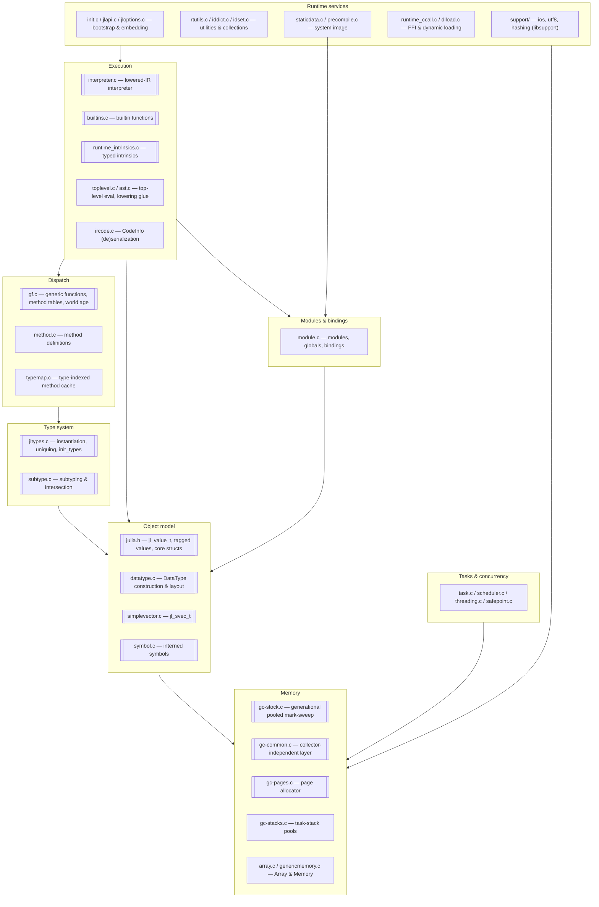
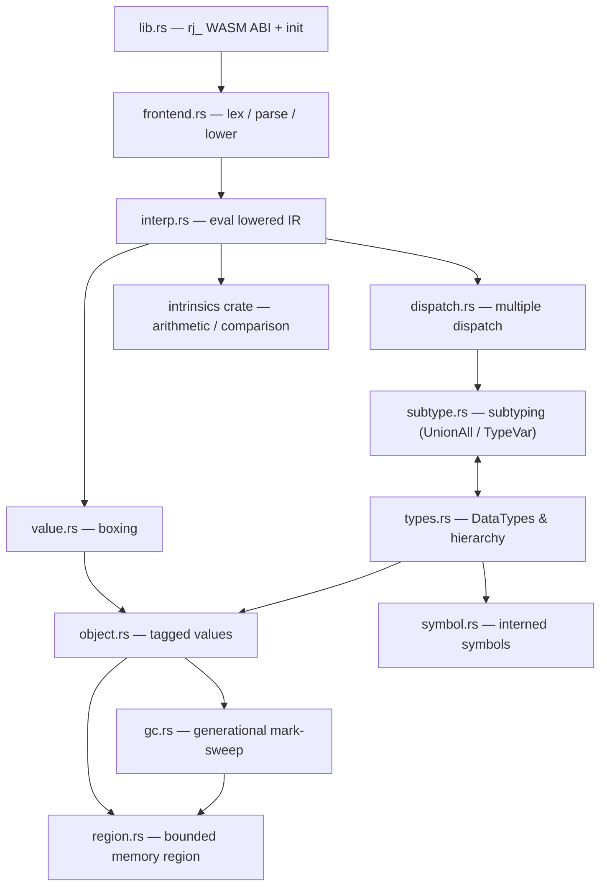
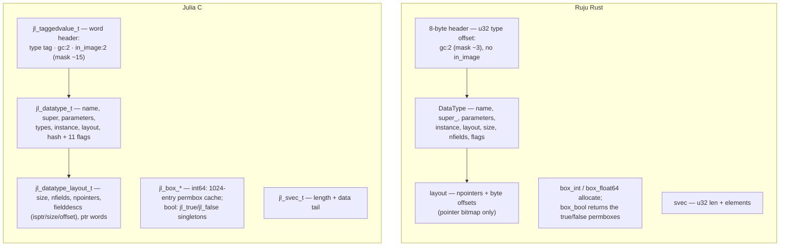
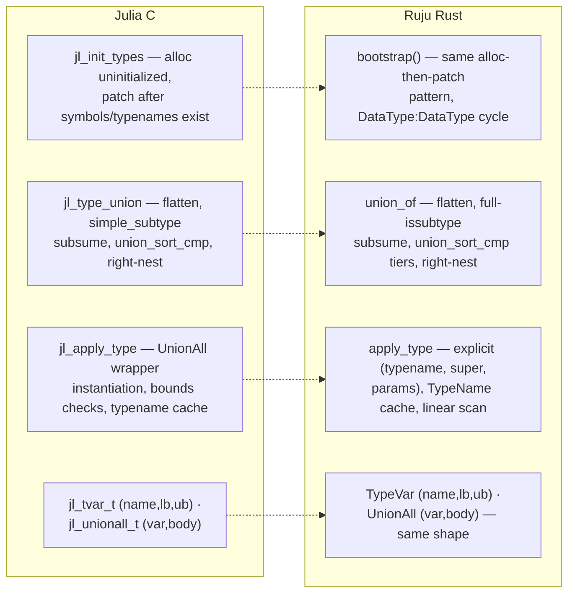
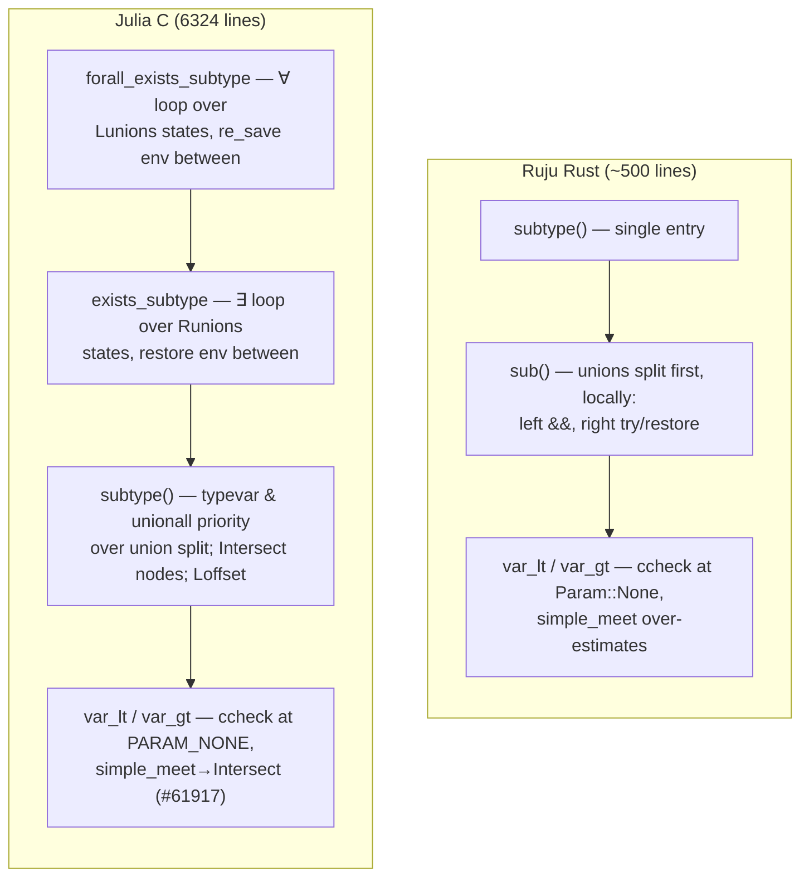
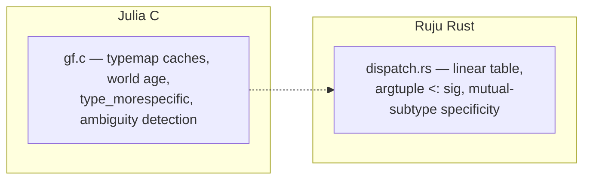
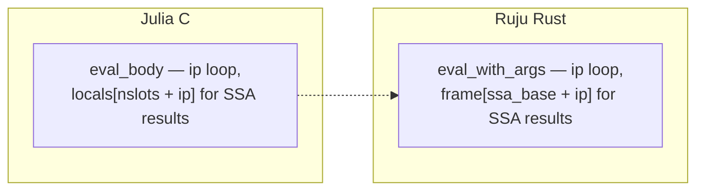
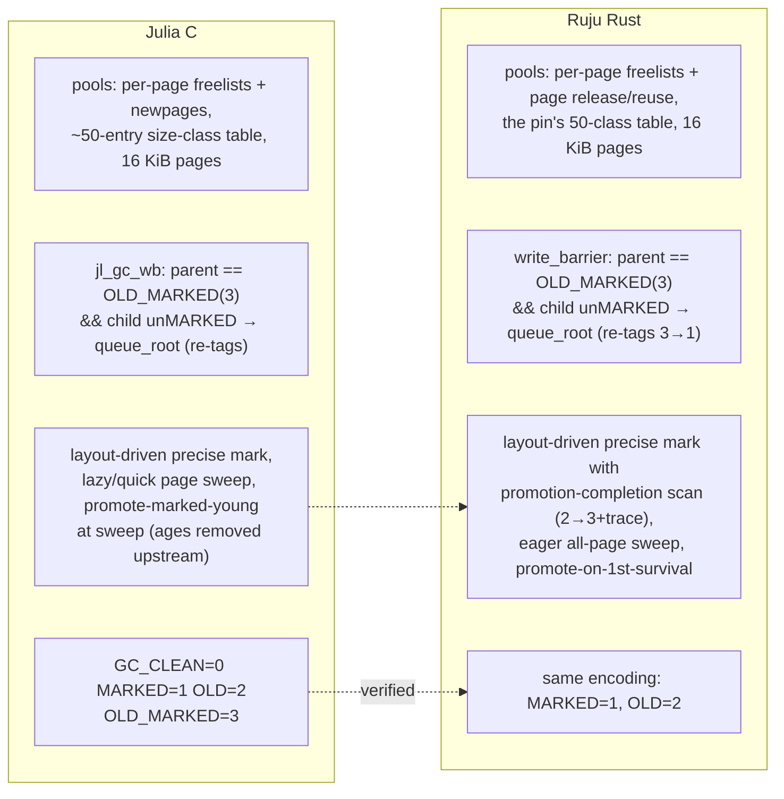

# Implementation

Where we are: the per-module comparison of Julia's C/C++ runtime
(`reference/julia/src/`, pinned at the commit in `reference/README.md`)
against Ruju's Rust reimplementation. This is the evidence ledger — every
**Done · Faithful** row is backed by a reference-verified comparison
recorded here.

Each module section carries: the side-by-side C-vs-Rust mini-maps (where the
Rust port has begun), the status table, and the audit findings with their
line citations. Sections for modules not yet started carry the C side alone —
an empty right column is itself information.

**Contents:**
[How to read the status tables](#how-to-read-the-status-tables) ·
[The shape of Julia's C runtime](#the-shape-of-julias-c-runtime) ·
[The shape of Ruju's runtime](#the-shape-of-rujus-runtime) ·
[Audit record](#audit-record)

**Modules:**
[Object model & values](#object-model--values--juliah-datatypec-simplevectorc-vs-objectrs-valuers) ·
[Type system](#type-system--jltypesc-datatypec-vs-typesrs) ·
[Subtyping](#subtyping--subtypec-vs-subtypers) ·
[Method dispatch](#method-dispatch--gfc-typemapc-vs-dispatchrs) ·
[Interpreter](#interpreter--interpreterc-vs-interprs) ·
[Builtins](#builtins--builtinsc-vs-builtinsrs) ·
[Intrinsics](#intrinsics--runtime_intrinsicsc-vs-intrinsics-crate) ·
[Garbage collector](#garbage-collector--gc-stockc-gc-commonc-gc-pagesc-gc-stacksc-vs-gcrs-regionrs) ·
[Symbols](#symbols--symbolc-vs-symbolrs) ·
[Tasks & concurrency](#tasks--concurrency--taskc-threadingc-schedulerc-safepointc) ·
[Modules & top level](#modules--top-level--modulec-toplevelc) ·
[Runtime utilities](#runtime-utilities--rtutilsc-iddictc-idsetc-smallintsetc) ·
[IR & methods](#ir--methods--ircodec-methodc-opaque_closurec) ·
[Arrays & memory](#arrays--memory--arrayc-genericmemoryc) ·
[Serialization & system image](#serialization--system-image--staticdatac-precompilec) ·
[Init & C API](#init--c-api--initc-jlapic-jloptionsc-enginec) ·
[Front-end](#front-end-parsing--lowering--astc-juliasyntax-julialowering-vs-frontendrs) ·
[FFI](#ffi--runtime_ccallc) ·
[AOT backend](#aot-backend-phase-1--replaces-removed-codegencppjitlayerscpp) ·
[Platform & support](#platform-profiling--support--dlloadc-sysc-timingc-srcsupport)

## How to read the status tables

Two independent axes per piece:

- **Status** — how much exists: **Planned** (nothing yet) · **Partial**
  (present but incomplete) · **Done** (complete for what it covers).
- **Fidelity** — its relationship to Julia: **Faithful** (Julia's *design*,
  even if simplified or incomplete — same shape, possibly less of it) ·
  **Divergence** (a *deliberately different* design, for the WASM target or
  the composable-memory model).

A *simplification* is **Faithful + Partial**, not a divergence. "Done ·
Faithful" means *reference-verified* (`methodology.md`), not "tests pass" —
audits found the difference matters. When unsure, read the file named in the
section heading.

**Global conventions (project-wide divergences, stated once).** Every piece
below assumes these and does not repeat them; a row is **Divergence** only
for a departure *beyond* them.

- References are region-relative **offsets**, not native pointers (bounded,
  composable memory).
- A single bounded heap **region**; exported symbols are `rj_`-prefixed.
- **Single-threaded** for now (the `Sync` on global state relies on it).

## The shape of Julia's C runtime

Julia's `src/` divides into nine subsystems. Arrows point from a subsystem to
what it depends on. Double-bordered nodes are the ones Ruju's phase-0 runtime
reimplements (in whole or in part).

Not present in the vendored reference: `codegen.cpp` and `jitlayers.cpp` —
upstream Julia's LLVM JIT — which Ruju replaces with the planned build-time
AOT backend (a recorded divergence). The C runtime's layering is the porting
order: nothing above the object model works unless the object model is exact.

## The shape of Ruju's runtime

How the Rust modules fit together today. `runtime/` is conceptually the
replacement for `reference/julia/src/`.

| Module | Role |
| - | - |
| `lib.rs` | the `rj_`-prefixed WASM ABI and runtime initialization |
| `frontend.rs` | hand-written bootstrap lexer / parser / lowering for a subset of Julia source |
| `interp.rs` | tree-walking interpreter over lowered IR |
| `dispatch.rs` | multiple dispatch — method table, applicability, specificity |
| `subtype.rs` | subtyping, including the `where` machinery (`UnionAll` / `TypeVar`) |
| `types.rs` | `DataType`s, the type hierarchy, tuples / unions / parametrics, uniquing |
| `value.rs` | boxing and unboxing of primitive values |
| `object.rs` | the tagged-value model — every object headers its `DataType` |
| `symbol.rs` | interned (immortal) symbols |
| `gc.rs` | generational, pooled mark-sweep GC with shadow-stack rooting |
| `region.rs` | the single bounded region of WASM linear memory (offset-based references) |
| `intrinsics` (crate) | pure arithmetic and comparison intrinsics |

---

## Object model & values — `julia.h`, `datatype.c`, `simplevector.c` vs `object.rs`, `value.rs`

**Reference-verified (audit 2026-06).** Tagged header design (tag-before-
object, GC bits in the low header bits, `type_of` by masking); `jl_svec_t`
shape; the DataType-field subset claim; singletons via `instance`; the
freelist threaded through the header word exactly mirrors
`jl_taggedvalue_t`'s `next` union.

**Audit findings.**
1. ~~Bool boxing identity gap~~ — **fixed**: `box_bool` returns the
   `jl_true`/`jl_false` permboxes allocated at bootstrap (`jl_box_bool`,
   `datatype.c:1642`). The `±512` `jl_box_int64` permbox cache is still
   absent.
2. `jl_set_typeof` stores the whole header word; Ruju's `set_type` preserves
   GC bits — safer, benign, recorded.
3. Julia reserves 4 low header bits (`gc:2`, `in_image:2`); Ruju reserves 2
   (no system image yet). Part of the offset adaptation.
4. `object::alloc`'s collect-on-exhaustion retry is the documented trigger
   placeholder, not "Julia's behavior" as its comment claims.

| Piece | Status | Fidelity | Notes (Julia → ours) |
| - | - | - | - |
| Tagged header (tag-before-object, GC bits) | Done | Faithful | `jl_taggedvalue_t` |
| `DataType` struct | Partial | Faithful | ~8 of `jl_datatype_t`'s ~17 fields (incl. `types`, `instance`); `TypeName` gains `names` + `mutabl` (structs 2026-06) |
| Field layout | Partial | Faithful | `jl_compute_field_offsets` core (structs 2026-06), **reference-verified against the `datatype.c:735–833` body** — verification found and fixed two divergences in the first draft: a field aligns to its *type's* alignment (a struct's = max of its fields', not its size), and the total size pads to the struct alignment so nested inline copies are exact. Per-field offset/size/isptr descriptors after the GC's `[npointers, offsets]` prefix; inline pointer-free isbits fields, references otherwise. Omitted: inline isbits unions (selector bytes), inline immutables containing pointers (`first_ptr`/`hasptr`), atomics, `n_uninitialized`, `haspadding`/`isbitsegal` tracking (needed when struct egal arrives) |
| Boxing | Partial | Faithful | every primitive width except `Int128`/`UInt128`/`Float16` (intrinsics 2026-06); `Bool` boxes are the `jl_true`/`jl_false` permboxes (fixed, audit 2026-06); no permbox caches for ints/chars |
| `SimpleVector` | Done | Faithful | `jl_svec_t` |
| Singletons | Done | Faithful | `jl_datatype_t.instance`: `nothing` lives in `Nothing.instance`; zero-size pointer-free structs get an eager instance (`jl_compute_field_offsets`) |

## Type system — `jltypes.c`, `datatype.c` vs `types.rs`

**Reference-verified (audit 2026-06).** The bootstrap pattern matches
`jl_init_types`; the hierarchy and primitive sizes match `boot.jl` exactly;
tuple identification by shared `TypeName` matches `jl_tuple_typename`;
`TypeVar`/`UnionAll` object shapes match `jl_tvar_t`/`jl_unionall_t`; union
normalization has the right overall algorithm.

**Audit findings.**
5. ~~Union canonical order missed Julia's tiers~~ — **fixed**: `type_cmp`
   now implements `union_sort_cmp`'s tiers (singletons, then isbits, then
   other DataTypes, then UnionAlls) over the `name_cmp` tie-break.
6. Julia does *not* intern unions; `===` on types is structural
   (`jl_types_egal`). The gap is a missing `types_egal`, not a missing cache.
7. During normalization the C subsumption check uses `simple_subtype`
   (typevar-aware, deliberately weaker); Ruju calls full `issubtype`
   unconditionally — wrong in principle when members carry free typevars.
8. `apply_type` takes an explicit supertype (callers pass `Any`); Julia
   instantiates the wrapper's declared super with the parameters
   (`inst_type_w_` on `dt->super`, `jltypes.c:2554–2555`).
9. The primitive tower omits `BFloat16 <: AbstractFloat` (in `boot.jl`).

| Piece | Status | Fidelity | Notes |
| - | - | - | - |
| `jl_init_types` bootstrap | Done | Faithful | incl. the `DataType : DataType` cycle |
| Hierarchy & primitive sizes | Done | Faithful | verified vs `boot.jl` |
| `TypeName` | Partial | Faithful | name + cache; missing module/wrapper/names/hash |
| `apply_type` instantiation | Partial | Faithful | tuples + parametrics; `UnionAll` instantiation via `instantiate_unionall`/`inst_type` (`jl_instantiate_unionall`/`inst_type_w_`, `jltypes.c:1606,2752`, varargs-era 2026-07): single-variable substitution over typevars, nested `UnionAll` (with bound-var remap), `Union`, `Vararg`, and datatype/tuple parameters, re-uniquing rebuilt parametrics. Omitted: the recursive-type stack, `check`/`nothrow` bound validation, and parametric-supertype re-instantiation (nominal supers carried through unchanged — our demo parametrics are `Any`-supered) |
| Uniquing (hash-consing) | Partial | Faithful | on `TypeName`; linear scan vs sorted/hashed |
| `Union` | Partial | Faithful | normalized (`jl_type_union`): flatten, subtype-dedup, canonical sort with `union_sort_cmp`'s singleton/isbits tiers (fixed, audit 2026-06); dedup uses full `issubtype` vs the C's typevar-aware `simple_subtype`; type `===` needs structural `jl_types_egal` (Julia does **not** intern unions — `jl_type_union` builds fresh structs, `jltypes.c:706,759`); no `Vararg` merge |
| `Bottom` | Partial | Faithful | a `DataType`; Julia uses a `TypeofBottom` instance (`jl_typeofbottom_type`, `jltypes.c:651`) |
| `UnionAll` / `TypeVar` | Partial | Faithful | `jl_unionall_t`/`jl_tvar_t` objects (var + bounds + body); no `where`-var renaming/aliasing or `innervars` |
| `Type{T}` kinds | Planned | Faithful | — |
| Abstract `Tuple` (`jl_anytuple_type`) | Planned | Faithful | tuple super is `Any` for now |

## Subtyping — `subtype.c` vs `subtype.rs`

**Reference-verified (audit 2026-06).** The `jl_stenv_t`/`jl_varbinding_t`
mapping is real: per-var `lb`/`ub` narrowing through
`simple_meet`/`simple_join`, the `existential` flag as Julia's `R`,
`depth0`-ordered ∀∃-vs-∃∀ handling, the ∃∃ inner-most-variable rule
(`var_outside`), and the consistency-scope machinery (`occurs_cov`/
`cov_diag` mirror `push/pop_consistency_scope`).

**Audit findings.**
10. ~~Two free typevars consulted bounds~~ — **fixed**: unconditionally
    false, as `subtype.c:1970`.
11. **Dispatch-order divergences (open).** Julia gives typevar-left and
    UnionAll-left priority over splitting a right-side union, and has a
    typevar-right fast path before splitting a left union; Ruju splits
    unions first, unconditionally. Changes which bounds get recorded.
12. ~~`ccheck` ran at the caller's param~~ — **fixed**: enters at
    `Param::None`, as `subtype_ccheck` does.
13. ~~`forall_exists_equal` reverse direction at Invariant~~ — **fixed**:
    reverse at `Param::None` + the same-name-datatype fast path; the
    two-union greedy path is still absent.
14. **The pinned C has moved past the port (open).** The vendored
    `subtype.c` carries the `Intersect` meet node (#61917),
    `push_forall_bound_scope`, and `Loffset` — machinery absent from
    `subtype.rs`.
15. Oracle coverage: 24 → 53 assertions (post-audit expansion), which
    immediately caught a fourth bug — the diagonal rule rejected typevar
    lower bounds, breaking UnionAll alpha-equivalence (**fixed** per
    `subtype.c:1404–1419`; `concrete`-flag propagation still absent).

Oracle: `runtime/verify_julia_subtype.mjs` runs assertions copied verbatim
from JuliaLang/julia's own `test/subtype.jl` (mapping `Ref{T}`→`Box{T}`,
`Int`→`Int64`) — currently 87/87 (all 2026-07): the unbounded-varargs slice
added 19 cases (`test/subtype.jl:43–59,587–594`), the two-parameter `Pair`
constructor added 8 invariant/`where`/diagonal cases (`:206–271`), and a
curated expansion added 7 more bounded-typevar and diagonal `test_3` cases
(`:205,214,238,241,264,267,273`) plus 2 passing tuple-over-union cases
(`:413,416`) — all expressible with the existing ABI and passing on the current
engine, so they widen coverage without new code. Plus **2** tracked known
divergences, both tuple-over-union distributivity (`:371` and `:410` — the
latter, `Tuple{Union{…}} <: Tuple{Ref{T}} where T`, added 2026-07): each needs
a per-union-branch choice the global union-decision machine makes but local
backtracking cannot; both self-report if a fix makes them pass.

| Piece | Status | Fidelity | Notes |
| - | - | - | - |
| `jl_subtype` structural core | Partial | Faithful | reflexive/`Any`/`Bottom`, Union forall–exists, covariant tuples (incl. an unbounded-`Vararg` tail — `subtype_tuple`/`subtype_tuple_tail`/`subtype_tuple_varargs` length classification + tail walk, `subtype.c:1740–1899`, varargs slice 2026-07), nominal, invariant parametrics, `UnionAll`/`TypeVar` via the env. Audit 2026-06 fixes landed: free-vs-free typevars now unconditionally false; `forall_exists_equal` reverse check at `PARAM_NONE` + same-name-datatype fast path. Remaining divergences: unions split before typevar/UnionAll handling (Julia prioritizes the latter, `subtype.c:1934–1948`); no two-union greedy path; local union backtracking vs the global decision machine (see oracle's known divergence) |
| Existential env (`jl_stenv_t`) | Partial | Faithful | `var_lt`/`var_gt` narrow per-var `lb`/`ub`; ∀/∃ via the `existential` flag; `invdepth`/`depth0` order interacting existentials (`var_outside`, ∀∃-vs-∃∀). No `where`-var renaming or `innervars` leak handling |
| Diagonal rule | Partial | Faithful | `occurs_cov` + `cov_diag` consistency-scope folding (`subtype_ccheck`), static `var_occurs_invariant`, `is_leaf_bound`; `ccheck` enters at `PARAM_NONE` (fixed, audit 2026-06); typevar lower bounds accepted (fixed — Julia also propagates `concrete=1` to that var, `subtype.c:1411–1415`, which we still don't); pinned C has newer machinery the port predates (`Intersect` #61917, `push_forall_bound_scope`, `Loffset`) |
| Union backtracking | Partial | Faithful | env save/restore on the exists branch; not Julia's `Lunions`/`Runions` bit-stack iterator (`forall_exists_subtype`, `subtype.c:2383`) |
| `simple_meet` / `simple_join` | Partial | Faithful | join defers to the normalized `union_type` (keeps free vars, so `S>:T` survives); meet over-estimates to `b` for typevar operands (no `Intersect` node) |
| `jl_type_intersection` | Planned | Faithful | — |
| `jl_type_morespecific` | Partial | Faithful | subtype-based approximation |
| Varargs | Partial | Faithful | unbounded `Vararg{T}` in tuple tails (varargs slice 2026-07): its own `jl_vararg_t`-analog value kind (element `T@0`, `N` absent), the `subtype_tuple` length classification (`JL_VARARG_UNBOUND` vs `NONE`) and `subtype_tuple_tail`/`subtype_tuple_varargs` walk (`subtype.c:1740–1899`), and a `Vararg` arm in `var_occurs_invariant`. Omitted: bounded `Vararg{T,N}` (the `INT`/`BOUND` kinds, `N` length algebra, `check_vararg_length`), vararg uniquing, and the repeated-element/separable tail fast paths |
| Fast paths (`obviously_egal`) | Planned | Faithful | — |

## Method dispatch — `gf.c`, `typemap.c` vs `dispatch.rs`

**Audit finding.**
16. The old "Julia uses type intersection" note was imprecise: for a
    concrete argument tuple, runtime dispatch *is* subtype-based (against
    typemap caches); intersection serves abstract match queries and
    ambiguity detection.

| Piece | Status | Fidelity | Notes |
| - | - | - | - |
| Method table | Partial | Faithful | Rust-side table; Julia's is heap `jl_methtable_t` (`julia.h:979`) |
| Applicability | Partial | Faithful | `argtuple <: sig` — matches Julia's concrete-tuple dispatch (`jl_typemap_assoc_exact`, `gf.c:3259`; intersection serves match queries/guards, `gf.c:1149`); missing: typemap cache, world age |
| Specificity | Partial | Faithful | subtype-based |
| Method cache (`typemap`) | Planned | Faithful | linear scan per call now |
| World age | Planned | Faithful | — |
| Ambiguity / `MethodError` | Planned | Faithful | first match; `NULL` on miss |
| `@generated`, kwargs, vararg methods | Planned | Faithful | — |

## Interpreter — `interpreter.c` vs `interp.rs`

**Reference-verified (audit 2026-06).** The `eval_body` instruction-pointer
loop and the slots-then-SSA-values single-frame layout match the C exactly
(`locals[jl_source_nslots + ip]` ↔ `frame[ssa_base + ip]`).

| Piece | Status | Fidelity | Notes |
| - | - | - | - |
| `eval_body` loop | Done | Faithful | instruction-pointer loop |
| Statements (`Goto`/`GotoIfNot`/`Return`/`:call`/`:(=)`) | Partial | Faithful | `GotoIfNot` skips the `Bool` `TypeError` (`interpreter.c:505–507`); a builtin error (`DivideError`) now diverts to the innermost active handler's catch block, else propagates as a `Result` eval error (exceptions slice 1, 2026-07) |
| Operands (SSA / slot / const) | Done | Faithful | — |
| Phi / phic / upsilon | Planned | Faithful | SSA-form nodes |
| Exception handling (`enter`/`leave`) | Partial | **Divergence** | control flow + value binding ported (exceptions slices 1–2, 2026-07): `Enter`/`Leave` + an explicit handler stack, and `Throw`/`Caught` for `throw`/`catch e` — a thrown value diverts to the innermost handler's catch destination and is bound there via `Caught` (`Expr(:the_exception)`), held in a rooted frame cell across the catch block (`EnterNode`/`:leave`/`jl_throw`/`jl_current_exception`, `interpreter.c:521,608`). the front-end lexes/parses/lowers `try <body> catch <handler> end` to these statements (exceptions slice 3), so a `DivideError` inside a `try` is recovered in the `catch` **end-to-end from source through WASM** (`harness.mjs`). **Divergence** because WASM has no `setjmp`/`longjmp` — the C's per-handler `jl_setjmp` + recursive `eval_body` becomes a handler stack + catch-dest jump in the single ip-loop (the shape compiled code will reuse, per the AOT carry-forward ledger). Omitted for later slices: `throw` and `catch e` from *source* (the interpreter `Throw`/`Caught` exist; only the syntax is unwired), reifying builtin errors (`DivideError`) as exception *objects* (they divert control but bind no value), the exception stack (`pop_exception`/nested rethrow), `finally`, and scoped `EnterNode`s |
| `:new` / `getfield` / `setfield!` / globals / closures | Partial | Faithful | `New`/`GetField`/`SetField` statements over the slice-1 runtime core (structs 2026-06); field resolution by interned symbol at run time; globals and closures still Planned |
| IR source | Partial | **Divergence** | hand-built Rust IR via a Rust front-end; faithful path is heap `CodeInfo` from `JuliaLowering` |

## Builtins — `builtins.c` vs `builtins.rs`

**Reference-verified (2026-06, egal increment).** `egal` ports `jl_egal_`
(`julia.h:1877`) → `jl_egal__unboxed_` (`julia.h:1866`: symbols, `Bool`,
`Nothing`, mutables compare by identity only — sound because of interning,
the permboxes, and `instance`) → `jl_egal__bitstag` (`builtins.c:247`:
payload bits by width, svec elementwise, DataType name+parameters, `Union`
componentwise, `UnionAll` via `egal_types` with `tvar_names = 1`).
`types_egal` ports `egal_types` (`builtins.c:169`) with the typevar
environment; `jl_types_egal` (`builtins.c:230`) is the `tvar_names = 0`
entry — so `===` on `where` types is name-sensitive while structural type
equality is alpha-equivalent, and the tests pin that asymmetry. The
front-end lexes `===` to the egal builtin (any values, no unboxing).

| Piece | Status | Fidelity | Notes |
| - | - | - | - |
| `typeof`, `<:` | Partial | Faithful | via the ABI |
| `===` (`jl_egal`), `jl_types_egal` | Partial | Faithful | implemented for every value kind that exists (primitives by bits — NaN egal, ±0.0 not; identity-only kinds; svec; types; `where` alpha-equivalence). Omitted with the values that don't exist yet: strings, struct fields (`compare_fields`), `Vararg`, `TypeEq`, modules, `object_id`; the concrete-DataType fast path is skipped (uniquing reaches the same answer through parameters) |
| `isa` | Planned | Faithful | — |
| `getfield`/`setfield!`/`nfields`/`fieldtype` | Partial | Faithful | runtime core landed (structs 2026-06): `new_struct` (`jl_new_structv`, `datatype.c:1675` — arity + `isa` checks, singleton return), `get_nth_field` (`datatype.c:1854` — inline bits re-boxed via `jl_new_bits`), `set_nth_field` (`datatype.c:1912` — barrier on references; immutability error per `get_checked_fieldindex`, `builtins.c:1031`), field lookup by interned name. Errors travel the eval `Result` channel. Interpreter/front-end wiring is slice 2; egal on struct values (`compare_fields`) still absent |
| `tuple`, `apply`, `invoke`, array builtins | Planned | Faithful | `invoke`-like dispatch exists |

## Intrinsics — `runtime_intrinsics.c` vs `intrinsics` crate

**Reference-verified (audit 2026-06).** Wrapping two's-complement
`add_int`/`sub_int`/`mul_int`, signed comparisons, IEEE-754 float ops —
match `runtime_intrinsics.c` for the implemented subset.

| Piece | Status | Fidelity | Notes |
| - | - | - | - |
| Integer arithmetic | Partial | Faithful | `add/sub/mul/neg` wrapping; `checked_sdiv/srem` with Julia's `DivideError` conditions (`runtime_intrinsics.c:1251` — the throw is the interpreter's, via the eval error channel); `slt/sle/ult/ule/eq`; i64 width only (intrinsics 2026-06) |
| Bitwise / shifts | Partial | Faithful | `and/or/xor/not`; `shl/lshr/ashr` with the exact count-overflow semantics (`runtime_intrinsics.c:1569–1574`: ≥ width → 0 / sign word); i64 only |
| Float arithmetic & compare | Partial | Faithful | `add/sub/mul/div/neg` + `rem_float` (= `fmod`) + `lt/le/eq` |
| Conversions (`sitofp`, `trunc`, …) | Partial | Faithful | `sitofp`/`fptosi` (i64↔f64). `fptosi` on out-of-range input: the C casts (implementation-defined; Julia documents "an arbitrary value", `base/float.jl:401`); we chose Rust's saturating cast (NaN → 0) — a permitted choice, but **unverified against Julia's actual output**; add an oracle case when conversions reach surface syntax (intrinsics 2026-06). `trunc/sext/zext/bitcast` later |
| Pointer / memory intrinsics | Planned | Faithful | — |
| Operator → intrinsic dispatch | Partial | Faithful | type-switched in `apply`; `/` converts integer operands via `sitofp` (Julia's `base/` promotion, `base/int.jl:95–97`); faithful is generic-function operators over the typed intrinsics |

## Garbage collector — `gc-stock.c`, `gc-common.c`, `gc-pages.c`, `gc-stacks.c` vs `gc.rs`, `region.rs`

**Reference-verified (audit 2026-06).** Generational state encodings match
exactly; precise layout-driven marking; non-moving design; shadow-stack
rooting as the mandatory `JL_GC_PUSH`/`JL_GC_PUSHARGS` analog; freelist
threaded through the header word = `jl_taggedvalue_t.next`.

**Audit findings (three Done·Faithful rows downgraded; 18–19 open, =
strategy's "GC exactness & tuning" frontier item).**
17. ~~Write barrier condition differed in both halves~~ — **fixed (GC
    exactness slice 1, 2026-06)**: the exact four-state machine of
    `gc-stock.c:164–191` — barrier on parent `== 3` with child unMARKED,
    `queue_root` re-tag (3→1, the at-most-once guard), remset restore to 3
    with trace at mark start, promotion-completion scan (2→3+trace) in every
    mark, quick sweeps leaving 2/3 untouched, full sweeps demoting 3→2 with
    the one-full-cycle lag for old garbage. A state-machine test pins every
    transition.
18. ~~Pool allocation constants and structure were placeholders~~ — **largely
    fixed (GC tail slice B, 2026-06)**: the pin's table, 16 KiB pages,
    per-page freelists, `pagemeta`, page release/reuse; deferred-sweep
    allocation and `newpages` remain. Original finding: 16 KiB
    default pages vs 4 KiB; ~50-entry size-class table vs 12-entry
    geometric; per-page freelists + `newpages` + `pagemeta` vs one global
    freelist per class.
19. ~~Sweeping was eager~~ — **fixed (GC tail slice B, 2026-06)**: page
    release, the settled-page skip, and the walked-page protocol landed;
    only on-demand (allocation-time) sweeping remains.

| Piece | Status | Fidelity | Notes |
| - | - | - | - |
| Pool allocation (size classes, pages, free lists) | Partial | Faithful | the pin's exact size-class table (`jl_gc_sizeclasses`, `julia_internal.h:544–586`, the 32-bit `MAX_ALIGN > 4` branch — 50 classes to 2032) and 16 KiB pages (`gc-stock.h:47–49`); per-page freelists threaded through header words, with whole-page release and cross-class reuse (GC tail slice B, 2026-06). Remaining: Julia's allocation-time deferred freelist build (`fl_begin`/`fl_end` lazy sweeping) and the `newpages` bump path; oversize > 2032 now takes the big-object path (slice C) |
| Big-object path | Done | Faithful | the young/oldest bigval generations (`jl_gc_big_alloc_inner`, `gc-stock.c:436–465`; `sweep_big`, `:495–560`): the young list is walked every sweep under the same promote/demote rule as pages; quick sweeps park `OLD_MARKED` bigvals on the oldest list and never visit it; full sweeps demote it wholesale and merge it back to be re-proven. Rust-side vectors stand in for the C's intrusive links (a representation choice, as with the symbol table); freed blocks recycle first-fit because the bump region cannot reclaim arbitrary ranges (GC tail slice C, 2026-06) |
| Precise marking | Done | Faithful | type-layout driven |
| Sweeping (page walk, free-list rebuild) | Partial | Faithful | the pin's page protocol (GC tail slice B, 2026-06): whole-page release on `!has_marked` (`gc-stock.c:882–887`, the flag persisting between walks), the quick-sweep skip of settled all-old pages (`:890–897`, `prev_nold == nold` discipline), and walked pages freeing every unmarked cell — quick sweeps included (`:925–933`), closing the earlier keeps-unmarked-old divergence (sound because the remset machinery guarantees live olds on walked pages are marked). Mark-side `pagemeta` (`has_marked`/`has_young`/`nold`) maintained per `gc_setmark_pool_` (`:291–309`). Remaining: allocation-time deferred sweeping (pages swept on demand rather than at collection) |
| Non-moving collection | Done | Faithful | the stock GC is non-moving too |
| Generational state encodings | Done | Faithful | `GC_CLEAN/MARKED/OLD/OLD_MARKED`, verified |
| Promotion policy | Done | Faithful | promote-marked-young at sweep **is the pin's design** (`gc-stock.c:935–937`: `current_sweep_full \|\| bits == GC_MARKED → GC_OLD`) — the pin removed `PROMOTE_AGE` and the per-object age arrays; only the stale comment at `:196` describes the old design. The previous row note ("Julia uses `PROMOTE_AGE` + per-object age") was ported from memory of older Julia, not the pin — corrected, GC slice 2, 2026-06 |
| Write barrier + remembered set | Done | Faithful | exact `jl_gc_wb` (`gc-wb-stock.h:14`) + `jl_gc_queue_root` (`gc-stock.c:1493`): fires on parent `== GC_OLD_MARKED` with child unMARKED; re-tag 3→1 is the at-most-once guard; remset cleared at mark start with entries restored to 3 and traced (`gc_queue_remset`, `:2828`), then **rebuilt** during marking — any scanned old object with a young-at-scan-time reference is re-pushed (`gc_mark_push_remset`, `:1613`, the `nptr == 0x3` rule). After a quick sweep, entries are put back in the *queued* state, `GC_MARKED` (`:3405–3414`), so the barrier cannot refire on them — slice 2's note claimed duplicates were "tolerated, as in the pin"; the pin in fact *prevents* barrier-after-scan duplicates via this re-queue (corrected, slice A). Full sweeps clear the remset outright (`:3415`). Slices 1–2 + tail A, 2026-06 |
| Collection trigger | Partial | Faithful | proactive at the heap target, checked at allocation (`heap_size >= heap_target`, `gc-stock.c:356`); the target is live size + `overallocation` growth (`:3032–3050`, ported) floored at `default_collect_interval` scaled to the region (`:33–35`). Julia's MemBalancer rate machinery behind `target_allocs` omitted (GC tail slice A, 2026-06); exhaustion collect-and-retry remains the backstop |
| Full-vs-quick policy | Done | Faithful | the pin's predicates (`gc-stock.c:3377–3400`): full next when promoted bytes since the last full sweep exceed 0.15 of the heap, or the heap outgrew the post-full baseline by `overallocation`; `user_max`/`under_pressure` omitted — no CLI options (GC tail slice A, 2026-06) |
| Shadow-stack rooting (`gcframe`) | Done | Faithful | — |
| Machine-stack scanning | n/a | **Divergence** | impossible in WASM; the shadow stack is *mandatory* instead |
| Safepoints | Partial | Faithful | trivial (single-threaded); multithreaded protocol later |
| Finalizers | Planned | Faithful | includes `mark_reset_age` (`gc-stock.c:3165–3172`): objects reachable only from `to_finalize` are reset as-if-new — finalizer-only machinery, lands here |
| Weak references | Planned | Faithful | — |
| Heap snapshot / alloc profiler | Planned | Faithful | tooling |

## Symbols — `symbol.c` vs `symbol.rs`

**Audit finding.**
20. Julia interns into a hash-keyed **invasive binary tree** living inside
    each `jl_sym_t` (`left`/`right`/`hash` fields), not a "hashed table" as
    the old note said; Ruju's side-table design also means the symbol object
    layout differs.

| Piece | Status | Fidelity | Notes |
| - | - | - | - |
| Interned, immortal symbol table | Partial | Faithful | immortal ✓; a Rust `Vec` (linear) vs Julia's hash-keyed invasive binary tree embedded in `jl_sym_t` (`left`/`right`/`hash`) — our symbol body is `len + bytes`, no embedded tree links |

## Tasks & concurrency — `task.c`, `threading.c`, `scheduler.c`, `safepoint.c`

| Piece | Status | Fidelity | Notes |
| - | - | - | - |
| Tasks (coroutines) | Planned | **Divergence** | WASM has no native stack switch (needs asyncify / the stack-switching proposal) |
| Threading | Planned | **Divergence** | WASM threads = SharedArrayBuffer + workers, a different model |
| Scheduler | Planned | Faithful | — |
| Locks / atomics | Planned | Faithful | WASM atomics exist |

## Modules & top level — `module.c`, `toplevel.c`

| Piece | Status | Fidelity | Notes |
| - | - | - | - |
| Modules & bindings | Planned | Faithful | — |
| Global variables | Planned | Faithful | — |
| Top-level eval | Partial | Faithful | the front-end evaluates expressions; no module/global system |
| Imports / exports | Planned | Faithful | — |

## Runtime utilities — `rtutils.c`, `iddict.c`, `idset.c`, `smallintset.c`

| Piece | Status | Fidelity | Notes |
| - | - | - | - |
| Error / exception throwing | Planned | Faithful | — |
| Display / printing (`jl_show`) | Planned | Faithful | — |
| Internal hash collections | n/a | **Divergence** | Rust `std` collections used internally instead of Julia's C IdDict/IdSet |

## IR & methods — `ircode.c`, `method.c`, `opaque_closure.c`

| Piece | Status | Fidelity | Notes |
| - | - | - | - |
| `CodeInfo` (de)serialization | Planned | Faithful | — |
| Method definitions (`jl_method_t`) | Partial | Faithful | Rust-side method bodies |
| OpaqueClosure | Planned | Faithful | — |

## Arrays & memory — `array.c`, `genericmemory.c` vs `memory.rs`

| Piece | Status | Fidelity | Notes |
| - | - | - | - |
| `GenericMemory` | Partial | Faithful | core landed (arrays slice 1, 2026-07), `memory.rs`: the `jl_genericmemory_t` shape `[length, ptr]` + inline data with `ptr` a real field aimed at the object's own body — the C's pooled path (`jl_alloc_genericmemory_unchecked`, `genericmemory.c:41–52`); overflow-checked, **explicitly zero-initialized** allocation (`_new_genericmemory_`, `:56–74` — a recycled chunk carries stale bytes, so the `memset` is load-bearing for boxed slots); `memoryrefget`/`memoryrefset` for the non-atomic subset (`:343,446`): boxed elements by reference with `UndefRefError` on unset and the **write barrier on the memory object** on store (`:463`), primitive-bits elements inline with `jl_new_bits` re-box on read, zero-size singletons via `instance` (`:361–364`); element-type `isa` check on set; GC marks boxed elements via the typename special-case exactly as `gc-stock.c:2412,2448–2456` (remset/`has_young_ref` flow through the same path, so old-memory→young-element edges work — pinned by a promote-then-store test). The buffer lives in linear memory in Julia's layout — the arrays carry-forward constraint (`design/roadmap.md`) is **honored**: element access is `region[ptr + i*elsz]`. Simplified: data always inline (no `MALLOCD`/string-owned buffers in the bounded region); inline storage for *primitive* isbits only (isbits structs/tuples/unions stay boxed); single type parameter (kind fixed `:not_atomic`, addrspace CPU); no zero-length singleton instance; no `memoryref` object (`jl_genericmemoryref_t`) — get/set take `(mem, i)` directly |
| `Array` | Planned | Faithful | the `jl_array_t` wrapper (`ref + dimsize`) over `GenericMemory`; growth (`push!`) lands here |
| `arrayref`/`arrayset`/`length`/`push!` | Planned | Faithful | over the landed memory core |

## Serialization & system image — `staticdata.c`, `precompile.c`

| Piece | Status | Fidelity | Notes |
| - | - | - | - |
| System image | Planned | **Divergence** | Ruju's "image" is the AOT-compiled artifact — a different model |
| Precompilation / package images | Planned | Faithful | — |

## Init & C API — `init.c`, `jlapi.c`, `jloptions.c`, `engine.c`

| Piece | Status | Fidelity | Notes |
| - | - | - | - |
| Runtime init | Partial | Faithful | `rj_init` (region + types + dispatch) |
| Embedding ABI | Partial | **Divergence** | the `rj_` C ABI is a WASM/JS-host interface, not the `jl_` C API |
| Options parsing | Planned | Faithful | — |

## Front-end (parsing & lowering) — `ast.c`, `JuliaSyntax`, `JuliaLowering` vs `frontend.rs`

| Piece | Status | Fidelity | Notes |
| - | - | - | - |
| Parsing | Partial | **Divergence** | Rust bootstrap lexer/parser; faithful path is `JuliaSyntax` (AOT) |
| Lowering to `CodeInfo` | Partial | **Divergence** | Rust lowering to our own IR; faithful path is `JuliaLowering` |

## FFI — `runtime_ccall.c`

| Piece | Status | Fidelity | Notes |
| - | - | - | - |
| `ccall` | Planned | **Divergence** | in WASM, "C" calls are host/JS imports — a different model |

## AOT backend (Phase 1) — replaces removed `codegen.cpp`/`jitlayers.cpp`

| Piece | Status | Fidelity | Notes |
| - | - | - | - |
| IR → code | Planned | **Divergence** | Julia JITs via LLVM; Ruju plans a build-time IR → WASM compiler |

## Platform, profiling & support — `dlload.c`, `sys.c`, `timing.c`, `src/support/`

| Piece | Status | Fidelity | Notes |
| - | - | - | - |
| Dynamic loading (`dlopen`) | n/a | **Divergence** | single WASM module; no dynamic loading |
| System info | Planned | Faithful | — |
| Support lib (hashing/ios/utf8/strtod) | n/a | **Divergence** | Rust `std`/crates provide equivalents |
| Timing / profiling | Planned | **Divergence** | native/signal-based profiling absent in WASM |

---

## Audit record

**2026-06 (full pass, modules: object model, types, subtyping, dispatch,
interpreter, GC, symbols, intrinsics).** Method: the Rust runtime (~3.8k
lines) read exhaustively; the C reference (~34k lines in the audited files)
read targeted to every status claim. Verdict: the codebase is what the
tables say it is **in shape** — no fabricated fidelity — but three GC rows
claimed Done for simplifications (findings 17–19, downgraded), two notes
mischaracterized Julia (6, 20, corrected), one identity gap existed (1,
since fixed), and a cluster of subtype divergences (10–15) sat exactly where
the then-24-assertion oracle was blind. Findings 1, 5, 10, 12, 13 and the
15-adjacent diagonal bug were fixed in the increments that followed; 11, 14,
17–19 and the remainder of 15 are open and appear on `strategy.md`'s
frontier. Audits have found over-claims every time they have run.
