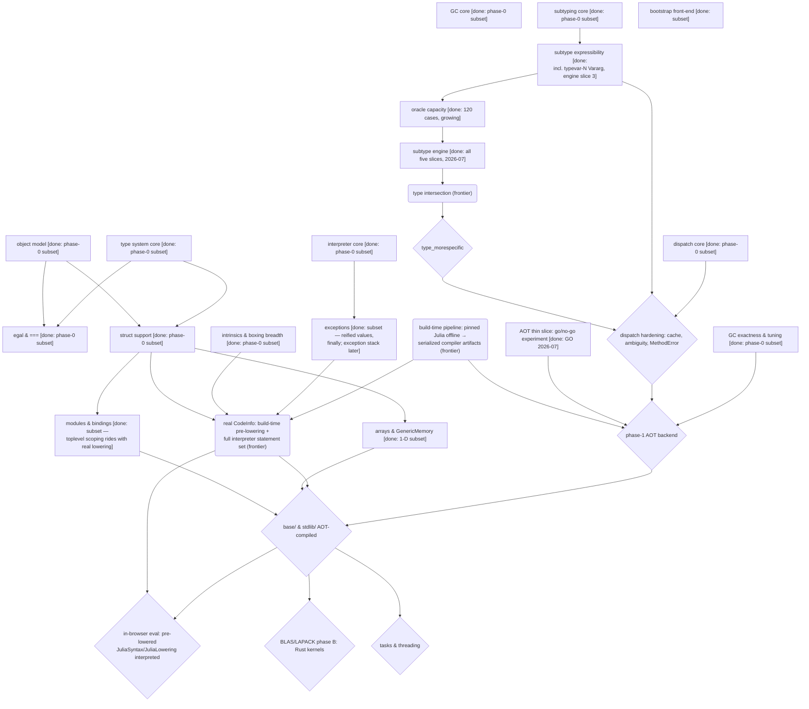

# Strategy

Where we are going, and what can be worked on *now*. The plan is a dependency
structure, not a list: at any moment several increments are unblocked, which
is what lets the project balance new capabilities against deeper fidelity and
absorb unexpected implementation challenges without being bottlenecked by
them.

**Contents:**
[What this is](#what-this-is) ·
[Key design decisions](#key-design-decisions) ·
[Why a dependency map](#why-a-dependency-map-and-how-to-use-it) ·
[The dependency map](#the-dependency-map) ·
[The frontier](#the-frontier) ·
[Selection principles](#selection-principles) ·
[Later phases](#later-phases-blocked-in-dependency-order)

## What this is

Ruju reimplements Julia's C/C++ runtime (`reference/julia/src/`) in Rust,
targeting WebAssembly (see the top-level `README.md`). The C runtime is the
**reference** we port from. The Julia-written layers (`reference/julia/base/`,
`stdlib/`, `Compiler/`, `JuliaSyntax/`, `JuliaLowering/`) stay, to be
AOT-compiled to WASM eventually. The end state: all of Julia, running in the
browser, through a runtime that compiles to WASM with the standard toolchain.

## Key design decisions

Two founding decisions shape the whole runtime; both were made up front and
have held. A second set was ratified 2026-07 after the post-M1 research pass
(evidence: `design/research/`, record: `design/research/DECISIONS-2026-07.md`).

**Cold path — interpreter fallback, AOT for the hot path.** Removing the
in-browser JIT raises the question of what runs when code needs a type/method
combination not compiled ahead of time. We ship an **interpreter** that
executes lowered IR against any concrete types (open-world correctness,
merely slow) and will **AOT-compile the hot path** later. *Rejected:* runtime
WASM codegen (a heavyweight backend and an async/sync mismatch) and a
closed-world `juliac`-style subset (abandons dynamic Julia). *Sequencing:*
Phase 0 — interpreter only (where we are); Phase 1 — AOT hot path with the
interpreter as fallback. Both share one value representation and one dispatch
service.

**GC rooting — a mandatory shadow stack with RAII.** WASM exposes no way to
scan the machine stack, so conservative stack scanning is impossible and
every root must be explicit. We port Julia's `gcframe` shadow stack but make
it **mandatory** (no scan fallback), expressed through RAII
(`Rooted`/`Frame`). *Rejected:* conservative scanning (impossible in WASM)
and a handle table (more indirection than needed). Roots live in addressable
slots, so the door stays open to a moving collector later.

**Real `CodeInfo` by build-time pre-lowering (M2, decided 2026-07).** The
pinned **native** Julia runs offline at build time to parse+lower source; the
resulting `CodeInfo` is serialized in a Ruju-owned pin-versioned format and
loaded by Ruju as data. Maximal fidelity by construction — it *is* upstream's
lowering output (production lowering at the pin is still flisp,
`ast.c:1248–1260`; JuliaLowering is experimental). *Rejected:* interpreting
JuliaSyntax/JuliaLowering in-wasm (circular — they need most of `base/`,
which needs a lowerer), AOT-first (roadmap inversion), and a flisp port
(**held as the recorded hedge**). *Consequences:* in-browser `eval` of new
source becomes a separate post-M5 milestone; `frontend.rs` is retained as a
dev convenience; Emscripten is used at no stage in any role; the build-time
Julia dependency is temporary — self-hosting removes it post-M5.
*Distribution (decided 2026-07-07):* the pinned Julia (`d99fded` — a DEV
commit with no official binary) is built **once** and published as a
checksummed release artifact; the dev environment fetches and verifies that
single pinned URL at setup. Agent-autonomous regeneration with a minimal,
auditable supply-chain surface and no per-session source build; the build
recipe is committed for reproducibility, and rebuilding the artifact is part
of any pin advance.

**AOT architecture (M4, decided 2026-07).** Typed IR comes from the pinned
`Compiler/` loaded as a package in the build-time Julia (`typeinf_ircode`) —
type inference is never reimplemented. The backend is a Rust program emitting
via `wasm-encoder` (+ "Beyond Relooper" for control flow; optional `wasm-opt`
post-pass); *rejected:* Cranelift (verified: no wasm32 backend), LLVM (held
as later escalation), emitting Rust source. Linking is **two modules** for
the MVP — the runtime exports memory + funcref table + `rj_` entry points,
the first real exercise of the composable-memory commitment — with Binaryen
`wasm-merge` to a single artifact **explicitly kept on the table** for
deployment. Compiled methods get two entry points after the pin's
`CodeInstance` `invoke`/`specptr` split. *Named accepted risk:*
cross-implementation miscompiles (64-bit-host layout folding vs 4-byte refs,
method-table divergence during the base/-subset transition, intrinsic
constant-folding vs recorded divergences) — mitigated by a whitelisted IR
vocabulary, then an `AbstractInterpreter` overlay, then self-hosted `base/`;
probed **early** by the thin-slice go/no-go experiment
(`design/research/research-aot-backend.md`), which no longer waits for
dispatch hardening.

## Why a dependency map, and how to use it

A linear plan answers "what comes next?" with one item, which makes the plan
hostage to its hardest step: when item 3 stalls on a research-grade problem,
items 4–9 stall with it. A **dependency map** answers with a *set*. It is a
directed graph whose nodes are capabilities and whose edges are
**constructive** dependencies — `A --> B` means B cannot be built (or cannot
be *verified faithful*) until A holds. Everything whose dependencies are all
satisfied forms the **frontier**: the menu of work that is genuinely
available right now.

This is deliberately not a schedule. The map has no time axis, no durations,
and no dates, because for work like this (a mechanical intrinsics port next
to research-grade subtype machinery) durations would be invented numbers, and
invented precision is the exact failure mode this project's culture exists to
prevent. What the frontier's *width* provides instead is balance: at any
moment it offers both **breadth** (new capabilities) and **depth** (making
existing capabilities more faithful), and the project stays productive while
the difficult problems get the sustained, unhurried attention they need to be
solved well — rather than bottlenecking everything behind them.

It is also not the architectural call graph — that lives in
`implementation.md`. Same subsystems, different edges: the architectural map's
edges say *what calls what*; this map's edges say *what must exist first*.

**To use it:** pick from the frontier table below using the selection
principles; after each increment, update node statuses and re-derive the
frontier (a finished gate may unblock several nodes at once); when adding a
node, add its incoming edges honestly — an edge omitted to make something
look available is an over-claim with arrows.

## The dependency map

Node status: `[done]` = working faithful subset exists; `(frontier)` =
unblocked now; `{blocked}` = waiting on an edge.

## The frontier

Unblocked now, in no required order — pick by the selection principles below.
**M1 (breadth online) was reached 2026-07**: every breadth item below is
landed as scoped, which unblocked the two research-grade gates — they *are*
the frontier now, alongside depth work in the landed subsets.

| Increment | What it is | What it unblocks |
| - | - | - |
| **subtype engine** | ~~slices 1–2~~ **landed 2026-07**: the rooting fix (finding 24, stress-enforced), the global union-decision machine (`Lunions`/`Runions` bit-stacks, ∀/∃ drivers, dispatch-order fixes — finding 11 closed; both pre-mapped oracle divergences healed on first run), then the `forall_exists_equal` tail (greedy path, `equal_var`, tuple-length gate, `push_forall_bound_scope`/`occurs_inv`, freeze/`limit_slow`/`env_unchanged` explosion guards); then ~~slice 3~~ **landed 2026-07-09**: the vararg length algebra — the `Loffset` channel, typevar-count `Vararg{T,N}` (the `BOUND` kind, `NTuple`), the full four-kind tuple length classification, `check_vararg_length`, the N-equation, and finding 23's expansion guard; then ~~slice 4~~ (the `Intersect` meet node #61917 + `concrete` propagation — finding 15 closed) and ~~slice 5~~ **landed 2026-07-09 — the engine is complete as researched**: `envout` (`jl_subtype_env`) hands callers the computed values of right-side `where` variables, verified against the pinned binary's own `jl_subtype_env` (10 cases native + the oracle's env section via the new `rj_subtype_env` ABI); oracle 106→120→126→**134**, 0 known divergences, bit-identical through slice 5 | **the M3 spine is open**: type intersection (now frontier) → `type_morespecific` → dispatch hardening |
| **real `CodeInfo` (M2)** | build-time pre-lowering (decided 2026-07): the pinned native Julia lowers offline; Ruju loads serialized `CodeInfo` as data; grow `interp.rs` to the full lowered statement set — plan in `design/research/research-real-lowering.md`. **C-0 begun 2026-07**: ~~`QuoteNode`/`GlobalRef` operands + global assignment~~ (stage 1) ~~calls through values~~ (stage 2 — function values under the abstract `Function`, `typeof`-keyed dispatch), and ~~`:method` in both arities~~ (stage 3 — method definitions from IR), and ~~the exception stack + `:pop_exception`~~ (stage 4), and ~~`:isdefined`~~ (stage 5) landed — the statement vocabulary is now complete for the current value model (`:splatnew` waits on runtime tuple values, `:static_parameter` on the sparams environment); ~~**C-1**~~ landed 2026-07: `tools/prelower.jl` (the pinned Julia serializes its own lowering, pin-versioned format), `loader.rs` + `rj_load_lowered` (lowered `CodeInfo` loaded as data and executed), the operator/Core-builtin prelude, and the **lowering oracle** (`verify_julia_lowering.mjs` — same source, two executors, one answer; 4/4 corpus programs incl. method definitions, globals, try/catch, loops). **M2's definition is met for the represented subset** — the milestone call is the human's; remaining depth rides the corpus (strings, structs-from-source, closures, `:splatnew`/tuple values, heap-`CodeInfo` in-memory form). The pinned-Julia artifact (C-1's producer) is building via `.github/workflows/build-pinned-julia.yml` | M2; `base/` code; method definitions from source |
| **build-time pipeline** | the offline harness both M2 and M4 share: run the pinned Julia, serialize compiler artifacts (`CodeInfo` now, typed `IRCode` later) | real `CodeInfo`; the AOT backend |
| **AOT thin slice** | ~~stages 1–2~~ **landed 2026-07-09 — GO** (spec: `design/research/research-aot-backend.md` §7; evidence: `implementation.md`, AOT section): the pinned Julia's own `code_ircode` output serialized (`tools/aot_fixture.jl`) → `ruju-aotc` (`wasm-encoder` + Beyond-Relooper) → two-module linking over the exported memory + funcref table → registered via `dispatch::Entry.fptr1` → called through both the specsig export and real dispatch. Thresholds: **401.8×** interpreter (≥100×), **0.95×** native-Rust-in-wasm (≤3×), fptr1 3.8µs vs interpreted 47.2µs per call. Stage 2 (D3's hardening): the **linear-memory shadow stack** (slot arena + exported top cell; `Rooted`/`Frame` are veneers — one root set for both fronts), the **region-base export**, and a compiled allocating function (`:new`/`getfield`, gcframe emission) exact under a collection per allocation — and the fixture caught a real D2a layout miscompile (tag-before-object) on first contact, as designed. Remaining: **stage 3** — compiled→dispatch fallback calls; the **exception-channel decision** (design open, human's call — nothing in the vocabulary throws yet) | the AOT semantic-gap risk is probed (one instance caught live) and the architecture + gcframe ABI validated; the `AOT` node now waits only on dispatch hardening |
| **depth in landed subsets** | N-D arrays, `popfirst!`/views, isbits-struct elements; scoped `EnterNode`s and backtraces; nested modules/imports; `BFloat16`, permbox caches (findings 1, 9); the `AbstractArray` tower and exception field metadata (findings 22, 28, audit 2026-07) | pulled in by demand from the two gates above |
| **arrays & GenericMemory** | landed 2026-07: ~~`GenericMemory` core~~ (the linear-memory buffer, get/set/length, GC element tracing + barrier), ~~1-D `Array` + growth~~ (`jl_array_grow_end`), ~~front-end syntax~~ (`[literals]`, `a[i]`, `push!`, `length`); remaining depth: N-D arrays, `popfirst!`/`deleteat!` (offset motion), shared views, isbits-struct/union elements | most real Julia programs; `base/` code |
| **modules & bindings** | landed 2026-07: ~~`Main` + bindings~~ (`jl_module_t` core, get/set_global with barriers), ~~top-level globals persisting across evals~~ (REPL-style seed/flush); remaining depth: nested modules, imports/exports, `jl_binding_t` partitions/constness, real toplevel scoping (with real lowering) | `base/` code; method definitions from source |
| **subtype expressibility** | landed 2026-07 (oracle 53→106): ~~unbounded varargs in tuples~~, ~~two-parameter `Pair` (multi-param invariant/diagonal)~~, ~~curated bounded/diagonal `test_3` expansion~~; ~~fixed-count `Vararg{T,N}` (expansion at construction)~~, ~~`Type{T}` kinds~~; ~~typevar-count `Vararg{T,N}`~~ (the `BOUND` kind — landed with engine slice 3, 2026-07-09, oracle → 126) — **complete as scoped** | grew the oracle to the coverage the engine needed; varargs also feeds dispatch |
| **exceptions** | **complete as scoped** 2026-07: ~~`enter`/`leave`~~, ~~`throw`/`catch e` from source~~, ~~reified exception objects~~ (`rtutils.c` analog: `DivideError`/`BoundsError{a,i}`/`ErrorException` values in the error channel), ~~`finally`~~, ~~the exception stack~~ (`pop_exception`, landed with M2 C-0 stage 4); remaining depth: scoped `EnterNode`s, backtraces | real lowering; `base/` code throws |

## Selection principles

When several frontier items are available:

1. **Prefer the widest gate** — structs unblock three branches; a same-effort
   increment that unblocks one branch waits.
2. **Prefer increments that grow the oracle** — verification capacity
   compounds; every oracle case keeps paying.
3. **Balance breadth and depth** — the frontier always offers both new
   capabilities (structs, exceptions) and deeper fidelity in existing ones
   (GC exactness, subtype hardening). Difficult problems get sustained
   attention across increments; the rest of the project advances in
   parallel rather than queueing behind them.
4. **Audit before entering a module** untouched since its last substantial
   change.

## Later phases (blocked, in dependency order)

**The subtype engine** (the global union-decision machine that heals the
oracle's known divergence, `Intersect`/`Loffset` from the newer pin,
cross-var `concrete` propagation) deliberately waits for the expressibility
slices: an engine rewrite verified against today's 53 oracle cases would be
unverified exactly where engines go wrong — the measuring instrument is
built first. The working cadence interleaves hardening slices between other
frontier items (GC exactness → varargs → arrays → `Type{T}`/`UnionAll`
instantiation → engine), so the type vocabulary and the engine grow together
and no retrofit cliff accumulates. Then: type intersection →
`type_morespecific` → dispatch hardening (typemap cache,
world age, ambiguity, `MethodError`). Arrays and modules behind structs. Real
`CodeInfo` via build-time pre-lowering (see Key design decisions) now that
structs, intrinsics breadth, and exceptions hold; a separate **in-browser
eval** milestone (pre-lowering JuliaSyntax/JuliaLowering themselves and
interpreting them) follows `base/`. The phase-1 AOT backend once dispatch and GC are hardened.
Then `base`/`stdlib` AOT — at which point **BLAS/LAPACK Phase A** (Julia's
generic fallbacks) arrives free, making linear algebra a performance problem,
not a correctness one:

- **Phase B — faer behind the LBT surface (decided 2026-07;** *rejected:*
  hand-rolled kernels — SVD/eigensolvers embody decades of numerics**).**
  The BLAS/LAPACK symbol surface `LinearAlgebra` actually calls (enumerated
  from the pinned stdlib in `design/research/research-faer-wasm.md`),
  presented by a Ruju-side shim over **faer** (pure Rust, MIT) — building on
  upstream's `faer-ffi`, registered through the runtime's internal ccall
  symbol table where `libblastrampoline` would forward. Verified empirically:
  after a 4-line 32-bit fix faer builds and runs on `wasm32-unknown-unknown`
  (51–396 KiB by decomposition, bit-identical to native); pulp's simd128 +
  relaxed-FMA backend already exists; `Par::Seq` is first-class. The faer
  side proceeds as an independent thin-fork track with its own roadmap;
  coverage gaps (Schur, Sylvester) fall back to Phase A generics.
- **Phase C — WebGPU offload** for large matrices behind the same interface.

Tasks and threading remain WASM-frontier-dependent (stack switching,
SharedArrayBuffer) and stay last.
