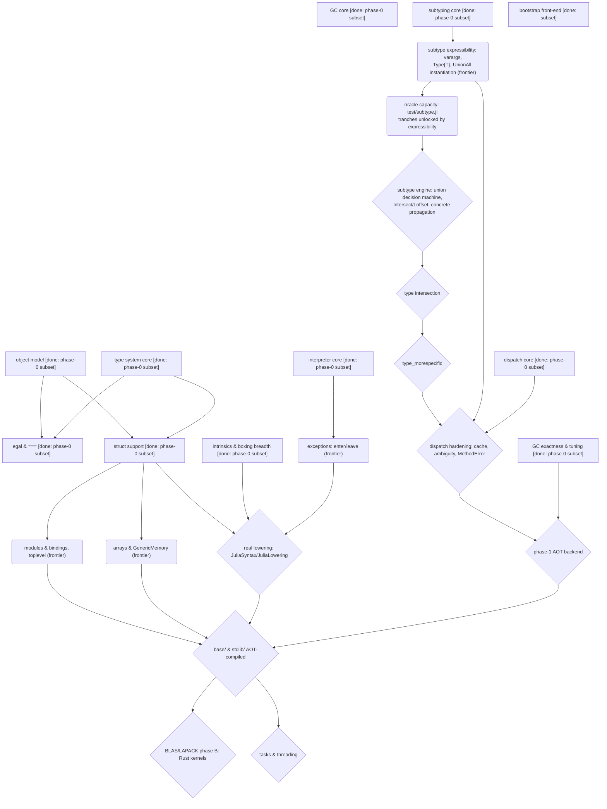

# Strategy

Where we are going, and what can be worked on *now*. The plan is a dependency
structure, not a list: at any moment several increments are unblocked, which
is what lets the project balance new capabilities against deeper fidelity and
absorb unexpected implementation challenges without being bottlenecked by
them.

**Contents:**
[What this is](#what-this-is) ·
[Key design decisions](#key-design-decisions) ·
[Why a dependency map](#why-a-dependency-map-and-how-to-use-it) ·
[The dependency map](#the-dependency-map) ·
[The frontier](#the-frontier) ·
[Selection principles](#selection-principles) ·
[Later phases](#later-phases-blocked-in-dependency-order)

## What this is

Ruju reimplements Julia's C/C++ runtime (`reference/julia/src/`) in Rust,
targeting WebAssembly (see the top-level `README.md`). The C runtime is the
**reference** we port from. The Julia-written layers (`reference/julia/base/`,
`stdlib/`, `Compiler/`, `JuliaSyntax/`, `JuliaLowering/`) stay, to be
AOT-compiled to WASM eventually. The end state: all of Julia, running in the
browser, through a runtime that compiles to WASM with the standard toolchain.

## Key design decisions

Two decisions shape the whole runtime. Both were made up front and have held.

**Cold path — interpreter fallback, AOT for the hot path.** Removing the
in-browser JIT raises the question of what runs when code needs a type/method
combination not compiled ahead of time. We ship an **interpreter** that
executes lowered IR against any concrete types (open-world correctness,
merely slow) and will **AOT-compile the hot path** later. *Rejected:* runtime
WASM codegen (a heavyweight backend and an async/sync mismatch) and a
closed-world `juliac`-style subset (abandons dynamic Julia). *Sequencing:*
Phase 0 — interpreter only (where we are); Phase 1 — AOT hot path with the
interpreter as fallback. Both share one value representation and one dispatch
service.

**GC rooting — a mandatory shadow stack with RAII.** WASM exposes no way to
scan the machine stack, so conservative stack scanning is impossible and
every root must be explicit. We port Julia's `gcframe` shadow stack but make
it **mandatory** (no scan fallback), expressed through RAII
(`Rooted`/`Frame`). *Rejected:* conservative scanning (impossible in WASM)
and a handle table (more indirection than needed). Roots live in addressable
slots, so the door stays open to a moving collector later.

## Why a dependency map, and how to use it

A linear plan answers "what comes next?" with one item, which makes the plan
hostage to its hardest step: when item 3 stalls on a research-grade problem,
items 4–9 stall with it. A **dependency map** answers with a *set*. It is a
directed graph whose nodes are capabilities and whose edges are
**constructive** dependencies — `A --> B` means B cannot be built (or cannot
be *verified faithful*) until A holds. Everything whose dependencies are all
satisfied forms the **frontier**: the menu of work that is genuinely
available right now.

This is deliberately not a schedule. The map has no time axis, no durations,
and no dates, because for work like this (a mechanical intrinsics port next
to research-grade subtype machinery) durations would be invented numbers, and
invented precision is the exact failure mode this project's culture exists to
prevent. What the frontier's *width* provides instead is balance: at any
moment it offers both **breadth** (new capabilities) and **depth** (making
existing capabilities more faithful), and the project stays productive while
the difficult problems get the sustained, unhurried attention they need to be
solved well — rather than bottlenecking everything behind them.

It is also not the architectural call graph — that lives in
`implementation.md`. Same subsystems, different edges: the architectural map's
edges say *what calls what*; this map's edges say *what must exist first*.

**To use it:** pick from the frontier table below using the selection
principles; after each increment, update node statuses and re-derive the
frontier (a finished gate may unblock several nodes at once); when adding a
node, add its incoming edges honestly — an edge omitted to make something
look available is an over-claim with arrows.

## The dependency map

Node status: `[done]` = working faithful subset exists; `(frontier)` =
unblocked now; `{blocked}` = waiting on an edge.

## The frontier

Unblocked now, in no required order — pick by the selection principles below.

| Increment | What it is | What it unblocks |
| - | - | - |
| **arrays & GenericMemory** | `GenericMemory`/`Array` (`genericmemory.c`, `array.c`): the buffer type, `arrayref`/`arrayset`, length, growth — de-risked: the GC's big-object path is in place | most real Julia programs; `base/` code |
| **modules & bindings** | `module.c`/`toplevel.c`: globals, bindings, top-level eval beyond expressions | `base/` code; method definitions from source |
| **subtype expressibility** | varargs in tuples, `Type{T}` kinds, `UnionAll` instantiation in `apply_type` — bounded slices, each unlocking a tranche of `test/subtype.jl` for the oracle | grows the oracle from 53 toward the coverage the **engine slice** needs to be measurable; varargs also feeds dispatch |
| **exceptions** | `enter`/`leave` in the interpreter (`interpreter.c`), error throwing (`rtutils.c`) | real lowering; `base/` code throws |

## Selection principles

When several frontier items are available:

1. **Prefer the widest gate** — structs unblock three branches; a same-effort
   increment that unblocks one branch waits.
2. **Prefer increments that grow the oracle** — verification capacity
   compounds; every oracle case keeps paying.
3. **Balance breadth and depth** — the frontier always offers both new
   capabilities (structs, exceptions) and deeper fidelity in existing ones
   (GC exactness, subtype hardening). Difficult problems get sustained
   attention across increments; the rest of the project advances in
   parallel rather than queueing behind them.
4. **Audit before entering a module** untouched since its last substantial
   change.

## Later phases (blocked, in dependency order)

**The subtype engine** (the global union-decision machine that heals the
oracle's known divergence, `Intersect`/`Loffset` from the newer pin,
cross-var `concrete` propagation) deliberately waits for the expressibility
slices: an engine rewrite verified against today's 53 oracle cases would be
unverified exactly where engines go wrong — the measuring instrument is
built first. The working cadence interleaves hardening slices between other
frontier items (GC exactness → varargs → arrays → `Type{T}`/`UnionAll`
instantiation → engine), so the type vocabulary and the engine grow together
and no retrofit cliff accumulates. Then: type intersection →
`type_morespecific` → dispatch hardening (typemap cache,
world age, ambiguity, `MethodError`). Arrays and modules behind structs. Real
lowering (replacing `frontend.rs`) once structs, intrinsics breadth, and
exceptions hold. The phase-1 AOT backend once dispatch and GC are hardened.
Then `base`/`stdlib` AOT — at which point **BLAS/LAPACK Phase A** (Julia's
generic fallbacks) arrives free, making linear algebra a performance problem,
not a correctness one:

- **Phase B — Rust kernels behind the LBT surface.** The subset of the
  BLAS/LAPACK ABI `LinearAlgebra` actually calls (`gemm`, `gemv`, `getrf`,
  `potrf`, `geqrf`, `syevr`/`gesdd`), in Rust, inside the same `.wasm`
  module, registered where `libblastrampoline` would forward. *Open
  decision:* hand-rolled kernels (small, owned) vs vendoring `faer-rs`
  (mature, large dependency).
- **Phase C — WebGPU offload** for large matrices behind the same interface.

Tasks and threading remain WASM-frontier-dependent (stack switching,
SharedArrayBuffer) and stay last.
